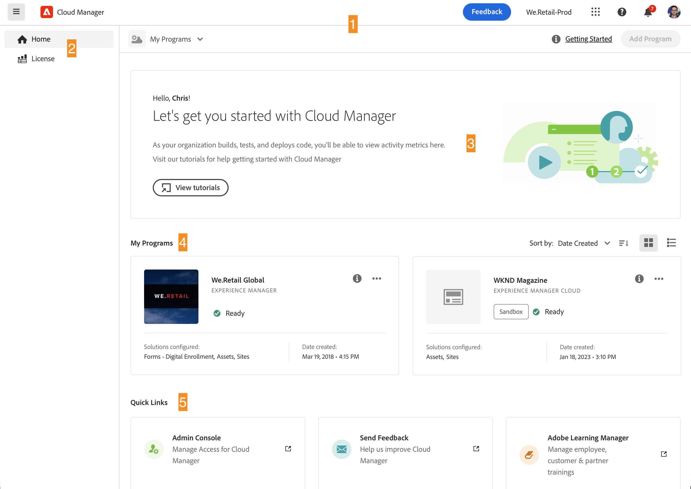
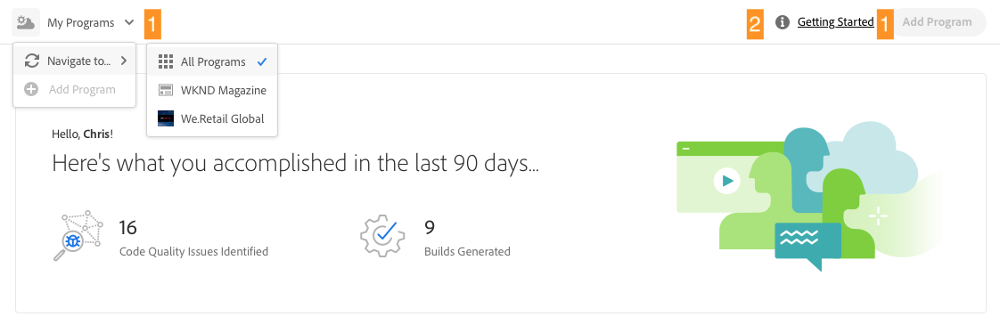
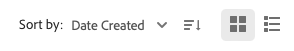
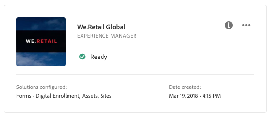
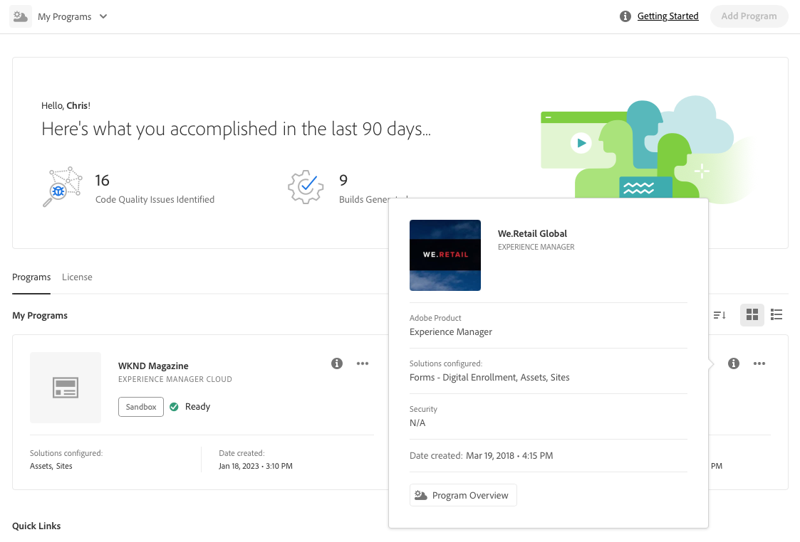
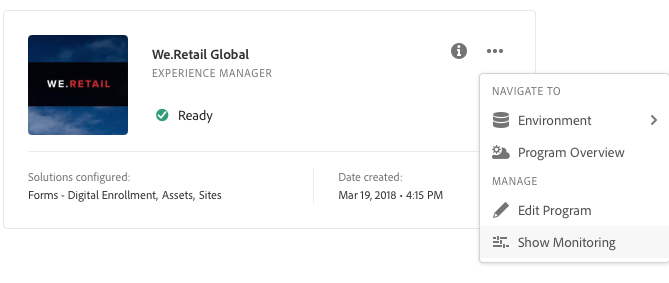
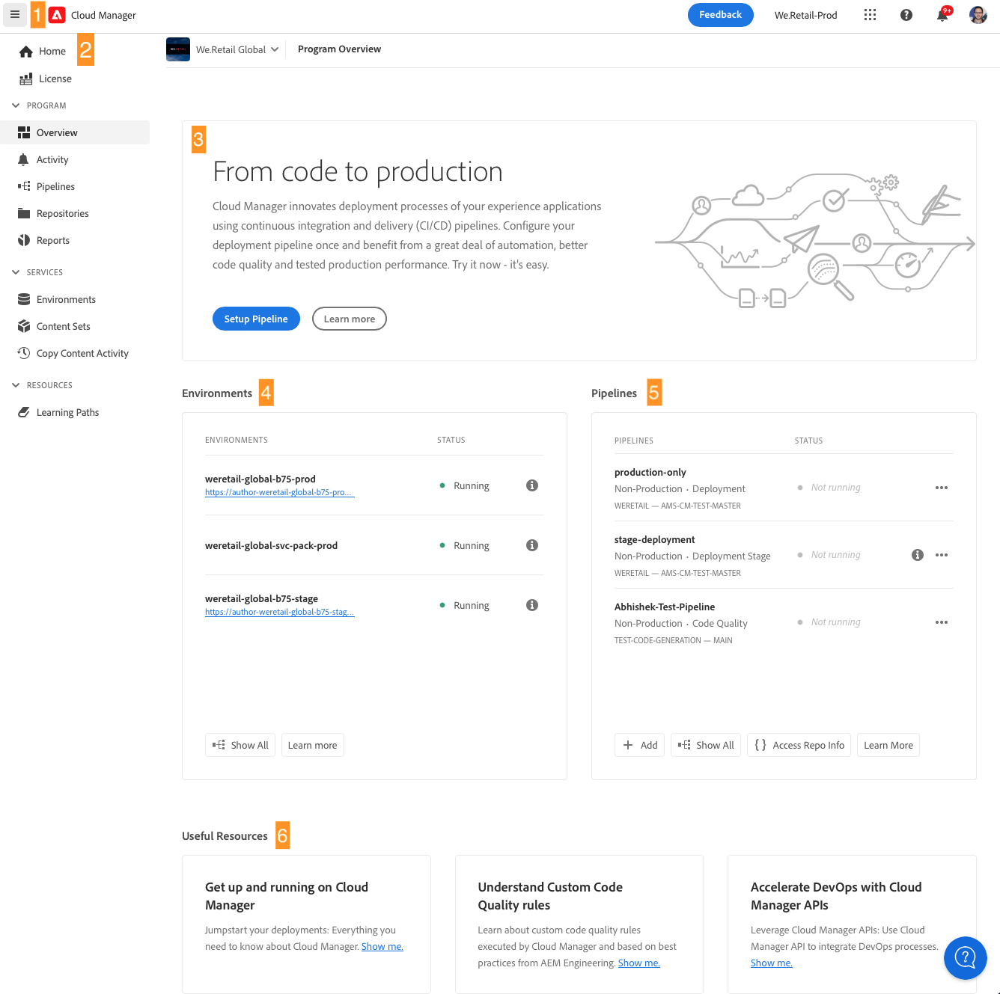
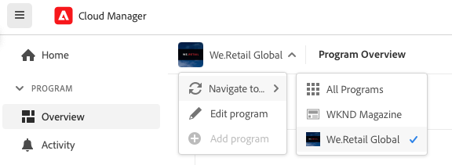
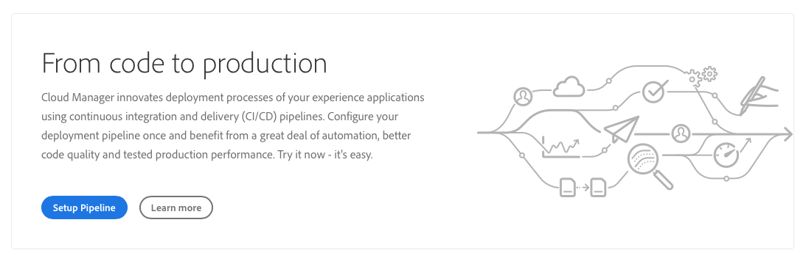

# Navigating the Cloud Manger UI {#navigation}

Learn how the Cloud Manager UI is organized and how to navigate to manage your programs and environments.

The Cloud manage UI is primarily composed of two graphical interfaces:

* [The My Programs console](#my-programs-console) where you can view and manage all of your programs.
* [The Program Overview window](#program-overview) where you can see the detail of and manage an individual program.

## My Programs Console {#my-programs-console}

When you log into Cloud Manager at at [my.cloudmanager.adobe.com](https://my.cloudmanager.adobe.com/) and select the appropriate organization, you arrive at the **My Programs** console.

The My Programs console provides an overview of all programs to which you have access in the selected organization. It is made up of several parts.

1. [Toolbars](#toolbars-my-programs-toolbars) for organization selection, alerts, and account settings
1. Tabs that allow you to toggle the current view of your programs.
   * **Home** view (default) that selects the **My Programs** view with an overview of all programs
   * **License** that accesses the License Dashboard. The license dashboard only applies to AEM as a Cloud Service programs, not AMS programs.
     * To determine the type of service your program has (AMS or AEMaaCS), please see the [Program Cards section](#program-cards) of this document.
   * Note that the tabs default to closed and can be revealed using the hamburger menu in the [Cloud Manager header.](#cloud-manager-header)
1. [Call-to-Actions and Statistics](#cta-statistics) for an overview of your recent activity
1. [**My Programs** section](#my-programs-section) with an overview of all your programs
1. [Quick links](#quick-links) to easily access related resources

>[!TIP]
>
>Please see the document [Programs and Program Types](/help/getting-started/program-setup.md) for details on programs.

### Toolbars {#my-programs-toolbars}

There are two toolbars on top of each other. 

#### Cloud Manager Header {#cloud-manager-header}

The first is the Cloud Manager header, which is persistent as you navigate Cloud Manager. It is an anchor that gives you access to settings and information that apply across Cloud Manager programs.

1. The hamburger menu giving access to tabs that can take you to specific parts of a in individual program or switch between the License Dashboard and the **[My Programs](#my-programs-console)** console depending on context.
   * The license dashboard only applies to AEM as a Cloud Service programs, not AMS programs.
   * To determine the type of service your program has (AMS or AEMaaCS), please see the [Program Cards section](#program-cards) of this document.
1. The Cloud Manager button will take you back to the My Programs console of Cloud Manager no matter where you are in Cloud Manager.
1. Tap or click the Feedback button to provide feedback to Adobe about Cloud Manager.
1. The organization selector displays the organization you are currently signed into (in this example, Foundation Internal). Tap or click to switch to another organization if your Adobe ID is associated with multiple.
1. Tapping or clicking the solutions switcher lets you quickly jump to other Experience Cloud solutions.
1. The help icon provides quick access to learning and support resources.
1. The notifications icon is badged with the number of currently assigned incomplete [notifications.](/help/using/notifications.md)
1. Select the icon representing your user to access your user settings. If you do not have a user picture configured, an icon is randomly assigned.

#### Program Toolbar {#program-toolbar}

The program toolbar provides links to switch between Cloud Manager programs and actions appropriate to the context.

1. The program selector opens up into a dropdown where you can quickly select other programs or take context-appropriate actions such as creating a new program
1. The getting started link gives you access to the [onboarding documentation journey](https://experienceleague.adobe.com/en/docs/experience-manager-cloud-service/content/onboarding/journey/overview) to get you up-and-running with Cloud Manager.
   * Note that the onboarding journey is designed for AEM as a Cloud Service and not Cloud Service for AMS, but many concepts are the same.
1. The action button offers context-appropriate actions such as creating a new program.

### Call-to-Actions and Statistics {#cta-statistics}

The call-to-action and statistics section provides aggregate data for your organization, for example, if you have successfully set up your programs, statistics of your activities over the past 90 days might show, including:

* Number of [deployments](/help/using/code-deployment.md)
* Number of [code quality issues](/help/using/code-quality-testing.md) identified
* Number of builds

Or if you are just beginning the setup of your org, there might be tips on next steps or documentation resources.

### My Programs Section {#my-programs-section}

The main content of the My Programs console is the **My Programs** section that lists your programs as individual cards. Tap or click on a card to access the **Program Overview** page of the program for details about the program.

>[!NOTE]
>
>Depending on your privileges you may not be able to select certain programs.

Use the sorting options to better find the program you need.

* Sort by
  * Date Created (default)
  * Program Name
  * Status
* Ascending (default) / Descending
* Grid View (default)
* List View

#### Program Cards {#program-cards}

Every program is represented by a card (or row in a table), providing an overview of the program and quick links to take action.

* Program image (if configured)
* Program name
* Service type:
  * **Experience Manager** for AMS programs
  * **Experience Manager Cloud** for [AEM as a Cloud Service programs](https://experienceleague.adobe.com/en/docs/experience-manager-cloud-service/content/implementing/home)
* Status
* Configured solutions
* Creation date

The information icon also gives quick access to additional information about the program (useful in list view).

The ellipsis icon gives you access additional actions you can take on the program.

* Navigate to a particular [environment](/help/using/managing-environments.md) of the program
* Open the [program overview](#program-overview)
* [Edit the program](/help/getting-started/program-setup.md)
* Show Monitoring

### Quick Links {#quick-links}

The quick links section give you access to commonly-used, related resources.

## Program Overview Window {#program-overview}

Once you select a program in the [**My Programs** console,](#my-programs-console) you are taken to the Program Overview.

The program overview gives you access to all details of a Cloud Manager program. Like the My Programs console, it is made of several parts.

1. [Toolbars](#program-overview-toolbar) to quickly jump back to the My Programs console as well as navigate the program
1. [Tabs](#program-tabs) to switch between different aspects of the program
1. A [call-to-action](#cta) based on the last actions of the program
1. An [overview of the environments](#environments) of the program
1. An [overview of the pipelines](#pipelines) of the program
1. Links to [useful resources](#useful-resources)

### Toolbars {#program-overview-toolbar}

The toolbars for the program overview are very similar to those of the [My Programs console.](#my-programs-toolbars) Only the differences are illustrated here.

#### Cloud Manager Header {#cloud-manager-header-2}

The Cloud Manager header has a hamburger menu that automatically opens to show the navigable tabs of the program overview.

Tap or click the hamburger menu icon to hide the tabs.

#### Program Toolbar {#program-toolbar-2}

The program toolbar still gives you access to quickly switch to other programs, but additionally gives access to context-appropriate actions such as adding and editing the program.

Additionally, the toolbar always provides which tab you are on if you have chosen to hidden the tabs using the hamburger menu.

### Program Tabs {#program-tabs}

Each program has a lot of options and data associated with it. These data are gathered into tabs to make navigating the program simpler. The tabs give you access to:

* Overview - The program overview as described in the current document
* [Activity](/help/using/managing-pipelines.md#activity) - The history of pipeline runs of the program
* [Pipelines](/help/using/managing-pipelines.md#pipelines) - All pipelines configured for the program
* [Repositories](/help/managing-code/managing-repositories.md) - All repositories configured for the program
* [Reports](/help/using/monitoring-environments.md#system-monitoring-overview) - Metrics such as SLA data
* [Environments](/help/using/managing-environments.md) - All environments configured for the program
* [Content Sets](/help/using/content-copy.md) - Sets of content created for copy purposes
* [Copy Content Activity](/help/using/content-copy.md) - Content copy activities
* Learning Paths - Additional learning resources about Cloud Manager

By default, when you open a program you arrive on the **Overview** tab. The current tab is highlighted. Select another tab to show its details.

Use the hamburger menu in the [Cloud Manager header](#cloud-manager-header-2) to hide the tabs.

### Call-to-Action {#cta}

The call-to-action section will give you helpful information depending on the status of your program. For a new program you may see next steps offered as well as a reminder of a go-live date, [set during program creation.](/help/getting-started/program-setup.md)

For a live program, the status of your last deployment with links for details and starting a new deployment.

### Environments Card {#environments}

The **Environments** card gives you an overview of your environments as well as links for quick actions.

The **Environments** card only lists three environments. Click **Show All** to see all environments of the program.

Please see the document [Managing Environments](/help/using/managing-environments.md) for details on how to manage your environments.

### Pipelines Card {#pipelines}

The **Pipelines** card gives you an overview of your pipelines as well as links for quick actions.

The **Pipelines** card only lists three pipelines. Click **Show All** to see all pipelines of the program.

Please see the document [Managing Pipelines](/help/using/managing-pipelines.md) for details on how to manage your pipelines.

### Useful Resources {#useful-resources}

The **Useful Resources** section provides links to additional learning resources for Cloud Manager.
