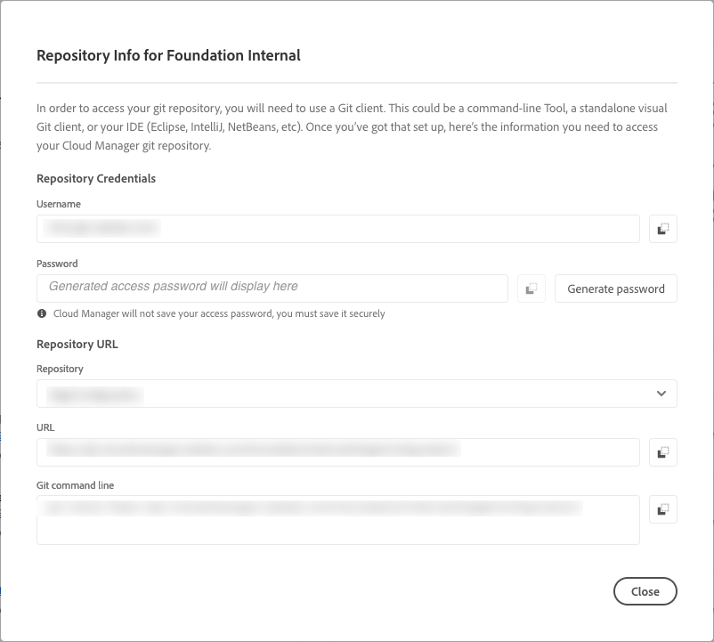

# Repository access information {#accessing-repos}

Learn how to access and manage your Adobe-managed Git repositories using the self-service Git account management in Cloud Manager.

## Access repository information from the Overview page {#overview-page}

Cloud Manager makes it easy to retrieve your repository access information for Adobe-managed repositories using **Access Repo Info** from the **Pipelines** card.  

The **Repository Info** dialog box lets you see the following access information for Adobe-managed repositories:

   * The Git username.
   * The Git password.
   * The URL to the Cloud Manager Git repository.
   * Prebuilt Git commands to add a remote to your Git repo quickly and push code.

   

Access information about [private repositories](/help/managing-code/private-repositories.md) is not available in Cloud Manager.

The **Access Repo Info** feature is visible to users with **Developer** or **Deployment Manager** roles.

**To access repository information from the Overview page:**

1. Log into Cloud Manager at [my.cloudmanager.adobe.com](https://my.cloudmanager.adobe.com/) and select the appropriate organization and program.

1. From the **Program Overview** page, under the **Pipelines** card, click **Access Repo Info**. 

   

1. To access the password, a new password must be generated. In the **Repository Info** dialog box, select **Generate password**.

1. In the confirmation dialog box, select **Generate password**.

1. To the right of the **Password** field, click  to copy the password to the clipboard.

   * Generating a password invalidates the previous password.
   * Cloud Manager does not save the password. It is your responsibility to save the password securely.
   * Because Cloud Manager does not save the password, if you lose the password, you must regenerate a new one.

   

Using these credentials, you can clone a local copy of the repository, make changes in that local repository, and when ready commit any code changes back to the remote code repository in Cloud Manager.

## Access repository information from the Repositories window {#repositories-window}

The **Access Repo Info** feature is also available from the [**Repositories** page](/help/managing-code/managing-repositories.md). It displays the same information about accessing Adobe-managed repositories.

## Revoke an access password {#revoke-password}

You can revoke an access password at any time. 

To do so, [create a support ticket for this request](https://experienceleague.adobe.com/?support-solution=Experience+Manager&support-tab=home#support). The ticket is treated with high priority and is usually revoked within one day.
