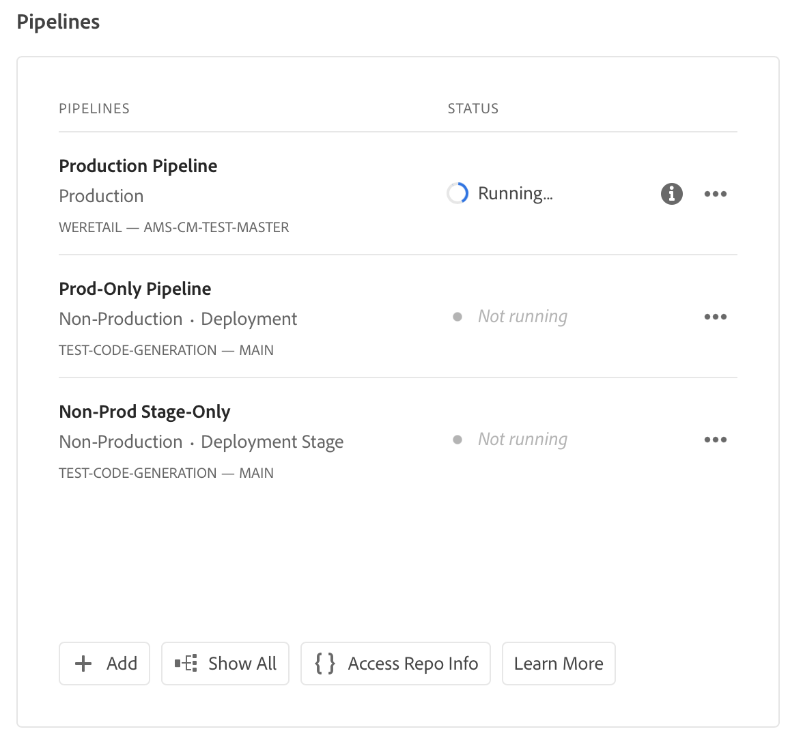
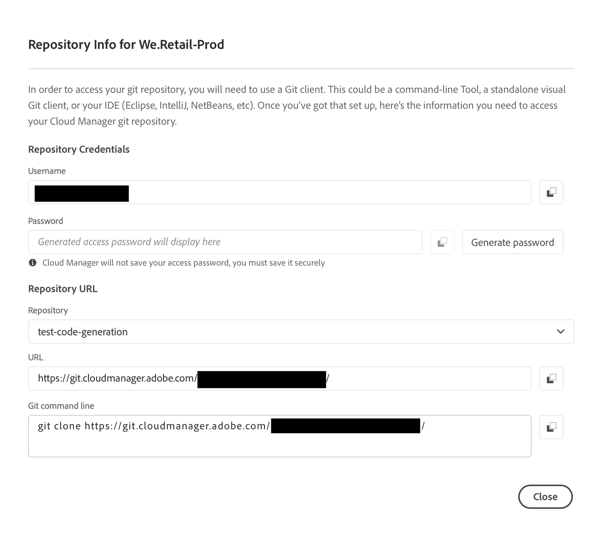
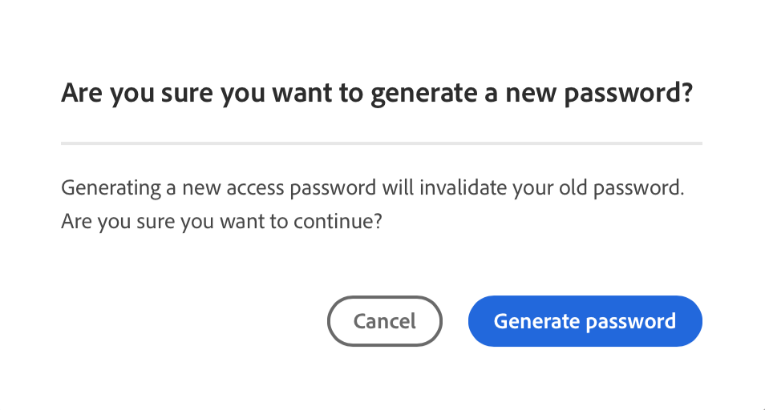
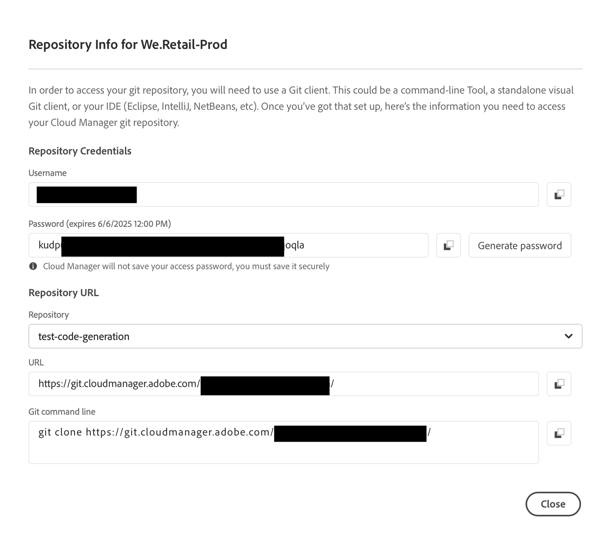

# Repository access information {#accessing-repos}

Learn how to access and manage your Adobe-managed Git repositories using the self-service Git account management in Cloud Manager.

## Access repository information from the Overview page {#overview-page}

1. Log into Cloud Manager at [my.cloudmanager.adobe.com](https://my.cloudmanager.adobe.com/) and select the appropriate organization and program.

1. Navigate to the **Pipelines** card from your **Program Overview** page.

   

1. Click **Access Repo Info**. In the **Repository Info for...** dialog box, you can view the following:

   * The Git username.
   * The Git password.
   * The URL to the Cloud Manager Git repository.
   * Prebuilt Git commands to add a remote to your Git repo quickly and push code.

   

1. To access the password, a new password must be generated. Click **`Generate password`**.

1. In the **Are you sure...** dialog box, confirm the password generation by clicking **Generate password**.

   

1. In the **Password** field, the password is generated. Click the copy icon to copy it to the clipboard.

   * Generating a password invalidates the previous password.
   * Cloud Manager does not save your access password. Be sure you save this password securely.
   * If you lose the password, you must generate a new one.

   

Using these credentials, you can clone a local copy of the repository, make changes in that local repository, and when ready commit any code changes back to the remote code repository in Cloud Manager.

>[!NOTE]
>
>* The **Access Repo Info** option is visible to users with the **Developer** role, or the **Deployment Manager** role, or both.
>* The **Access Repo Info** button only displays the repository access information for Adobe-managed repositories. Access information about [private repositories](private-repositories.md) is not available in Cloud Manager.

## Access repository information from the Repositories window {#repositories-window}

The **Access Repo Info** button is also available on the toolbar of the [**Repositories** window](managing-repositories.md). It displays the same information about accessing Adobe-managed repositories.

## Revoke an access password {#revoke-password}

You can revoke an access password at any time. [Create a support ticket for such a request](https://experienceleague.adobe.com/?support-solution=Experience+Manager&support-tab=home#support).

The ticket is treated with high priority and is typically revoked within one day.
