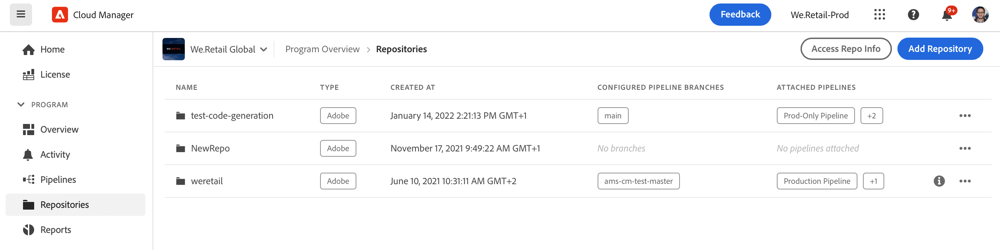
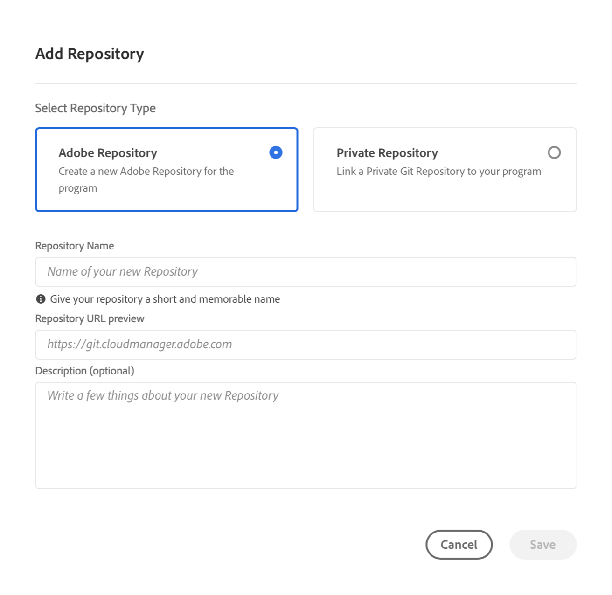

# Adding Adobe Repositories in Cloud Manager {#adobe-repositories}

Learn how to create Adobe-managed repositories in Cloud Manager.

## Adding an Adobe-Managed Repository {#add-adobe-repository}

The **Repositories** window makes it easy to add additional Adobe-managed repositories for your program.

1. Log into Cloud Manager at [my.cloudmanager.adobe.com](https://my.cloudmanager.adobe.com/) and select the appropriate organization and program.

1. From the **Program Overview** page, select the **Repositories** tab to switch to the **Repositories** page.

1. Click **Add Repository** in the toolbar.

   

1. Enter the name and description as requested and click **Save**.

   

When the wizard closes, your new repository is displayed in the table in the **Repositories** window. You can now associate a [CI/CD pipeline](/help/implementing/cloud-manager/configuring-pipelines/introduction-ci-cd-pipelines.md) with it or manage it within the [**Repositories** window.](managing-repositories)

>[!TIP]
>
>You can also add GitHub repositories that you manage yourself as [private repositories.](private-repositories.md)
