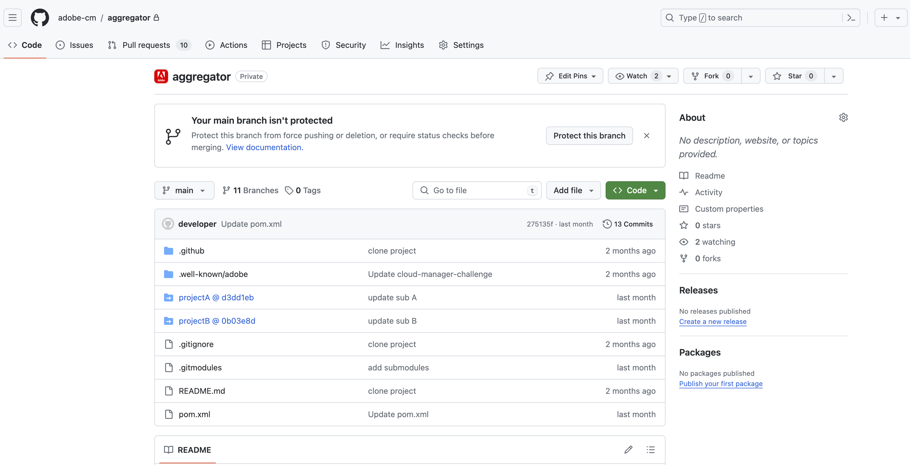
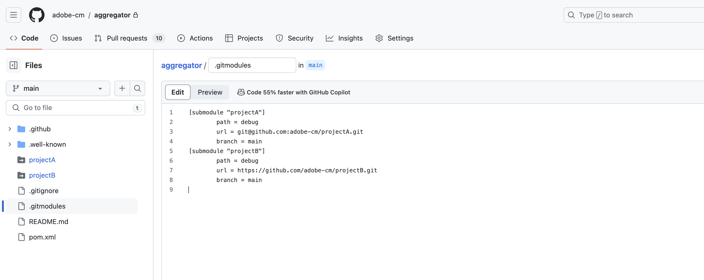

# Git Submodule Support for Adobe Repositories {#git-submodule-support}

Git submodules can be used to merge the content of multiple branches across git repositories at build time. 

When Cloud Manager's build process executes, after the repository configured for the pipeline is cloned and the configured branch is checked out, if the branch contains a `.gitmodules` file in the root directory, the command is executed.

```
$ git submodule update --init
```

This will check out each submodule into the appropriate directory. This technique is a potential alternative to [working with multiple source Git repositories](/help/managing-code/multiple-git-repos.md) for organizations which are comfortable with using git submodules and do not want to manage an external merging process.

For example, let's say there are three repositories, each containing a single branch named `main`. In the "primary" repository, i.e. the one configured in the pipelines, the `main` branch has a `pom.xml` file declaring the projects contained in the other two repositories:

```xml
<?xml version="1.0" encoding="UTF-8"?>
<project xmlns="http://maven.apache.org/POM/4.0.0" xmlns:xsi="http://www.w3.org/2001/XMLSchema-instance"
    xsi:schemaLocation="http://maven.apache.org/POM/4.0.0 http://maven.apache.org/maven-v4_0_0.xsd">
    <modelVersion>4.0.0</modelVersion>
   
    <groupId>customer.group.id</groupId>
    <artifactId>customer-reactor</artifactId>
    <version>0.0.1-SNAPSHOT</version>
    <packaging>pom</packaging>
   
    <modules>
        <module>project-a</module>
        <module>project-b</module>
    </modules>
   
</project>
```

You would then add submodules for the other two repositories:

```shell
$ git submodule add -b main https://git.cloudmanager.adobe.com/ProgramName/projectA/ project-a
$ git submodule add -b main https://git.cloudmanager.adobe.com/ProgramName/projectB/ project-b
```

This results in a `.gitmodules` file that looks like this:

```text
[submodule "project-a"]
    path = project-a
    url = https://git.cloudmanager.adobe.com/ProgramName/projectA/
    branch = main
[submodule "project-b"]
    path = project-b
    url = https://git.cloudmanager.adobe.com/ProgramName/projectB/
    branch = main
```

More information on git submodules can be found in the [Git reference manual](https://git-scm.com/book/en/v2/Git-Tools-Submodules).

## Limitations {#limitations}

When using git submodules, be aware of the following:

* The git URL must be exactly in the syntax described above.
* For security reasons, do not embed credentials in these URLs.
* Only submodules at the root of the branch are supported.
* Git submodules references are stored to specific git commits.
  * As a result, when changes to the submodule repository are made, the commit referenced needs to be updated, for example, by using `git submodule update --remote`.
* Unless otherwise necessary, it is highly recommended to use "shallow" submodules.
  * To do this, run `git config -f .gitmodules submodule.<submodule path>.shallow true` for each submodule.


## Git Submodule Support for Private Repositories {#private-repositories}

Support for git submodules when using [private repositories](private-repositories.md) is largely the same as when using Adobe repositories.

However, after setting up your `pom.xml` file and running the `git submodule` commands, you must add a `.gitmodules` file to the root directory of the aggregator repository for Cloud Manager to detect the submodule setup.





### Limitations and Recommendations {#limitations-recommendations-private-repos}

When using git submodules with private repositories, be aware of the following limitations.

* The git URLs for the submodules can either be in the HTTPS or SSH format, but they must link to a github.com repository
   * Adding an Adobe repository submodule to a GitHub aggregator repository or vice-versa won't work.
* The GitHub submodules must be accessible to the Adobe GitHub App.
* [The limitations of using git submodules with Adobe-managed repositories](#limitations-recommendations) also apply.
