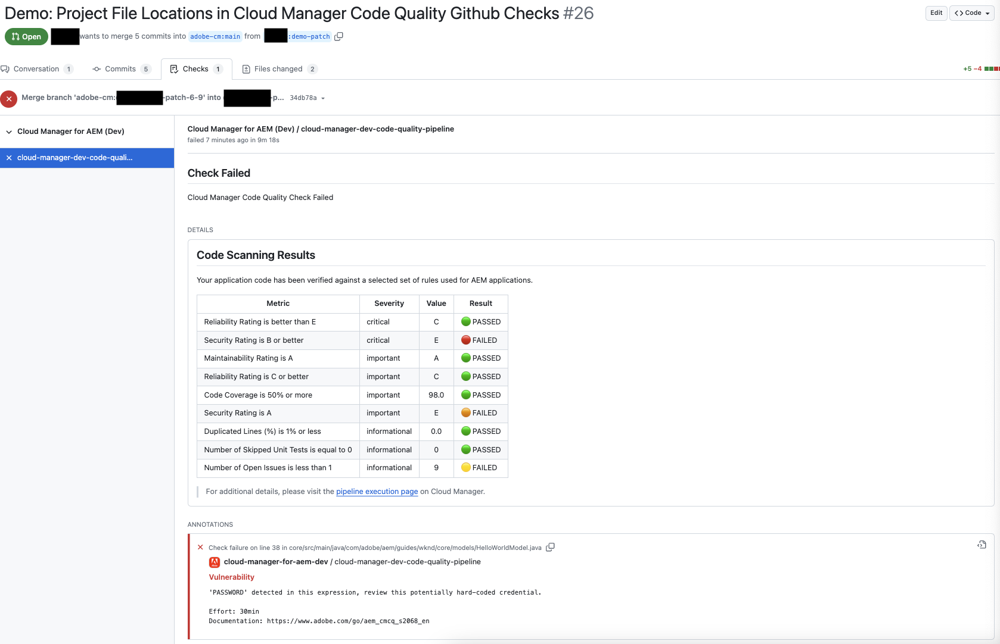
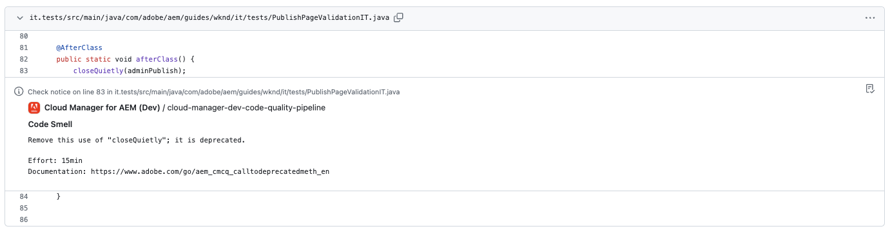
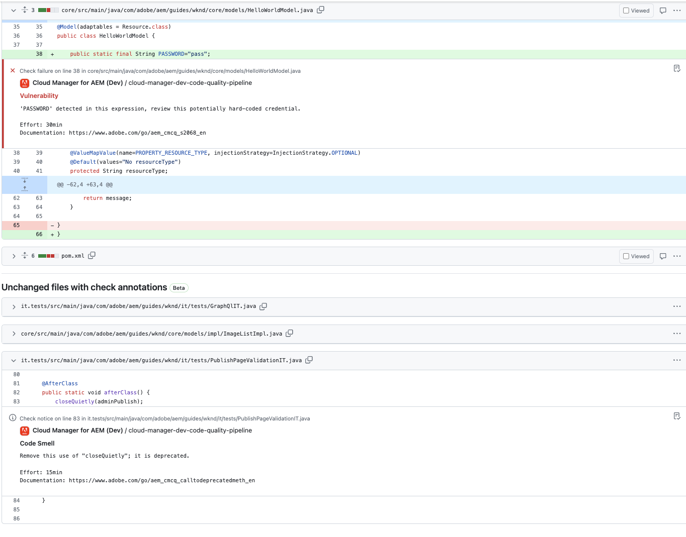
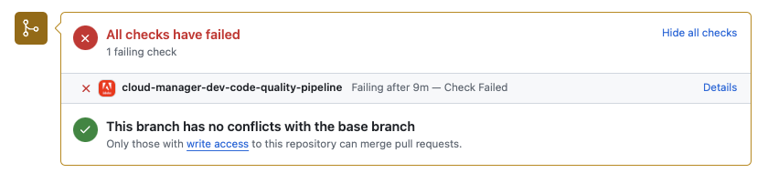
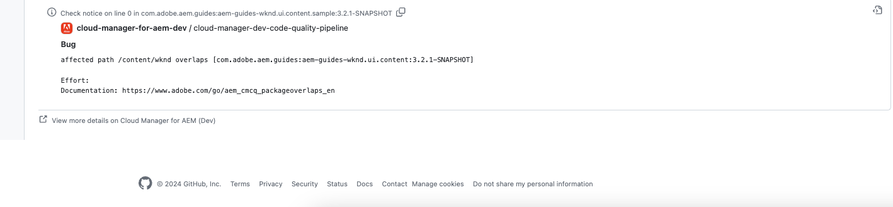

# GitHub Check Annotations {#github-annotations}

Learn how GitHub checks annotate PRs for your private repositories to provide you will helpful feedback.

## Overview {#overview}

If you are using [private repositories](private-repositories.md) for your Cloud Manager program, checks in GitHub are automatically run for every pull request. These are annotated with useful information to help you understand any issues with your code as soon as possible.

[Code quality](/help/using/code-quality-testing.md) issues detected by [SonarQube](/help/implementing/cloud-manager/custom-code-quality-rules.md) are clearly listed. 

The exact line of code with the issue is provided and you can click on it to show the relevant code. These annotations are provided for all code issues, not just those changed in the pull request.

All annotated lines are aggregated on the **Files Changed** tab on the GitHub pull request. Annotations for files that were not changed in the pull request appear in their own section.

## Code Quality Pipelines {#code-quality-pipelines}

The [code quality](/help/using/code-quality-testing.md) results are also visible in the pipeline which is automatically triggered by Cloud Manager at the bottom of the **Checks** tab. It is also accessible from the **Details** of the check of the pull request.

You can also visualize the issues in the form of a CSV. This can be retrieved by [viewing the details of the pipeline execution in Cloud Manager.](/help/using/managing-pipelines.md)
