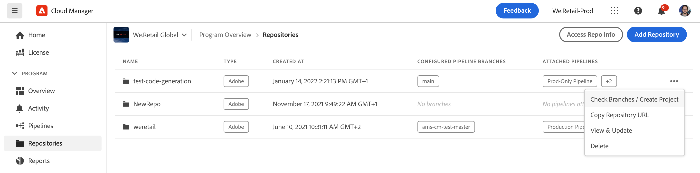
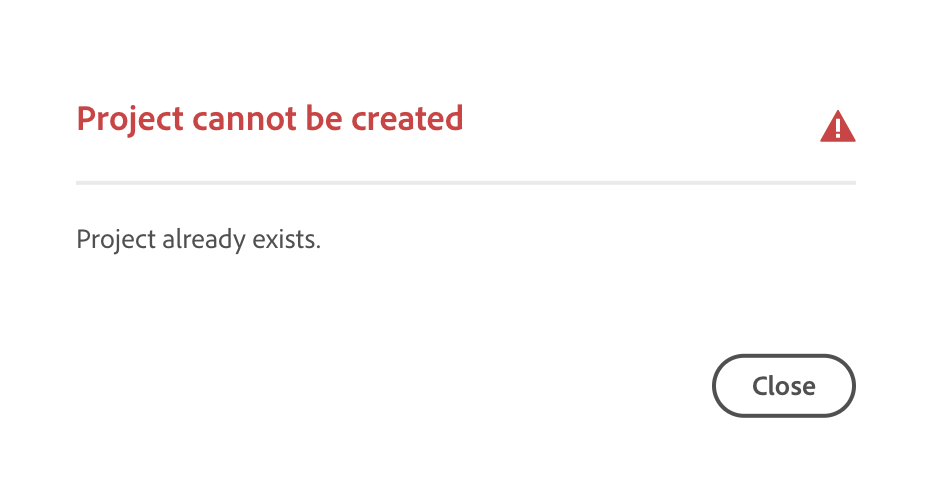
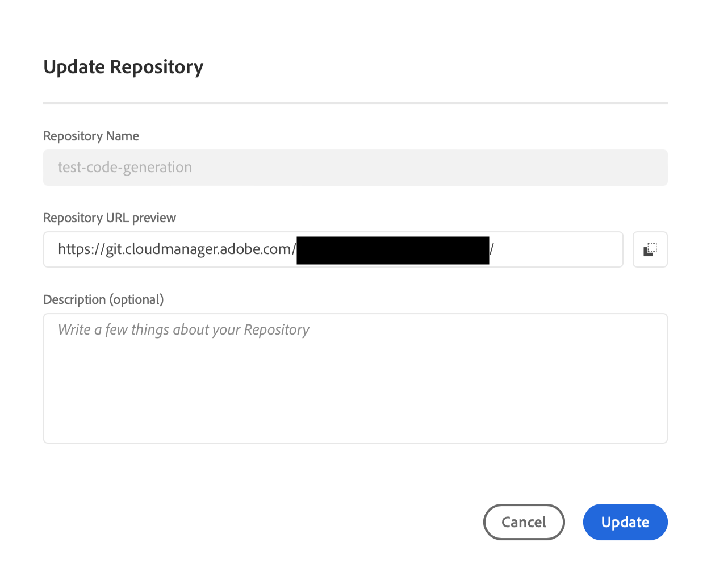
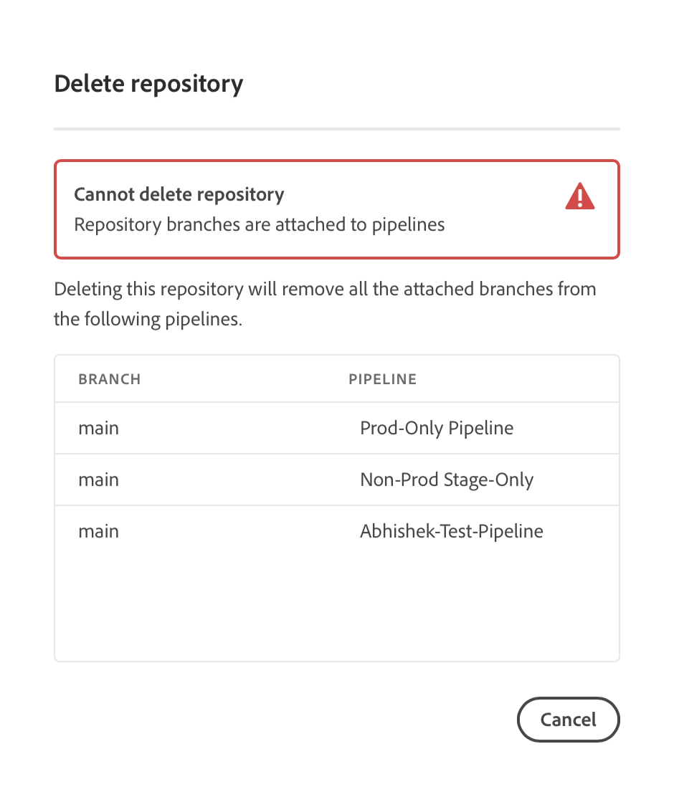

# Cloud Manager repositories {#cloud-manager-repos} 

Learn how to create, view, and edit your Git repositories in Cloud Manager.

## Overview {#overview}

Repositories are used to store and manage your project's code using Git. Every program you create in Cloud Manager has an Adobe-managed repository created for it.

You can choose to create additional Adobe-managed repositories and also add your own private repositories. All repositories associated with your program can be viewed in the **Repositories** window.

Repositories created in Cloud Manager are also available for you to select when adding or editing pipelines. See [CI-CD Pipelines](/help/overview/ci-cd-pipelines.md) to learn more.

There is a single primary repository or a branch for any given pipeline. With [Git submodule support](git-submodules.md), many secondary branches can be included at build time.

## Repositories window {#repositories-window}

1. Log into Cloud Manager at [my.cloudmanager.adobe.com](https://my.cloudmanager.adobe.com/) and select the appropriate organization and program.

1. From the **Program Overview** page, select the **Repositories** tab to switch to the **Repositories** page.

1. The **Repositories** window displays all repositories associated with your program.

   

The **Repositories** window provides details about the repositories:

* The type of repository.
  * **Adobe** indicates Adobe-managed repositories
  * **GitHub** indicates private GitHub repositories that you manage
* When it was created
* Pipelines that are associated with the repository

You can select the repository in the window and click the ellipsis button to take action on the selected repository.

* **[Check Branches / Create Project](#check-branches)** (only available for Adobe repositories)
* **[Copy Repository URL](#copy-url)**
* **[View &amp; Update](#view-update)**
* **[Delete](#delete)**

## Add repositories {#adding-repositories}

Click the **Add Repository** button in the **Repositories** window to start the **Add Repository** wizard.

Cloud Manager supports both repositories managed by Adobe (**Adobe Repository**) and your own self-managed repositories (**Private Repository**). The required fields differ depending on the type of repository that you choose to add.

See [Adding Adobe Repositories in Cloud Manager](adobe-repositories.md).
See [Adding Private Repositories in Cloud Manager](private-repositories.md).

>[!NOTE]
>
>A user must have the role **Deployment Manager** or **Business Owner** to be able to add a repository.
>
>There is a limit of 300 repositories across all programs in any given company or IMS organization.

## Access repo info {#repo-info}

When viewing your repositories in the **Repositories** window, you can view the details on how to access the Adobe-managed repositories programmatically by clicking the **Access Repo Info** button on the toolbar.

The **Repository Info** window opens with the details. For more information on accessing repository information, see [Accessing Repository Information](accessing-repositories.md).

## Check branches {#check-branches}

The **Check Branches / Create Project** action performs two functions depending on the state of the repository.

If the repository is newly created, the action creates a sample project based on [the AEM project archetype](https://experienceleague.adobe.com/en/docs/experience-manager-core-components/using/developing/archetype/overview).

If the repository already has had the sample project created, it checks the state of the repository and its branches and reports back if the sample project already exists.

## Copy repository URL {#copy-url}

The **Copy Repository URL** action copies the URL of the repository selected in the **Repositories** window to the clipboard to be used elsewhere.

## View and Update {#view-update}

The **View &amp; Update** action opens the **Update Repository** dialog. Using it you can view the **Name** and **Repository URL preview** and update the **Description** of the repository.

## Delete {#delete}

The **Delete** action removes the repository from your project. A repository cannot be deleted if it is associated with a pipeline.

When a repository is deleted in Cloud Manager, it is marked as deleted; it is no longer accessible to the user. However, it is maintained in the system for recovery purposes.

If you try to create a new repository after deleting a repository with the same name, you receive the error message `An error has occurred while trying to create repository. Contact your CSE or Adobe Support.`

If you receive this error message, contact Adobe Support so they can assist in renaming the deleted repository or choose a different name for your new repository.
