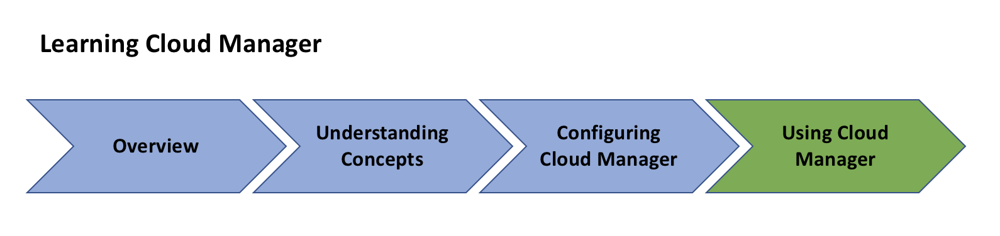

# Overview for AEM [!UICONTROL Cloud Manager]{#overview-index}

[!UICONTROL Cloud Manager] is a framework of tools and technologies available to all Adobe Managed Services customers.

This section provides the high level view of the list of resources that lets you get started with [!UICONTROL Cloud Manager].

Follow the resources below to begin your journey for using [!UICONTROL Cloud Manager], from understanding the key concepts and terminologies to setting up configurations (pre-requisites), that finally lets you get started with [!UICONTROL Cloud Manager].

The figure below illustrates the road map to your learning of [!UICONTROL Cloud Manager]:

Follow the resources in the Overview section to get an introduction to [!UICONTROL Cloud Manager]:

* **[Introduction to [!UICONTROL Cloud Manager]](introduction-to-cloud-manager.md)**
* **[Key Concepts](key-concepts.md)**
* **[[!UICONTROL Customer Journey]](customer-journey.md)**

