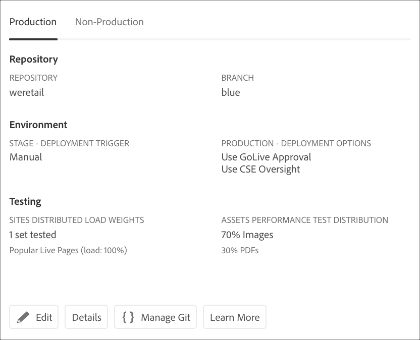
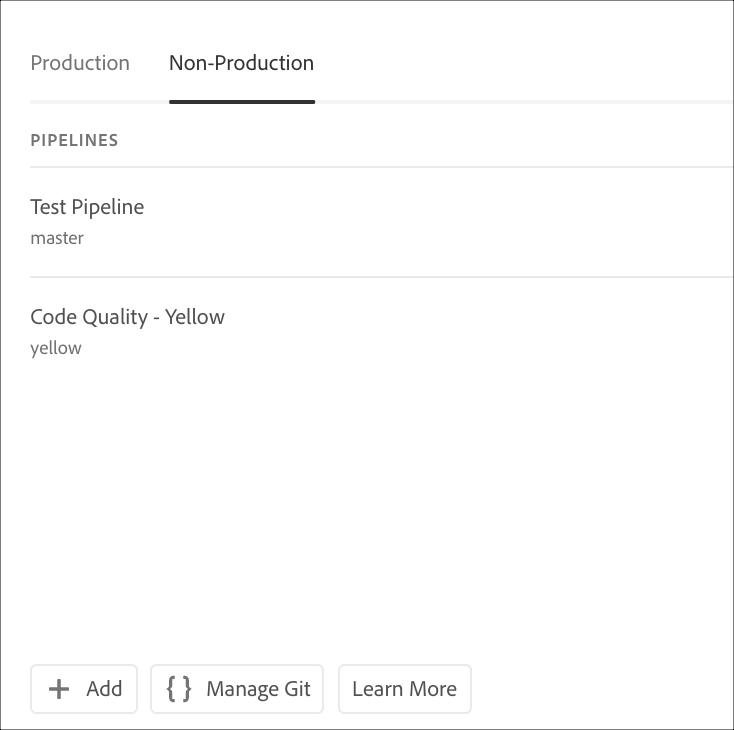
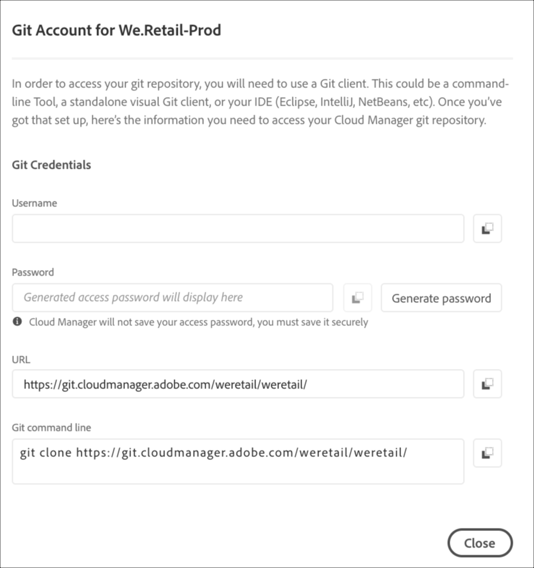

# Accessing Git {#accessing-git}

You can access and manage your Git Repository using Self-Service Git Account Management from Cloud Manager UI.

## Using Self-Service Git Account Management {#self-service-git}

Use the **Manage Git** button available from the Cloud Manager UI, most prominently on the pipeline card.

1. Navigate to your *Program's Overview* page and to Pipelines card.

1. You will view the **Manage Git** option to access and manage your Git Repository.

   

   Additionally, if you select the **Non-Production** pipeline tab, you will view the **Manage Git** option there too.

   

>[!NOTE]
>The **Manage Git** option is visible to users in the Developer or Deployment Manager role. Clicking on this button opens a dialog which allows the user to find the URL to their Cloud Manager Git Repository along with their username and password. 

   

