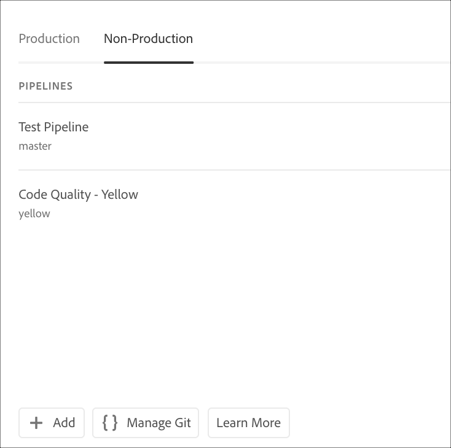

# Accessing Repositories {#accessing-repos}

You can access and manage your Git Repository using Self-Service Git Account Management from Cloud Manager UI.

## Using Self-Service Git Account Management {#self-service-git}

Use the **Access Repo Info** button available from the Cloud Manager UI, most prominently on the pipeline card.

1. Navigate to **Pipelines** card from your **Program Overview** page.

1. You will view the **Access Repo Info** option to access and manage your Git Repository.

   

   Additionally, if you select the **Non-Production** pipeline tab, you will view the **Access Repo Info** option there too.

   

   >[!NOTE]
   >The **Access Repo Info** option is visible to users in the Developer or Deployment Manager role. Clicking on this button opens a dialog which allows the user to find the URL to their Cloud Manager Git Repository along with their username and password.

   

   The important considerations to manage your Git in Cloud Manager are:

   * **URL**: The repository URL

   * **Username**: The user name

   * **Password**: The value shown when the Generate Password button is clicked.

      >[!NOTE]
      >A user can check out a copy of their code, and make changes in the local code repository. When ready, the user can commit their code changes back to the remote code repository in Cloud Manager.
