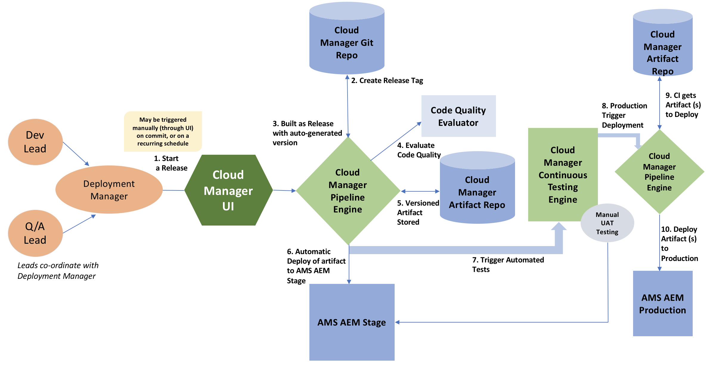

# CI/CD Pipeline{#ci-cd-pipeline}

## Pipeline Overview {#pipeline-overview}

Cloud Manager includes a Continuous Integration (CI) and Continuous Delivery (CD) framework which allows implementation teams to quickly test and deliver new or updated code. For example, implementation teams can set up, configure, and start an automated CI/CD pipeline that leverages Adobe coding best practices to perform a thorough code scan and ensure the highest code quality.

The CI/CD pipeline also automates unit and performance testing processes to increase deployment efficiency and pro-actively identify critical issues that are expensive to fix after deployment. Implementation teams can access a comprehensive code performance report to gain visibility into potential impact on KPIs and critical security validations if the code gets deployed to production.

## Pipeline Process {#pipeline-process}

The following diagram illustrates what happens once a release is triggered in Cloud Manager. The accompanying table explains each step in the workflow.

The following table details what is going on during each step of the process:

| Pipeline Process Step |What is going on? |
|---|---|
| 1. Start a release |A deployment manager triggers a release either manually, with a Git commit or based on a recurring schedule. |
| 2. Create Release tag |Cloud Manager creates a Git tag to mark the release using an automatically generated version number. For example: 2018.531.245527.0000001222 |
| 3. Built as Release with auto-generated version |Cloud Manager builds the application with the newly-assigned version number.  |
| 4. Evaluate Code Quality |Cloud Manager scans the source code and provides a summary before code can be deployed to the stage environment |
| 5. Versioned Artifact(s) Stored |The release artifacts is stored for later usage in the deployment steps. |
| 6. Automatic Deployment of Artifact(s) to AMS AEM Stage |The release artifact is deployed to the stage environment. |
| 7. Trigger Automated Tests |Cloud Manager runs the Performance and Security tests on the artifact. |
| 8. Production Trigger Deployment |After automated tests are complete Cloud Manager starts the deployment to production. |
| 9. Cloud Manager gets Artifacts(s) to Deploy |Cloud Manager pulls the stored release artifacts. |
| 10. Deply Artifacts(s) to Production |The release artifacts are deployed to the Production environment. |

### How to setup a CI/CD Pipeline {#how-to-setup-a-ci-cd-pipeline}

To learn more about pipeline configuration, see [****](../using/configuring-pipeline.md)** [C](../using/configuring-pipeline.md) [onfiguring CI/CD Pipeline](../using/configuring-pipeline.md)**.

## Quality Gates {#quality-gates}

The CI/CD Pipeline provides quality gates, or acceptance criteria, which must be met before the code can be moved from the stage environment to the deployment environment. There are three gates in the pipeline:

* Code Quality
* Performance Testing
* Security Testing

For each of these gates, there are three levels of issues identified:

* Critical - issues identified by the gate which cause an immediate failure of the pipeline.
* Important - issues identified by the gate which cause the pipeline to enter a paused state. A deployment manager, project manager, or business owner can either override the issues, in which case the pipeline proceeds, or they can accept the issues, in which case the pipeline stops with a failure.
* Information - issues identified by the gate which are provided purely for informational purposes and have no impact on the pipeline execution.

The following is an example of a Code Scan with issues identified for the code:

 

### How to setup gates {#how-to-setup-gates}

See ** [Configuring Gates](../using/configuring-pipeline.md)** for details on setting up your code, quality and performance gates.
