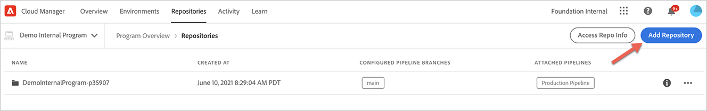
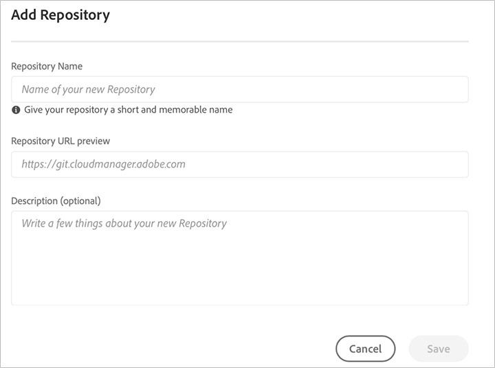
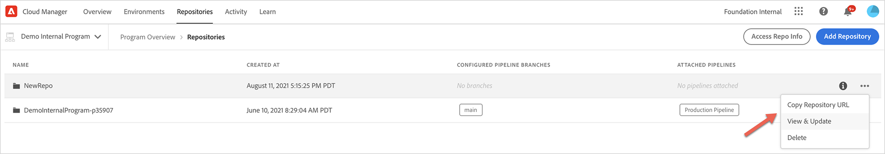

# Cloud Manager Repositories {#cloud-manager-repos} 

Repositories that are created and available in Cloud Manager can be viewed and managed via the Repositories page. 

## Adding and Managing Repositories {#add-manage-repos}

Follow the steps below to view and manage repositories in Cloud Manager:

1. From the **Program Overview** page, click on **Repositories** tab and navigate to the **Repositories** page.

1. Click on **Add Repository** to launch the wizard.

   >[!NOTE]
   >A user in Deployment Manager or Business Owner role must be logged in to be able to add a repository.

   

  
1. Enter the name and description as requested and click on **Save**.

   

1. Select **Save**. Your newly created repo will be displayed in the table, as shown below.

   

   >[!NOTE]
   >Repositories created in Cloud Manager will also be available for you to select from during the add or edit pipeline steps. 

1. You can select the repository and click on the menu options from the far right of the table to **Copy Repository URL**, **View & Update** or **Delete** your repository, as shown in the  figure below.

   


## Git Submodule Support {#git-submodule-support}

Git submodules can be used to merge the content of multiple branches across git repositories at build time. When Cloud Manager's build process executes, after the repository configured for the pipeline is cloned and the configured branch is checked out, if  the branch contains a `.gitmodules` file in the root directory, the command is executed.

```
$ git submodule update --init
```

This will check out each submodule into the appropriate directory. This technique is a potential alternative to [working with multiple source Git repositories](https://experienceleague.adobe.com/docs/experience-manager-cloud-manager/using/managing-code/working-with-multiple-source-git-repos.html) for organizations which are comfortable with using git submodules and do not want to manage an external merging process.

For example, let's say there are three repositories, each containing a single branch named main . In the "primary" repository, i.e. the one configured in the pipelines, the main  branch has a pom.xml file declaring the projects contained in the other two repositories:

```xml
<?xml version="1.0" encoding="UTF-8"?>
<project xmlns="http://maven.apache.org/POM/4.0.0" xmlns:xsi="http://www.w3.org/2001/XMLSchema-instance"
    xsi:schemaLocation="http://maven.apache.org/POM/4.0.0 http://maven.apache.org/maven-v4_0_0.xsd">
    <modelVersion>4.0.0</modelVersion>
   
    <groupId>customer.group.id</groupId>
    <artifactId>customer-reactor</artifactId>
    <version>0.0.1-SNAPSHOT</version>
    <packaging>pom</packaging>
   
    <modules>
        <module>project-a</module>
        <module>project-b</module>
    </modules>
   
</project>
```

You would then add submodules for the other two repositories:

```
$ git submodule add -b main https://git.cloudmanager.adobe.com/ProgramName/projectA/ project-a
$ git submodule add -b main https://git.cloudmanager.adobe.com/ProgramName/projectB/ project-b
```

This results in a `.gitmodules` file that looks like this:

```
[submodule "project-a"]
    path = project-a
    url = https://git.cloudmanager.adobe.com/ProgramName/projectA/
    branch = main
[submodule "project-b"]
    path = project-b
    url = https://git.cloudmanager.adobe.com/ProgramName/projectB/
    branch = main
```

More information on git submodules can be found in the [Git reference manual](https://git-scm.com/book/en/v2/Git-Tools-Submodules).

When using git submodules, please keep these things in mind:

* The Git URL must be exactly in the syntax described above. For security reasons, do not  embed credentials in these URLs.
* Only submodules at the root of the branch are supported.
* Git submodules references are stored to specific git commits. As a result, when changes to the submodule repository are made, the commit referenced needs to be updated, for example, by using `git submodule update --remote`.
* Unless otherwise necessary, it is highly recommended to use "shallow" submodules. To do this, run `git config -f .gitmodules submodule.<submodule path>.shallow true` for each submodule.
