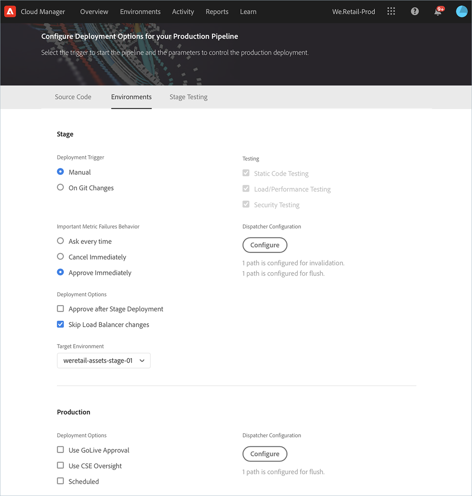
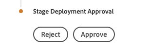
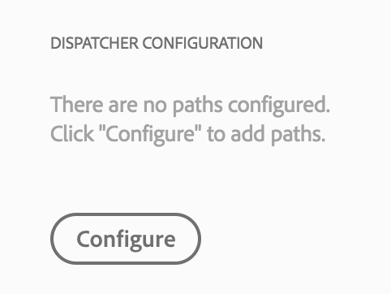

# Configure your CI/CD Pipeline {#configure-your-ci-cd-pipeline}

>[!NOTE]
>To learn how to configure CI/CD Pipeline for Cloud Manager in AEM as a Cloud Service, see [here](https://experienceleague.adobe.com/docs/experience-manager-cloud-service/implementing/using-cloud-manager/configure-pipeline.html?lang=en#using-cloud-manager).

The following page explains how to configure the **Pipeline**. To review more conceptual information on how the pipeline works see the [CI/CD pipeline overview](ci-cd-pipeline.md).

## Video Tutorial {#video-tutorial-one}

### Configuring Pipeline in Cloud Manager {#config-pipeline-video}

The CI/CD Production Pipeline configuration defines the trigger that will initiate the pipeline, parameters controlling the production deployment and performance test parameters.

>[!VIDEO](https://video.tv.adobe.com/v/26314/)

## Understanding the Flow {#understanding-the-flow}

You can configure your pipeline from the **Pipeline Settings** tile in the [!UICONTROL Cloud Manager] UI.

The Deployment Manager is responsible for setting up the pipeline. When doing so, you first select a branch from the **Git Repository**. Pipeline configuration consists of:

* defining the trigger that will start the pipeline.
* defining the parameters controlling the production deployment.
* configuring the performance test parameters.

## Setting up the Pipeline {#setting-up-the-pipeline}

>[!CAUTION]
>
>The pipeline cannot be setup until the Git repository has at least one branch and [Program Setup](setting-up-program.md) is complete.

Before you start to deploy your code, you must configure your pipeline settings from the [!UICONTROL Cloud Manager].

>[!NOTE]
>
>You can change the pipeline settings after initial set up.

### Configuring the Pipeline Settings from [!UICONTROL Cloud Manager] {#configuring-the-pipeline-settings-from-cloud-manager}

Once you have setup your program using [!UICONTROL Cloud Manager] UI, you are ready to setup your pipeline.

Follow these steps to configure the behavior and preferences for your pipeline:

1. Click **Setup Pipeline** to setup and configure your pipeline.

   

1. The **Setup Pipeline** screen displays.

   The three-step wizard allows you to setup your **Branch**, **Environments**, and **Testing** environment. 
   Select your Git branch and click **Next**.
   
   >[!NOTE]
   >
   >Branches found in the Git repository are linked to your program.

1. Access the **Environments** tab to select **Stage** and **Production** options.

   You can define the trigger to start the pipeline:

    * **On Git Changes** - starts the CI/CD pipeline whenever there are commits added to the configured git branch. Even if you select this option, you can always start the pipeline manually.  
    * **Manual** - using the UI manually start the pipeline.

    During pipeline setup or edit, the Deployment Manager has the option of defining the behavior of the pipeline when an important failure is encountered in any of the quality gates such as Code Quality, Security Testing, and Performance Testing.

   This is useful for customers who have the desire for more automated processes. The available options are:

* **Ask every time** - This is the default setting and requires manual intervention on any Important failure.
* **Cancel Immediately** - If selected, the pipeline will be cancelled whenever an Important failure occurs. This is essentially emulating a user manually rejecting each failure.
* **Approve Immediately** - If selected, the pipeline will proceed automatically whenever an Important failure occurs. This is essentially emulating a user manually approving each failure.

  Now you define the parameters controlling the production deployment. The three available options are as follows:

* **Use Go Live Approval** - A deployment must be manually approved by a business owner, project manager, or deployment manager via the [!UICONTROL Cloud Manager] UI.
* **Use CSE Oversight** - A CSE is engaged to actually start the deployment. During pipeline setup or edit when CSE Oversight is enabled, the Deployment Manager has the option of selecting:

  * **Any CSE**: refers to any available CSE  
  * **My CSE**: refers to a specific CSE assigned to the customer or their backup, if the CSE is out of the office

* **Scheduled** - This option allows the user to enable the scheduled production deployment.

 >[!NOTE]
 >If **Scheduled** option is selected, you can schedule your production deployment to the pipeline **after** the stage deployment (and **Use GoLive Approval**, if that has been enabled) to wait for a schedule to be set. The user can also choose to execute the production deployment immediately.
 >
 >Please refer to [**Deploy your Code**](deploying-code.md), to set the deployment schedule or execute the production immediately.

 

>[!NOTE]
>
>The **Use CSE Oversight** option is not available to all customers.

**Approve after Stage Deployment**

There is an optional step **Approve after Stage Deployment** which can be configured in the Production Pipeline. 
This is enabled in a new option on the **Pipeline Edit** screen:

 

It is then shown as a separate step during pipeline execution:

 
  
>[!NOTE]
>
>**Approve after Stage Deployment** functions similarly to the approval before the production deployment, but occurs immediately after the stage deployment step,that is, before any testing is done, compared with the approval before the production deployment, which is done after all testing is complete.

**Dispatcher Invalidation**

As a Deployment Manager, you have the opportunity to configure a set of content paths which will either be **invalidated** or **flushed** from the AEM Dispatcher cache for publish instances, while setting up or editing pipeline.

You can configure a separate set of paths for Stage and Production deployment. If configured, these cache actions will be performed as part of the deployment pipeline step, just after any content packages are deployed. These settings use standard AEM Dispatcher behavior - invalidate performs a cache invalidation, similar to when content is activated from author to publish; flush performs a cache deletion.

In general, the use of the invalidate action is preferable but there may be cases where flushing is required, especially when using AEM HTML Client Libraries.

>[!NOTE]
>
>Please refer to [Dispatcher Overview](dispatcher-configurations.md) get more information on Dispatcher caching.

Follow the steps below to configure Dispatcher Invalidations:

1. Click **Configure** under the Dispatcher Configuration heading

   

1. Enter the path, select the action from **Type**, and click **Add**. You can specify up to 100 paths per environment. Once you have added the paths, click **Apply**.

   

1. Once you are back on the **Pipeline Settings** page, you will see an updated summary of the selections.

   Click **Save** to persist this configuration.

   
    
1. Access the **Testing** tab to define your testing criteria for your program. You can now configure the performance test parameters.

   You can configure *AEM Sites* and *AEM Assets* Performance Testing, depending on which products you have licensed. Refer to [Performance Testing](understand-your-test-results.md#performance-testing) for more details.

1. Click **Save** to complete the setup of pipeline process.

   >[!NOTE]
   >Additionally, once you have setup the pipeline, you can still edit settings for the same using **Production Pipeline Settings** tile from the [!UICONTROL Cloud Manager] UI.

   

## Non-Production & Code Quality Only Pipelines

In addition to the main pipeline which deploys to stage and production, customers are able to set up additional pipelines, referred to as **Non-Production Pipelines**. These pipelines always execute the build and code quality steps. They can optionally also deploy to Adobe Managed Services environment.

## Video Tutorial {#video-tutorial-two}

### Cloud Manager Non-Production & Code Quality Only Pipelines {#non-prod-video}

CI/CD Non-production pipelines are broken into two categories, Code Quality pipelines, and Deployment pipelines. Code Quality pipelines all code from a Git branch to build and be evaluated against Cloud Manager's code quality scan. 

>[!VIDEO](https://video.tv.adobe.com/v/26316/)

### Adding a Non-Production Pipeline {#add-non-production-pipeline}

On the home screen, these pipelines are listed in a new card:

1. Access the **Pipelines** card from the Cloud Manager home screen. Click on **+Add** and select **Add Non-Production Pipeline**. 

   

1. **Add Non-Production Pipeline**  dialog box displays. Select the type of pipeline you want to create, either **Code Quality Pipeline** or **Deployment Pipeline**.

   Additionally, you can also set up **Deployment Trigger** and **Important Failure Behavior** from **Deployment Options**. Click on **Continue**.

   

1. The newly created non-production pipeline now displays in the **Pipelines** card.

   

   The pipeline is shown on the card on the home screen with three actions, as shown below:
   
   * **Add** - allows adding of a new pipeline.
   * **Access Repo Info** - allows the user to get the information necessary to access Cloud Manager Git repository.
   * **Learn More** - navigates to understanding the CI/CD pipeline documentation resource. 

### Editing a Non-Production Pipeline {#editing-nonprod-pipeline}

You can edit the pipeline configurations from the **Pipelines card** from **Program Overview** page. 

Follow the steps below to edit the configured non-production pipeline:

1. Navigate to **Pipelines** card from the **Program Overview** page.

1. Select the non-production pipeline and click on **...**. Click on **Edit**, as shown in the figure below.

   

1. The **Edit Production Pipeline** dialog box displays that allows you to update the **Pipeline Name**, **Repository**, **Git Branch**, **Deployment Trigger**, and **Important Metrics Failure Behavior**.

   
   
      >[!NOTE]
      >See [Adding and Managing Repositories](/help/implementing/cloud-manager/managing-code/cloud-manager-repositories.md) to learn how to add and manage repositories in Cloud Manager.

1. Click on **Update** once you are done editing the non-production pipeline.

## The Next Steps {#the-next-steps}

Once you have configured the pipeline, you need to deploy your code.

Please see [Deploy your Code](deploying-code.md) for more details.
