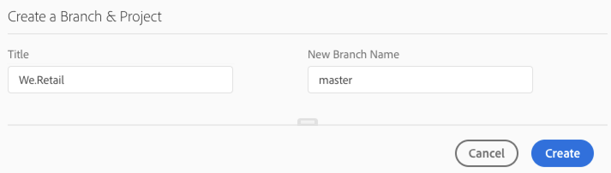

# Create an AEM Application Project {#create-an-aem-application-project}

## Using Wizard to Create an AEM Application Project {#using-wizard-to-create-an-aem-application-project}

When customers are on-boarded to Cloud Manager, they are provided with an empty git repository. Current Adobe Managed Services (AMS) customers (or on-premise AEM customers who are migrating to AMS) will generally already have their project code in git (or another version control system) and will import their project into the Cloud Manager git repository. New customers, however, do not have existing projects.

To help get new customers started, Cloud Manger is now able to create a minimal AEM project as a starting point. This process is based on the [**AEM Project Archetype**](https://github.com/Adobe-Marketing-Cloud/aem-project-archetype).

<!-- 

Comment Type: annotation
Last Modified By: jsyal
Last Modified Date: 2018-10-08T12:52:50.071-0400

2018.8.0: Added this new section

 -->

Follow the steps below to create an AEM application project in Cloud Manager:

1. Once you log in to Cloud Manager and the basic program setup is complete, a special call to action card will be shown on the **Overview** screen, if the repository is empty.

   

1. Click **Create** to navigate to the **Pipeline Setup** screen.

   

1. Click **Create to** open a dialog box, which allows the user to provide the parameters required by the AEM Project Archetype. In its default form, the dialog box asks for two values:

    * **Title** - by default this is set to the *Program Name*
    
    * **New Branch Name** - by default this is *master*

   

   The dialog box has a drawer which can be opened by clicking on the handle toward the bottom of the dialog. In its expanded form, the dialog shows all of the configuration parameters for the Archetype. Many of these parameters have default values which are generated based on the **Title**.

   

   >[!NOTE]
   >
   >For example, if the **Title** is ***We.Finance***, the Base Maven Artifact Id parameter is generated as ***com.wefinance***. These values can be changed, if desired.
   >
   >
   >For example, you can change from the generated ***value com.wefinance*** to ***net.wefinance***.

1. Click **Create** in the preceding step to create the starter project by using the archetype and commit to the named git branch. Once this is done, you can set up the pipeline.

## Setting up your Project {#setting-up-your-project}

### Modifying Project Setup Details {#modifying-project-setup-details}

In order to be built and deployed successfully with Cloud Manager, existing AEM projects need to adhere to some basic rules:

* Projects must be built using Apache Maven.
* There must be a *pom.xml* file in the root of the Git repository. This *pom.xml* file can refer to as many submodules (which in turn may have other submodules, etc.) as necessary.

* You can add references to additional Maven artifact repositories in your *pom.xml* files. However, access to password-protected or network-protected artifact repositories is not supported.
* Deployable content packages are discovered by scanning for content package *zip* files which are contained in a directory named *target*. Any number of submodules may produce content packages.

* Deployable Dispatcher artifacts are discovered by scanning for *zip* files (again, contained in a directory named *target*) which have directories named *conf* and *conf.d*.

* If there is more than one content package, the ordering of package deployments is not guaranteed. Should a specific order be needed, content package dependencies can be used to define the order. Packages may be [skipped](#skipping-content-packages) from deployment.

<!-- 

Comment Type: annotation
Last Modified By: jsyal
Last Modified Date: 2018-10-08T09:20:10.106-0400

2018.8.0: added existing in the opening sentence

 -->

## Build Environment Details {#build-environment-details}

Cloud Manager builds and tests your code using a specialized build environment. This environment has the following attributes:

* The build environment is Linux-based, derived from Ubuntu 18.04.
* Apache Maven 3.6.0 is installed.
* The Java version installed is Oracle JDK 8u202.
* There are some additional system packages installed which are necessary:

    * bzip2
    * unzip
    * libpng
    * imagemagick
    * graphicsmagick

* Other packages may be installed at build time as described [below](#installing-additional-system-packages).
* Every build is done on a pristine environment; the build container does not keep any state between executions.
* Maven is always run with the command: *mvn --batch-mode clean org.jacoco:jacoco-maven-plugin:prepare-agent package*
* Maven is configured at a system level with a settings.xml file which automatically includes the public Adobe **Artifact** repository. (Refer to [Adobe Public Maven Repository](https://repo.adobe.com/) for more details).


## Environment Variables {#environment-variables}

### Standard Environment Variables {#standard-environ-variables}

In some cases, customers find it necessary to vary the build process based on information about the program or pipeline. 

For example, if build-time JavaScript minification is being done, through a tool like gulp, there may be a desire to use a different minification level when building for a dev environment as opposed to building for stage and production. 

To support this, Cloud Manager adds these standard environment variables to the build container for every execution.

| **Variable Name** | **Definition** |
|---|---|
| CM_BUILD |  Always set to "true" | 
| BRANCH | The configured branch for the execution  |
| CM_PIPELINE_ID |  The numeric pipeline identifier | 
| CM_PIPELINE_NAME |  The pipeline name | 
| CM_PROGRAM_ID |  The numeric program identifier | 
| CM_PROGRAM_NAME |  The program name | 
| ARTIFACTS_VERSION |  For a stage or production pipeline, the synthetic version generated by Cloud Manager | 

### Custom Environment Variables {#custom-environ-variables}

In some cases, a customer's build process may depend upon specific configuration variables which would be inappropriate to place in the git repository. Cloud Manager allows for these variables to be configured by a Customer Success Engineer (CSE) on a customer-by-customer basis. These variables are stored in a secure storage location and are only visible in the build container for the specific customer. Customers wishing to use this feature need to contact their CSE to configure their variables.

Once configured, these variables will be available as environment variables. In order to use them as a Maven properties, you can reference them inside your pom.xml file, potentially within a profile as described above:

```xml
        <profile>
            <id>cmBuild</id>
            <activation>
                  <property>
                        <name>env.CM_BUILD</name>
                  </property>
            </activation>
            <properties>
                  <my.custom.property>${env.MY_CUSTOM_PROPERTY}</my.custom.property>  
            </properties>
        </profile>
```

>[!NOTE]
>
>Environment variable names may only contain alphanumeric and underscore (_) characters. By convention, the names should be all upper-case.

## Activating Maven Profiles in Cloud Manager {#activating-maven-profiles-in-cloud-manager}

In some limited cases, you may need to vary your build process slightly when running inside Cloud Manager as opposed to when it runs on developer workstations. For these cases, [Maven Profiles](https://maven.apache.org/guides/introduction/introduction-to-profiles.html) can be used to define how the build should be different in different environments, including Cloud Manager.

Activation of a Maven Profile inside the Cloud Manager build environment should be done by looking for CM_BUILD environment variable described above. Conversly, a profile intended to be used only outside of the Cloud Manager build environment should be done by looking for the absense of this variable.

For example, if you wanted to output a simple message only when the build is run inside Cloud Manager, you would do this:

```xml
        <profile>
            <id>cmBuild</id>
            <activation>
                  <property>
                        <name>env.CM_BUILD</name>
                  </property>
            </activation>
            <build>
                <plugins>
                    <plugin>
                        <artifactId>maven-antrun-plugin</artifactId>
                        <version>1.8</version>
                        <executions>
                            <execution>
                                <phase>initialize</phase>
                                <configuration>
                                    <target>
                                        <echo>I'm running inside Cloud Manager!</echo>
                                    </target>
                                </configuration>
                                <goals>
                                    <goal>run</goal>
                                </goals>
                            </execution>
                        </executions>
                    </plugin>
                </plugins>
            </build>
        </profile>
```

>[!NOTE]
>
>To test this profile on a developer workstation, you can either enable it on the command line (with `-PcmBuild`) or in your Integrated Development Environment (IDE).

And if you wanted to output a simple message only when the build is run outside of Cloud Manager, you would do this:

```xml
        <profile>
            <id>notCMBuild</id>
            <activation>
                  <property>
                        <name>!env.CM_BUILD</name>
                  </property>
            </activation>
            <build>
                <plugins>
                    <plugin>
                        <artifactId>maven-antrun-plugin</artifactId>
                        <version>1.8</version>
                        <executions>
                            <execution>
                                <phase>initialize</phase>
                                <configuration>
                                    <target>
                                        <echo>I'm running outside Cloud Manager!</echo>
                                    </target>
                                </configuration>
                                <goals>
                                    <goal>run</goal>
                                </goals>
                            </execution>
                        </executions>
                    </plugin>
                </plugins>
            </build>
        </profile>
```


## Installing Additional System Packages {#installing-additional-system-packages}

Some builds require additional system packages to be installed to function fully. For example, a build may invoke a Python or ruby script and, as a result, need to have an appropriate language interpreter installed. This can be done by calling the [exec-maven-plugin](https://www.mojohaus.org/exec-maven-plugin/) to invoke APT. This execution should generally be wrapped in a Cloud Manager-specific Maven profile. For example, to install python:

```xml
        <profile>
            <id>install-python</id>
            <activation>
                <property>
                        <name>env.CM_BUILD</name>
                </property>
            </activation>
            <build>
                <plugins>
                    <plugin>
                        <groupId>org.codehaus.mojo</groupId>
                        <artifactId>exec-maven-plugin</artifactId>
                        <version>1.6.0</version>
                        <executions>
                            <execution>
                                <id>apt-get-update</id>
                                <phase>validate</phase>
                                <goals>
                                    <goal>exec</goal>
                                </goals>
                                <configuration>
                                    <executable>apt-get</executable>
                                    <arguments>
                                        <argument>update</argument>
                                    </arguments>
                                </configuration>
                            </execution>
                            <execution>
                                <id>install-python</id>
                                <phase>validate</phase>
                                <goals>
                                    <goal>exec</goal>
                                </goals>
                                <configuration>
                                    <executable>apt-get</executable>
                                    <arguments>
                                        <argument>install</argument>
                                        <argument>-y</argument>
                                        <argument>--no-install-recommends</argument>
                                        <argument>python</argument>
                                    </arguments>
                                </configuration>
                            </execution>
                        </executions>
                    </plugin>
                </plugins>
            </build>
        </profile>
```

This same technique can be used to install language specific packages, i.e. using `gem` for RubyGems or `pip` for Python Packages.

>[!NOTE]
>
>Installing a system package in this manner does **not** install it in the runtime environment used for running Adobe Experience Manager. If you need a system package installed on the AEM environment, contact your Customer Success Engineers (CSE).

## Skipping Content Packages {#skipping-content-packages}

In Cloud Manager, builds may produce any number of content packages. 
For a variety of reasons, it may be desirable to product a content package but not deploy it. This may be useful, for example, when building content packages used only for testing or which will be repackaged by another step in the build process, that is, as a sub-package of another package. 

To accommodate these scenarios, Cloud Manager will look for a property named ***cloudManagerTarget*** in the properties of built content packages. If this property is set to none, the package will be skipped and not deployed. The mechanism to set this property depends upon the way the build is producing the content package. For example, with the filevault-maven-plugin you would configure the plugin like this:

```xml
        <plugin>
            <groupId>org.apache.jackrabbit</groupId>
            <artifactId>filevault-package-maven-plugin</artifactId>
            <extensions>true</extensions>
            <configuration>
                <properties>
                    <cloudManagerTarget>none</cloudManagerTarget>
                </properties>
        <!-- other configuration -->
            </configuration>
        </plugin>
```

With the content-package-maven-plugin it is similar:

```xml
        <plugin>
            <groupId>com.day.jcr.vault</groupId>
            <artifactId>content-package-maven-plugin</artifactId>
            <extensions>true</extensions>
            <configuration>
                <properties>
                    <cloudManagerTarget>none</cloudManagerTarget>
                </properties>
        <!-- other configuration -->
            </configuration>
        </plugin>
```

## Develop your Code Based on Best Practices {#develop-your-code-based-on-best-practices}

Adobe Engineering and Consulting teams have developed a [comprehensive set of best practices for AEM developers](https://helpx.adobe.com/experience-manager/6-4/sites/developing/using/best-practices.html).
