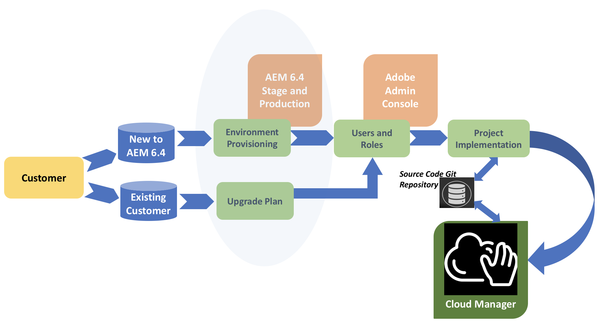

# Customer Journey{#customer-journey}

As a customer, you may be new to Adobe Experience Manager (AEM), currently using AEM 6.4, or may need to upgrade to the AEM 6.4 release in order to use Cloud Manager. The following scenarios explain your journey as a new or existing customer to get started with Cloud Manager.

>[!NOTE]
>
>Cloud Manager is only available to Adobe Managed Services customers using AEM 6.4 or above.

## On-boarding to Cloud Manager {#on-boarding-to-cloud-manager}

*a) New AEM Customer on Adobe Managed Services*

As a new customer, you will be on-boarded to Cloud Manager as part of the on-boarding process to the Adobe managed cloud service.

The URL to access Cloud Manager will be included in the welcome email, along with the instructions to login to Experience Cloud, and use the Adobe Admin Console for managing your users and their respective permisions, for those users who need to access Cloud Manager.

*b) Existing AEM Customer on Adobe Managed Services*

As an existing customer, you will first need to upgrade your existing production and non-production environments to the AEM 6.4 release. At the same time you will perform the upgrade, you will be on-boarded and provided with the URL to access Cloud Manager. Additionally, you will need to start using the Adobe Admin Console for managing your users and their respective permisions, for those users who need to access Cloud Manager.

Your existing AEM project will also need to conform to the recommended best practices, as you will start using Cloud Manager for deploying new code changes to your AEM environments.

To get additional information on the benefits of upgrading to AEM 6.4, see [Upgrading to AEM 6.4](/content/help/en/experience-manager/6-4/sites/deploying/using/upgrade).

## Accessing Cloud Manager {#accessing-cloud-manager}

You will get acces to Cloud Manager and your AEM environments by simply logging in to the Experience Cloud landing page, using your Adobe Identity Management credentials, and selecting AEM from the solution switcher interface.

After logging in Cloud Manager for the first time, you will have access to your AEM environments directly from the Cloud Manager UI. At this point, you are ready to explore all the possibilities of Cloud Manager, once you have your first code branch ready to be deployed to your stage and production environments.

To explore and get started with Cloud Manager, see [First Time Login](../using/first-time-login.md). For additional information about AEM, see [Getting Started with AEM 6.4](/content/help/en/experience-manager/6-4/sites/deploying/using/deploy). Additionally, refer to [AEM Resources](https://www.adobe.com/marketing-cloud/experience-manager/resources.html?promoid=759X6WV8&mv=other) for further information.

## Getting started with Cloud Manager {#getting-started-with-cloud-manager}

Once you are logged in to Cloud Manager, the first thing to do will be to to set up your code repository environment, then your team and roles. Specificically, the role memberships are assigned by adding the user to a Cloud Manager profile using the Admin Console UI.

Next, you have to set up your source code branches in the **Git Repository**, define your goals in terms of load and performance KPIs, and test scenarios to successfully deploy your code to your stage and production environments once all the quality checks have passed successfully.

## End to End journey {#end-to-end-journey}

The following diagram illustrates the customer journey at a high level, when using Cloud Manager CI/CD pipeline for deploying your code changes to your stage and production environments.

