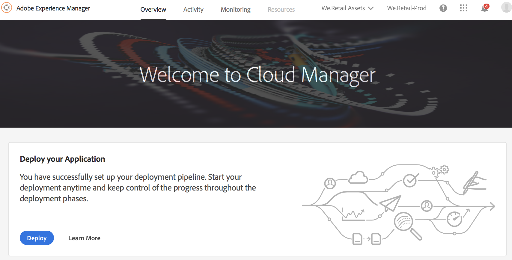
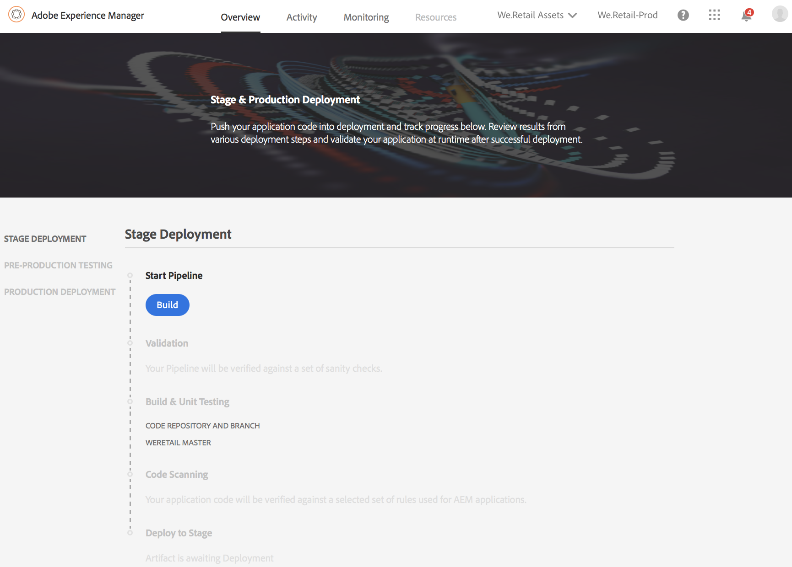
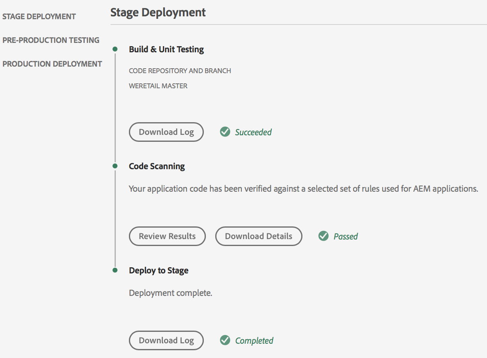
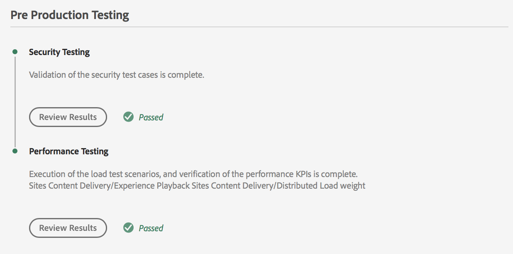
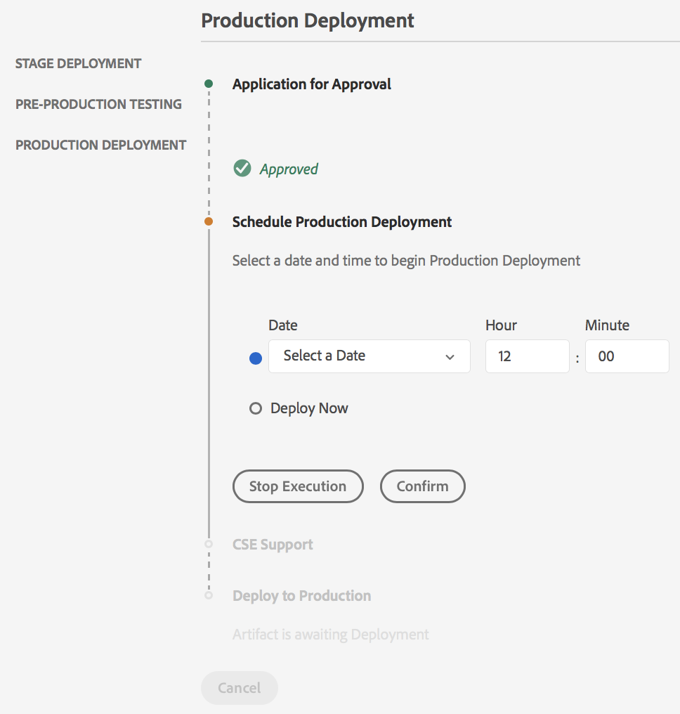
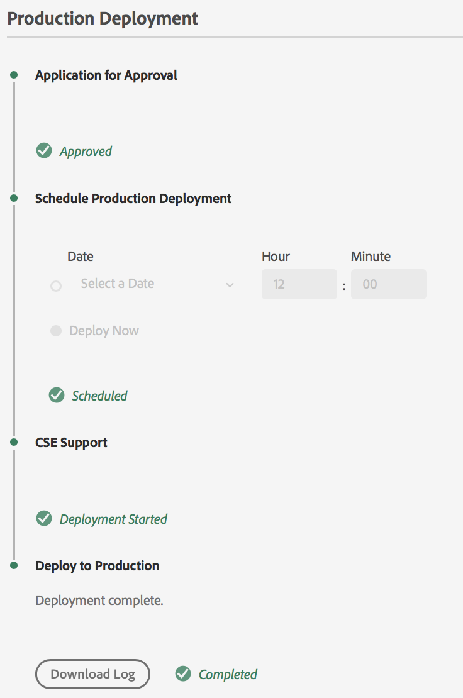

# Deploy your Code{#deploy-your-code}

## Deploying Code with Cloud Manager {#deploying-code-with-cloud-manager}

Once you have configured your **Pipeline** (repository, environment, and testing environment), you are ready to deploy your code.

1. Click **Deploy** from the Cloud Manager to start the deployment process.

   

1. The **Pipeline Execution** screen displays.

   Click **Build** to start the process.

   

1. The complete build process deploys your code.

   The following stages are involved in the build process:

    1. Stage Deployment
    1. Pre-Production Testing
    1. Production Deployment

   >[!NOTE]
   >
   >Additionally, you can review the steps from various deployment processes by viewing logs, or reviewing results, for the testing criteria.

   The** Stage Deployment**, involves the following steps:

    * Build & Unit Testing
    * Code Scanning
    * Deploy to Stage

   

   The** Pre-Production Testing**, involves the following steps:

    * Security Testing
    * Performance Testing

   

   The** Production Deployment**, involves the following steps:

    * **Application for Approval **(if enabled)
    * **Schedule Production Deployment **(if enabled)** 
      **
    
    * **CSE Support **(if enabled)
    * **Deploy to Production**

   >[!NOTE]
   >
   >The **Schedule Production Deployment **is enabled while configuring the pipeline.
   >
   >
   >Using this option, you can either schedule your production delpoyment or click **Deply Now** to execute the production deployment immediately.
   >
   >
   >The scheduled date and time is specified in terms of the user's timezone.
   >
   >
   >Click **Confirm** to verify your settings.

   

   Once you confirm the deployment schedule, your code deployment completes.

   The following screen displays, when the **Deploy Now** option is selected from the above step.

   

