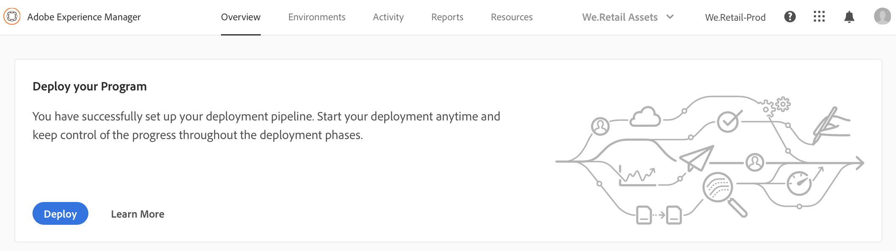
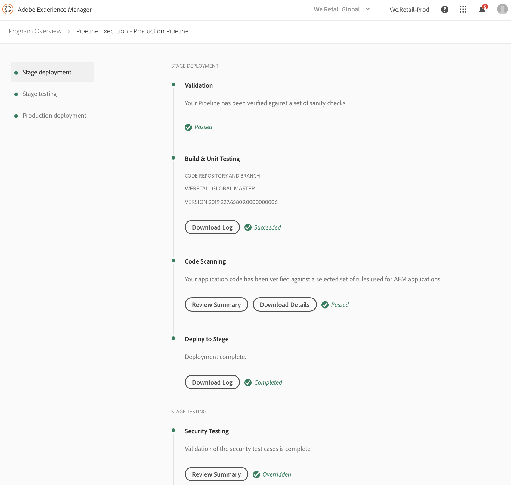
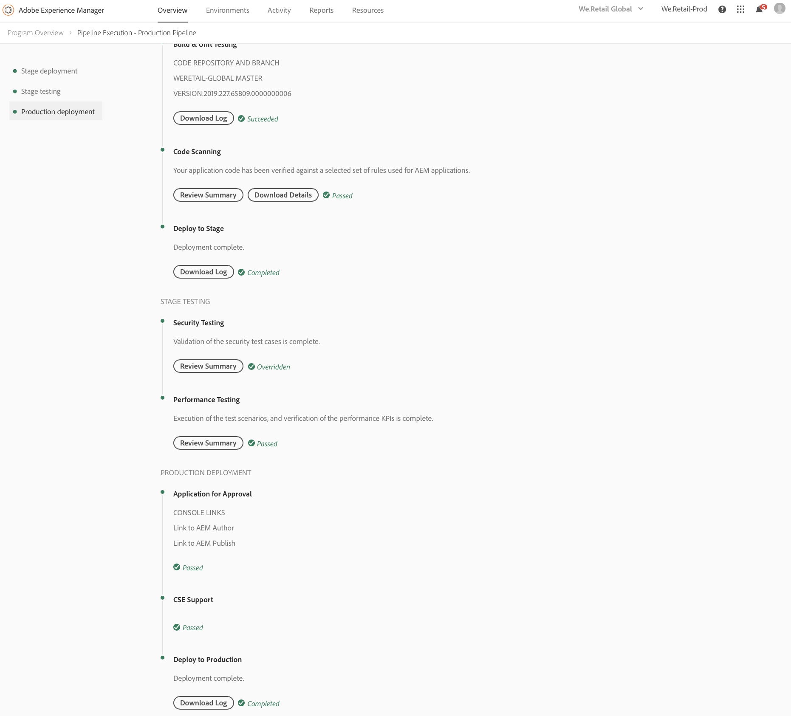
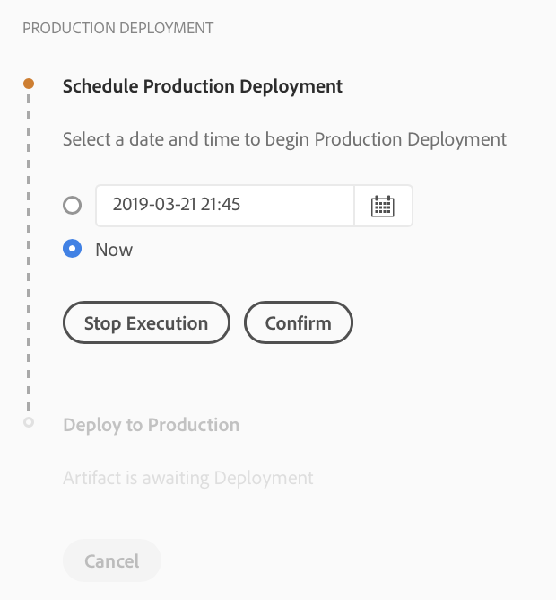
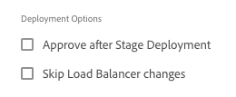

# Deploy your Code {#deploy-your-code}

## Deploying Code with Cloud Manager {#deploying-code-with-cloud-manager}

Once you have configured your **Pipeline** (repository, environment, and testing environment), you are ready to deploy your code.

1. Click **Deploy** from the Cloud Manager to start the deployment process.

   

1. The **Pipeline Execution** screen displays.

   Click **Build** to start the process.

   

1. The complete build process deploys your code.

   The following stages are involved in the build process:

    1. Stage Deployment
    1. Stage Testing
    1. Production Deployment

   >[!NOTE]
   >
   >Additionally, you can review the steps from various deployment processes by viewing logs, or reviewing results, for the testing criteria.

   The **Stage Deployment**, involves the following steps:

    * Build & Unit Testing
    * Code Scanning
    * Deploy to Stage

   

   The **Stage Testing**, involves the following steps:

    * Security Testing
    * Performance Testing

   

   The **Production Deployment**, involves the following steps:

    * **Application for Approval** (if enabled)
    * **Schedule Production Deployment** (if enabled)
    * **CSE Support** (if enabled)
    * **Deploy to Production**

   

   >[!NOTE]
   >
   >The **Schedule Production Deployment** is enabled while configuring the pipeline.
   >
   >
   >Using this option, you can either schedule your production delpoyment or click **Now** to execute the production deployment immediately.
   >
   >
   >The scheduled date and time is specified in terms of the user's timezone.
   >
   >
   >Click **Confirm** to verify your settings.

   

   Once you confirm the deployment schedule, your code deployment completes.

   The following screen displays, when **Now** option is selected from the above step.

   

## Deployment Process {#deployment-process}

The following section describes how AEM and dispatcher packages are deployed in the stage phase and in the production phase.

Cloud Manager uploads all target/*.zip files produced by the build process to a storage location.  These artifacts are retrieved from this location during the deploy phases of the pipeline.

When Cloud Manager deploys to non-production topologies, the goal is to complete the deployment as quickly as possible and therefore the artifacts are deployed to all nodes simultaneously as follows:

1. Cloud Manager determines whether each artifact is an AEM or dispatcher package.
1. Cloud Manager removes all dispatchers from the Load Balancer to isolate the environment during the deployment.

   Unless configured otherwise you can skip Load Balancer Changes in Dev and Stage Deployments, that is, detach and attach steps in both non-production pipelines, for dev environments, and the production pipeline, for stage environments.

   

   >[!NOTE]
   >
   >This feature is expected to be primarily used by 1-1-1 customers.

1. Each AEM artifact is deployed to each AEM instance via Package Manager APIs, with package dependences determining the deployment order.

   To learn more about how you can use packages to install new functionality, transfer content between instances, and back up repository content, please refer to How to Work with Packages.

   >[!NOTE]
   >
   >All AEM artifacts are deployed to both the author and the publishers. Runmodes should be leveraged when node-specific configurations are required. To learn more about how the runmodes allow you to tune your AEM instance for a specific purpose, please refer to Run Modes.

1. The dispatcher artifact is deployed to each dispatcher as follows:

   1. Current configs are backed up and copied to a temporary location
   1. All configs are deleted except the immutable files. Refer to Manage your Dispatcher Configurations for more details. This clears the directories to ensure no orphaned files are left behind.
   1. The artifact is extracted to the httpd directory.  Immutable files are not overwritten. Any changes you make to immutable files in your git repository will be ignored at the time of deployment.  These files are core to the AMS dispatcher framework and cannot be changed.
   1. Apache performs a config test. If no errors are found, the service is reloaded. If an error occurs, the configs are restored from backup, the service is reloaded, and the error is reported back to Cloud Manager.
   1. Each path specified in the pipeline configuration is invalidated or flushed from the dispatcher cache.
   
   >[!NOTE]
   >
   >Cloud Manager expects the dispatcher artifact to contain the full file set.  All dispatcher configuration files must be present in the git repository. Missing files or folders will result in deployment failure.

1. Following the successful deployment of all AEM and dispatcher packages to all nodes, the dispatchers are added back to the load balancer and the deployment is complete.

   >[!NOTE]
   >
   >You can skip load lalancer changes in development and stage deployments, that is, detach and attach steps in both non-production pipelines, for developer environments, and the production pipeline, for stage environments. 

### Deployment to Production Phase {#deployment-production-phase}

The process for deploying to production topologies differs slightly in order to minimize impact to AEM Site visitors. 

Production deployments generally follow the same steps as above, but in a rolling manner:

1. Deploy AEM packages to author.
1. Detach dispatcher1 from the load balancer.
1. Deploy AEM packages to publish1 and the dispatcher package to dispatcher1, flush dispatcher cache.
1. Put dispatcher1 back into the load balancer.
1. Once dispatcher1 is back in service, detach dispatcher2 from the load balancer.
1. Deploy AEM packages to publish2 and the dispatcher package to dispatcher2, flush dispatcher cache.
1. Put dispatcher2 back into the load balancer.
This process continues until the deployment has reached all publishers and dispatchers in the topology.

