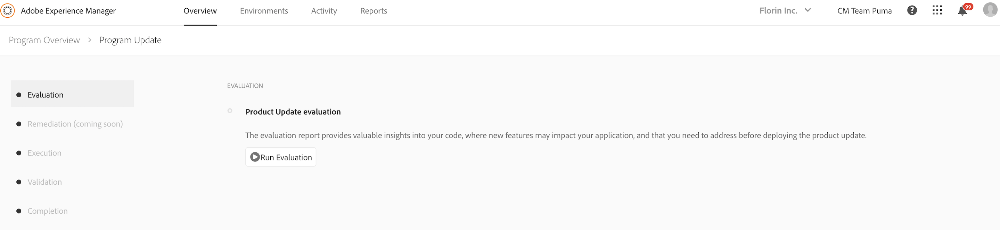

# Evaluation Phase {#evaluation}

Once you click **[!UICONTROL Start Update]**, the first phase in Product Update Wizard is the Evaluation phase. In this phase, you can assess the upgrade complexity with the pattern detector accessible to you directly from the wizard. At the end of this step, you will have access to the evaluation report.

The generated report allows you to check the Author instance for upgradability by detecting patterns that:

* Violate certain rules and are done in areas that will be affected or overwritten by the upgrade.

* Use an AEM 6.x feature or an API that is not backwards compatible on the new AEM and can potentially break after upgrade.

This serves as an assessment of the development effort that is involved in upgrading to Adobe Experience Manager (AEM) 6.5.

>[!NOTE]
   >To learn more about pattern detector, refer to [Assessing the Upgrade Complexity with the Pattern Detector](https://helpx.adobe.com/experience-manager/6-4/sites/deploying/using/pattern-detector.html)

## Running the Evaluator {#running-evaluator}

Follow the steps below to run the evaluator:

1. Select **[!UICONTROL Run Evaluation]** to run the pattern detector. The pattern detector can run on any environment. However, in order to increase detection rate and avoid any slowdowns on business critical instances, Cloud Manager will run it on staging environment on the author instance.

1. The wizard informs you the status of your action. You will notice **In progress** or **completed** as applicable when the evaluation report is being generated.

Once the report is generated, you can select [!UICONTROL Download] to save a copy of the evaluation report.

>[!NOTE]
   >The other four phases succeeding **Evaluation** namely **Remediation**, **Execution**, **Validation**, and **Completion** are coming soon and are not available in the current release.
