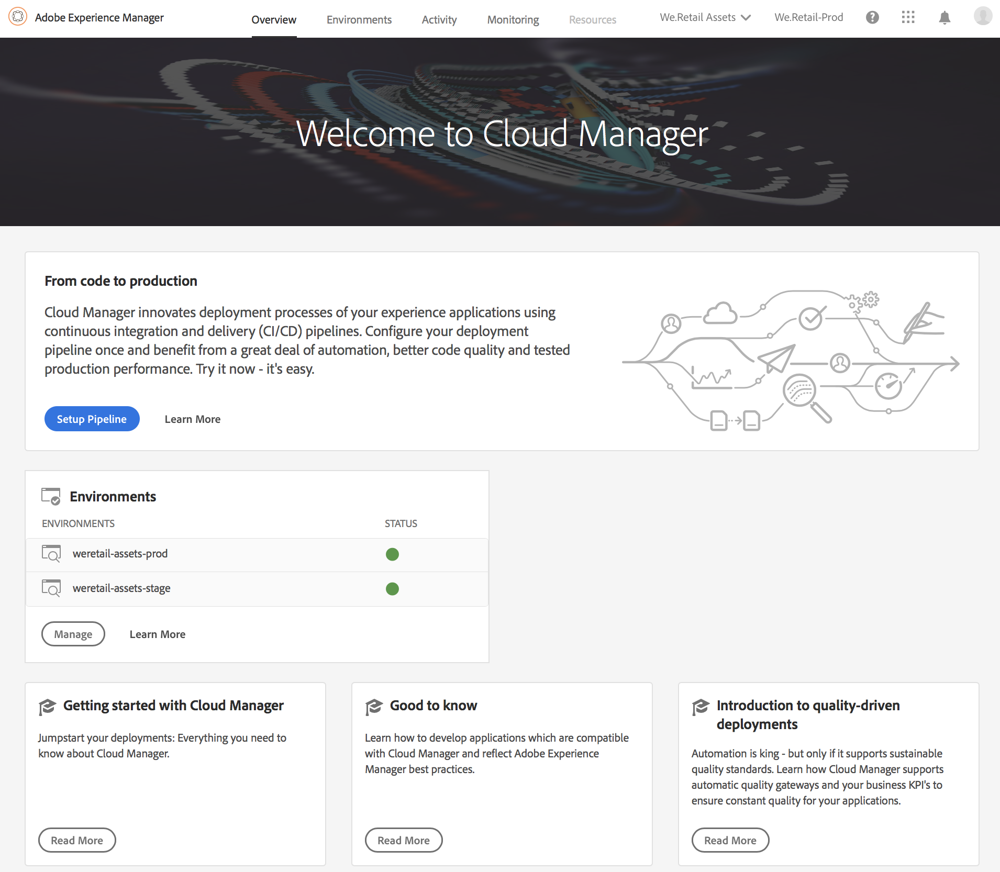

# First Time Login{#first-time-login}

Once you have setup the general configurations for Cloud Manager, you are ready to use the User Interface (UI) for Cloud Manager.

>[!NOTE]
>
>Depending on the roles assigned in Cloud Manager and the state of the application, you will see different screens while using Cloud Manager UI.

## Logging in for the First Time {#logging-in-for-the-first-time}

1. Log in to the **Adobe [!UICONTROL Experience Cloud]** and you will see the list of **Programs**.

   

1. Select the program (for example, **We.Retail Global**) and click on the top left icon to open Cloud Manager.

   

1. The dashboard for Cloud Manager displays.

   

1. Click **Setup Program** for setting the **Program** description and defining the Key Performance Indicators (KPIs).

   >[!NOTE]
   >
   >Please see [Setup your Program](/using/setting-up-program.htmlchl-author.corp.a/content/help/en/experience-manager/cloud-manager/using/setting-up-program) to complete the next steps.

