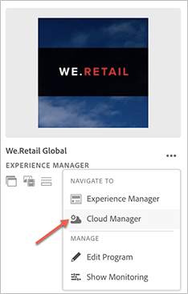

# First Time Login {#first-time-login}

Once you have setup the general configurations for [!UICONTROL Cloud Manager], you are ready to use the User Interface (UI) for [!UICONTROL Cloud Manager].

>[!NOTE]
>Depending on the roles assigned in [!UICONTROL Cloud Manager] and the state of the application, you will see different screens while using [!UICONTROL Cloud Manager] UI.

## Logging in for the First Time {#logging-in-for-the-first-time}

1. Log in to the **Adobe [!UICONTROL Experience Cloud]** and you will see the list of **Programs**.

1. Select the program (for example, **We.Retail Global**). Once you see your program card on the landing page, select the **...** to see menu options available to you.   Select **Cloud Manager** to navigate to the Cloud Manager's **Overview** page. 

   

1. The Cloud Manager's **Overview** page displays.

   

1. Click **Setup Program** for setting the **Program** description and defining the Key Performance Indicators (KPIs).

   >[!NOTE]
   >
   >Please see [Setup your Program](https://helpx.adobe.com/experience-manager/cloud-manager/using/setting-up-program.html) to complete the next steps.

## Video Tutorial {#video-tutorial-two}

### Cloud Manager Activity tab {#activity-video}

Cloud Manager provides a consolidated view into a Program's activity, listing all CI/CD Pipeline executions, both production and non-production, allowing visibility into the past and present activity, and any activity's Details can be reviewed.

>[!VIDEO](https://video.tv.adobe.com/v/26313/)
