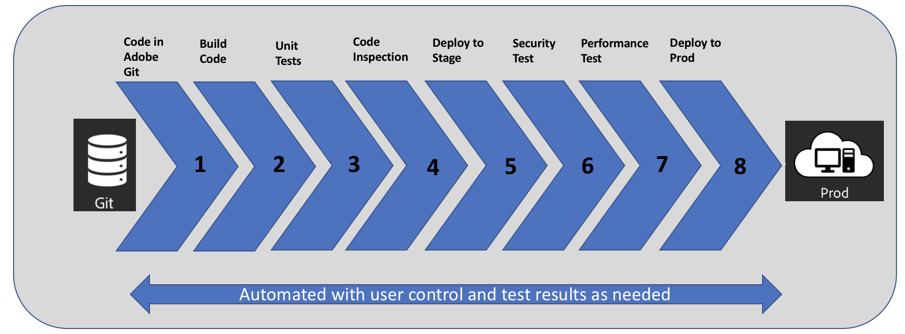

# Introduction to [!UICONTROL Cloud Manager]{#introduction-to-cloud-manager}

>[!CONTEXTUALHELP]
>id="aemcloud_cloudmanager_introduction"
>title="Introduction to Cloud Manager"
>abstract="Enables organizations to self-manage Experience Manager in the cloud. It includes a continuous integration and continuous delivery (CI/CD) framework that lets IT teams and implementation partners expedite the delivery of customizations or updates without compromising performance or security."
>additional-url="https://experienceleague.adobe.com/docs/experience-manager-learn/cloud-service/cloud-manager/programs.html?lang=en#cloud-manager" text="Create Programs"
>additional-url="https://experienceleague.adobe.com/docs/experience-manager-learn/cloud-service/cloud-manager/environments.html?lang=en#cloud-manager" text="Create Environments"

## Introduction {#introduction}

[!UICONTROL Cloud Manager], part of Adobe Experience Manager (AEM) in Cloud, enables organizations to self-manage Experience Manager in the cloud. It includes a continuous integration and continuous delivery (CI/CD) framework that lets IT teams and implementation partners expedite the delivery of customizations or updates without compromising performance or security.

This documentation site specifically describes the features and functions of Cloud Manager available to Adobe Managed Services (AMS) customers. Documentation on Cloud Manager features and functions for AEM as a Cloud Service customers can be found in the [Experience Manager as a Cloud Service User Guides](https://experienceleague.adobe.com/docs/experience-manager-cloud-service/landing/home.html?lang=en).

Using the [!UICONTROL Cloud Manager] self-service customer portal, **Organizations** can perform/leverage the following:

* **Continuous Integration / Continuous Delivery** of code to reduce time to market from months/weeks to days/hours.
* **Code Inspection, performance testing and security validation** based on best practices before pushing to production to minimize production disruptions.
* **Automatic, scheduled or manual deployment** even outside of business hours for maximum flexibility and control.
* **Autoscaling** feature intelligently detects the need for increased capacity and automatically brings online additional Dispatcher/Publish segment(s).

The following image illustrates the CI/CD process flow used in [!UICONTROL Cloud Manager]:

 

## Key Features in [!UICONTROL Cloud Manager] {#key-features-in-cloud-manager}

Organizations can take advantage of the following features, with [!UICONTROL Cloud Manager]:

### Self-Service Interface {#self-service-interface}

The User Interface (UI) for [!UICONTROL Cloud Manager] enables customers to easily access and manage the cloud environment and CI/CD pipeline for their Experience Manager applications.

Customers define application-specific Key Performance Indicators (KPIs) - peak page views per minute and expected response time for a page load, that ultimately form the basis for measuring a successful deployment. Roles and permissions for different team members can be easily defined. While the new self-service interface puts the control back in your hands, it also offers links to best practices and access to experts within Adobe who can provide the necessary guidance as needed.

To explore and get started with [!UICONTROL Cloud Manager]'s UI, see [First Time Login](https://helpx.adobe.com/experience-manager/cloud-manager/using/first-time-login.html).

### CI/CD Pipeline {#ci-cd-pipeline}

One of the key capabilities of [!UICONTROL Cloud Manager] is the ability to exercise an optimized CI/CD pipeline to speed the delivery of custom code or updates such as adding new components on the website.

Through the [!UICONTROL Cloud Manager] UI, customers can configure and kick off their CI/CD pipeline. During this pipeline, a thorough code scan is executed to ensure that only high-quality applications pass through to the production environment.

To learn more about configuring pipeline from [!UICONTROL Cloud Manager]'s UI, see [Configure your CI/CD Pipeline](https://helpx.adobe.com/experience-manager/cloud-manager/using/configuring-pipeline.html).

### Flexible Deployment Modes {#flexible-deployment-modes}

[!UICONTROL Cloud Manager] offers customers flexible and configurable deployment modes so they can deliver experiences according to changing business demands.

With an automatic trigger mode, the code is automatically deployed to an environment based on specific events such as code commit. You can also schedule code deployments during specified time frames, even outside business hours.

Independently of the deployment trigger, quality checks are always performed as part of the CI/CD pipeline execution, every time a deployment is triggered. Quality checks include, code inspection, security testing, and performance testing delivered out of the box with literally no effort required from customers or their partners.

To learn more about deploying code and quality checks, see [Deploy your Code](deploying-code.md)

### Autoscaling {#autoscaling}

[!UICONTROL Cloud Manager] detects the need for additional capacity when the production environment is subject to unusually high load and automatically brings additional capacity online via autoscaling feature.

During an autoscaling event, [!UICONTROL Cloud Manager] automatically triggers the autoscaling provisioning process, sends a notification of the autoscaling event, and brings on-line the additional capacity within minutes. The additional capacity will be provisioned in the production environment, in the same region(s) and matching the same system specifications as the running Dispatcher/Publish nodes.

The autoscaling feature will apply only to the Dispatcher/Publish tier, and will always be executed using a horizontal scaling method, with a minimum of one additional segment of a Dispatcher/Publish pair, and up to a maximum of ten segments. Any additional capacity provisioned will be manually scaled-in within a period of ten business days as determined by the CSE (Customer Success Engineer). 

>[!NOTE]
>Customers interested in exploring whether or not autoscaling is appropriate for their application must contact their CSE or Adobe representative.
