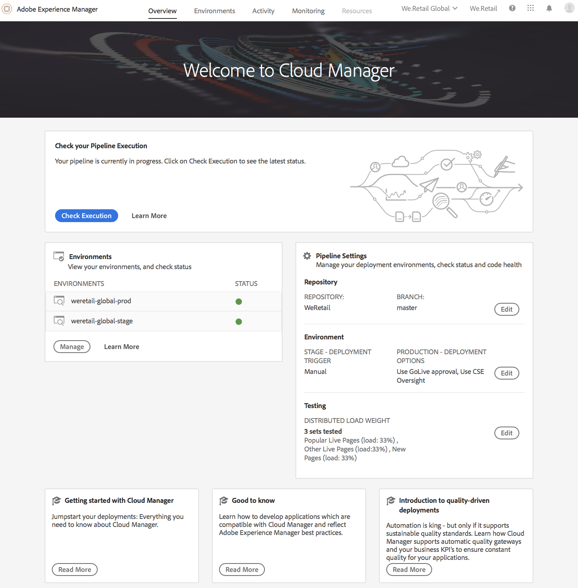
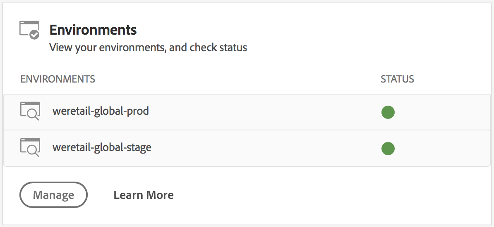
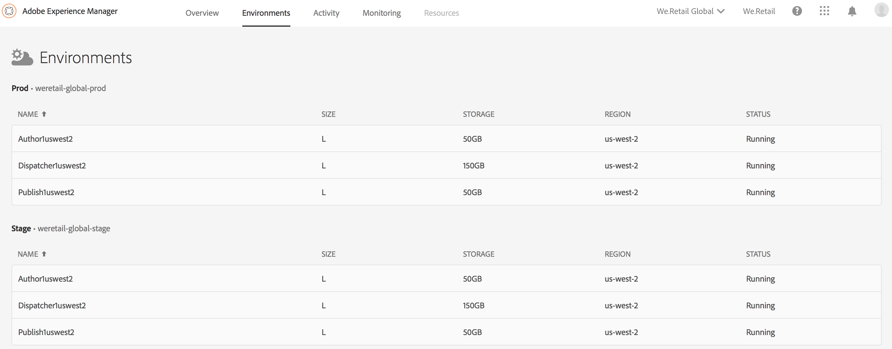

# Manage your Environments{#manage-your-environments}

The **Overview** page of Cloud Manager includes the **Environments** tile that lists all the managed AEM environments.

Each of the listed environments displays its associated status.

## Accessing Environments in Cloud Manager {#accessing-environments-in-cloud-manager}

The **Environments** tile displays the Production and Stage environments provisioned in your program along with the status.

### Environments {#environments}

Click **Manage** to display the **Environments** screen.

The **Environments** screen displays a card each for *Production* and *Stage* environments (as applicable) in your program. The name of the environment is seen above each card. The card includes a table of nodes in the environment along with the t-shirt size of the cpu, the storage, the region, and the status**. **

>[!NOTE]
>
>The **STATUS** of the node represents the power state of the VM and does not reflect the status of AEM on the server. The status can be **Running**, **Stopped**, or **Unavailable**.

