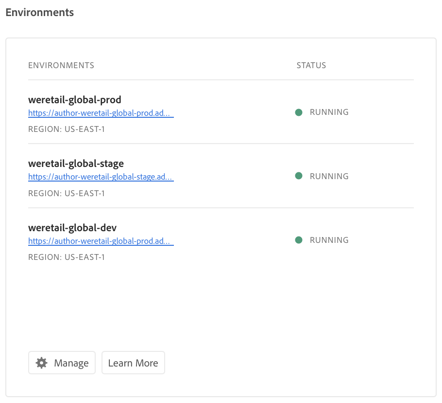

# Manage your Environments {#manage-your-environments}

>[!NOTE]
>To learn about managing environments for Cloud Manager in AEM as a Cloud Service, see [here](https://experienceleague.adobe.com/docs/experience-manager-cloud-service/implementing/using-cloud-manager/manage-environments.html?lang=en#using-cloud-manager).

The **Overview** page of Cloud Manager includes the **Environments** tile that lists all the managed AEM environments.

Each of the listed environments displays its associated status.

## Video Tutorial {#video-tutorial}

### Cloud Manager Environment Overview {#environ-video}

The following video provides an overview to Cloud Manager Environments that are composed of AEM Author, AEM Publish and Dispatcher instances.

>[!VIDEO](https://video.tv.adobe.com/v/26318/)

## Accessing Environments in Cloud Manager {#accessing-environments-in-cloud-manager}

The **Environments** tile displays the Production and Stage environments provisioned in your program along with the status.

The status is the rolled-up power state across the nodes in the environment. It is green if all nodes are running, red if even one node is stopped, blue if even one node is coming up, and yellow if even one node has a power state unavailable (in this order of priority).

### Environments {#environments}

Click **Manage** to display the **Environments** screen.

The **Environments** screen displays a card each for *Production* and *Stage* environments (as applicable) in your program. The name of the environment is seen above each card. The card includes a table of nodes in the environment along with the t-shirt size of the cpu, the storage, the region, and the status.

>[!NOTE]
>
>The **STATUS** of the node represents the power state of the VM and does not reflect the status of AEM on the server. The status can be **Running** (green circle), **Stopped** (red circle), **Coming up** (blue circle) or **Unavailable** (yellow circle).

>[!NOTE]
>
>If you require your environment logs they can be requested via your Customer Success Engineer.
