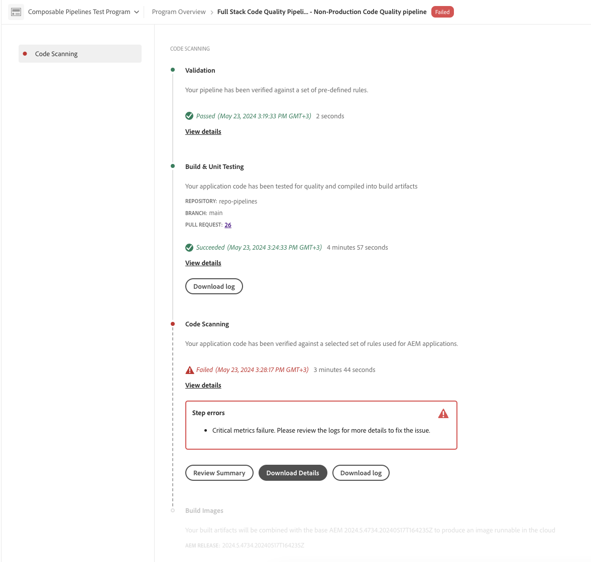
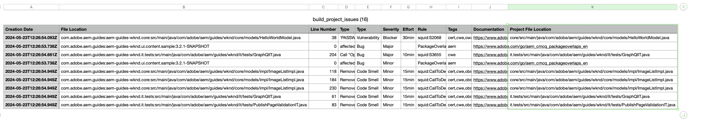

# Manage pipelines {#managing-pipelines}

Learn how to manage your existing pipelines including running, editing, and deleting them.

## Pipeline card {#pipeline-card}

The **Pipelines** card on the **Program Overview** page in Cloud Manager gives you an overview of all of your pipelines and their current status.

By clicking  next to each pipeline, you can take the following actions:

* [Run the pipeline](#running-pipelines).
* [Edit the pipeline](#editing-pipelines).
* [Delete the pipeline](#deleting-pipelines).
* [View details](#view-details).

At the bottom of the list of pipelines, you have the following general options.

* **Add** - To [add a new production pipeline](/help/using/production-pipelines.md) or [add a new non-production pipeline](/help/using/non-production-pipelines.md).
* **Show All** - Takes the user to the **Pipelines** screen to view all pipelines in a more detailed table.
* **Access Repo Info** - Displays the information necessary to access the Cloud Manager Git repository.
* **Learn More** - Navigates to CI/CD pipeline documentation resources.

## Pipelines page {#pipelines}

The **Pipelines** page shows a complete list of all pipelines for the selected program. This list is useful because it presents more comprehensive information than what is available in the [Pipelines card](#pipeline-card).

1. Log into Cloud Manager at [my.cloudmanager.adobe.com](https://my.cloudmanager.adobe.com/) and select the appropriate organization and program.

1. From the **Program Overview** page, click the **Pipelines** tab to switch to the **Pipelines** page.

1. Here you can see a list of all pipelines for the program and start and stop pipeline execution as you would in the **Pipelines Card**.

Clicking the `i` icon reveals details about the last or current execution of the pipeline.

Clicking **View details** takes you to the [details of the pipeline execution](#view-details).

## Activity page {#activity}

The **Activities** page shows a complete list of all pipelines executions for the selected program.

1. Log into Cloud Manager at [my.cloudmanager.adobe.com](https://my.cloudmanager.adobe.com/) and select the appropriate organization and program.

1. From the **Program Overview** page, click the **Activity** tab to switch to the **Activity** page.

1. Here you can see a list of all pipeline executions for the program including current and historical executions.

Clicking the `i` icon reveals details about the execution of the selected pipeline run.

Click **View details** to review [details of the pipeline execution](#view-details).

## Run a pipeline {#run-one-pipeline}

1. Log into Cloud Manager at [my.cloudmanager.adobe.com](https://my.cloudmanager.adobe.com/) and select the appropriate organization and program.
1. Navigate to the **Pipelines** card from the **Program Overview** page.
1. Click  next to the pipeline that you run, then click **Run**.

    The Status column indicates when the pipeline run begins.

    You can see the details of the run by clicking  again and clicking **[View details](#view-details)**.

    Depending on the type of pipeline, you may be able to cancel the run by clicking  again and clicking **Cancel**.

## Run multiple pipelines {#run-multiple-pipelines}

With Cloud Manager you can run multiple pipelines simultaneously, improving deployment efficiency for Adobe Managed Services (AMS) customers. The **Run selected** feature lets you select multiple pipelines and trigger them to run at once. It reduces the manual effort of having to run pipelines individually and optimizes build and deployment workflows.  

**To run multiple pipelines:** 

1. Log into Cloud Manager at [my.cloudmanager.adobe.com](https://my.cloudmanager.adobe.com/) and select the appropriate organization and program.
1. From the left side menu, click  **Pipelines**.
1. In the table on the **Pipeline** page, select the checkboxes next to the pipelines you want to run.
    If necessary, click  **Filters** to sort pipelines by name, or environment, or deployed code type, or a combination of all three.
1. Near the upper-right corner of the page, click **Run selected (x)**.  
1. In the **Run selected pipelines (x)** dialog box, click **Run (x)**.

    The **Run** button reflects the number of pipelines that can proceed. For example, you may have select four pipelines but one is already running. Or, an environment linked to a selected pipeline no longer exists. In such cases, the system adjusts accordingly. The button updates to "Run (3)" to indicate that three pipelines can proceed.

1. Pipelines begin running, and their status is updated in the **Pipelines** list.  

## Edit pipelines {#editing-pipelines}

You cannot edit a pipeline that is running.

**To edit pipelines:**

1. Log into Cloud Manager at [my.cloudmanager.adobe.com](https://my.cloudmanager.adobe.com/) and select the appropriate organization and program.

1. From the **Program Overview** page, navigate to the **Pipelines** card.

1. Click  next to the pipeline that you want to edit, then click **Edit**.

1. In the **Edit Production Pipeline** or **Edit Non-Production Pipeline** dialog box, you can edit the same details that you entered during pipeline creation.

    See [Configuring Production Pipelines](/help/using/production-pipelines.md) and [Configuring Non-Production Pipelines](/help/using/non-production-pipelines.md) for details on the fields and configuration options available for pipelines.

1. When you are done, click **Update**.

## Delete pipelines {#deleting-pipelines}

You cannot delete a running pipeline.

**To delete pipelines:**

1. Log into Cloud Manager at [my.cloudmanager.adobe.com](https://my.cloudmanager.adobe.com/) and select the appropriate organization and program.

1. From the **Program Overview** page, navigate to the **Pipelines** card.

1. Click  next to the pipeline that you run, then click **Delete**.

## View pipeline details {#view-details}

You can only view details of a pipeline that is running or has been run at least once.

**To view pipeline details:**

1. Log into Cloud Manager at [my.cloudmanager.adobe.com](https://my.cloudmanager.adobe.com/) and select the appropriate organization and program.

1. From the **Program Overview** page, navigate to the **Pipelines** card.

1. Click  next to the pipeline that you run, then click **View details**.

1. You are taken to the details page of the running pipeline.

From here, you can see the status of the various steps of the pipeline and retrieve build logs for diagnostic purposes. See the document [Code Deployment](/help/using/code-deployment.md) for more information.

All the steps in a pipeline execution are displayed with the ones not yet started grayed out. Finished steps display their duration.

When a pipeline step is complete, a summary is presented.

Click the **View details** link to reveal the **Duration** section. This section includes the average duration for the pipeline based on the historical trend for that program.

If your pipeline contained a **Code Scanning** step, which raised issues, you can click **Download Details** to view a list of [code quality tests](/help/using/code-quality-testing.md) that did not pass.

A **Project File Location** column is available in the CSV file to indicate the location of the offending code. This column is the project-relative path, whereas the **File Location** column is Maven-generated.

