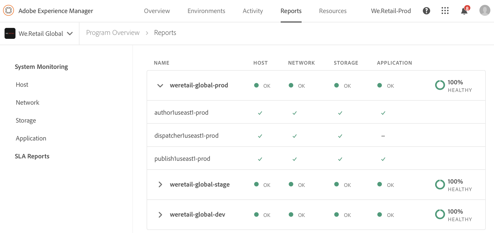
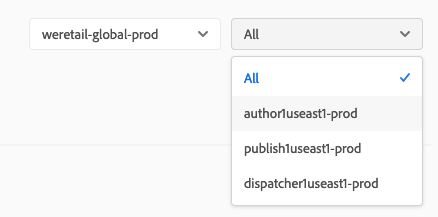
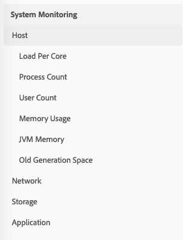
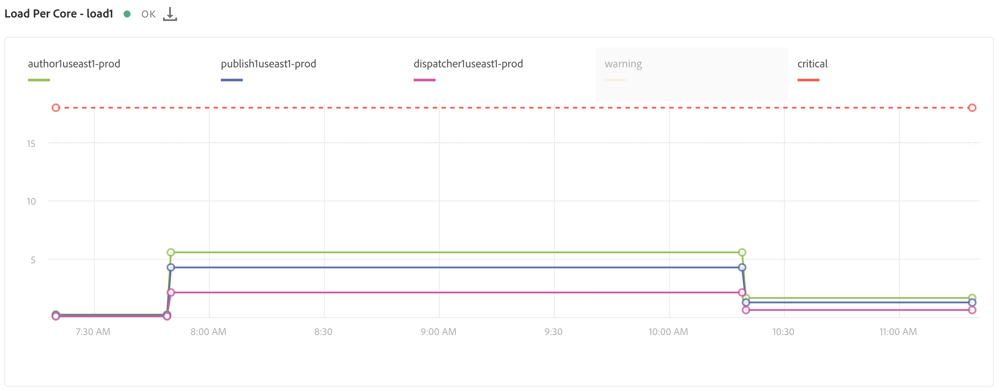

# System Monitoring {#system-monitoring}

System Monitoring in [!UICONTROL Cloud Manager] is done by observing the individual instances within an environment and tracking a variety of metrics for each instance. Each metric has two defined thresholds – a *warning threshold* and a *critical threshold*. 

If a metric is over its critical threshold, it is considered to be in a critical state; if a metric is over its warning threshold (but below its critical threshold), it is considered to be in a warning state. The thresholds are set by Adobe Managed Services and can be visualized in [!UICONTROL Cloud Manager]. In most cases, thresholds are consistent between customers, but there are cases where Adobe Managed Services will modify thresholds to match specific customer requirements. Questions about the thresholds should be directed to your Customer Success Engineer (CSE).

## Navigating to System Monitoring {#navigating-system-monitoring}

Navigating to the System Monitoring feature can be done in two ways. 

1. Log in to **Managed Services - Programs** landing page.

   

1. Click on the third icon on the program card.
 
   

   *Or*,

* Navigate to the **System Monitoring** landing page through the **Reports** global navigation menu item within [!UICONTROL Cloud Manager].

## System Monitoring Overview Page {#system-monitoring-overview-page}

The System Monitoring Overview page lists the monitored environments in the program and reports on their high-level health across four separate categories:

* **Host**
* **Storage**
* **Network**
* **Application**

The status in each category is a summary of individual metrics – if any metric in a category is in the critical state, the whole category is in a critical state for the purpose of the overview page. The same summarization can be viewed at an environment level and at an instance level. 

>[!NOTE]
>
>By default when navigating to this page, the production environment instances are visible, but other environments can be opened as well.

## Video Tutorial {#video-tutorial}

### Cloud Manager Reports Overview {#reports-video}

Cloud Manager Reports provide a view into the Program's Environments and AEM instances through a set of charts that report on and track a variety of metrics for each AEM instance.
Refer to the video below for more details.

>[!VIDEO](https://video.tv.adobe.com/v/26315/)

## System Monitoring Detail {#system-monitoring-detail}

To view the details of specific metrics, you can either click on one of the categories in the left navigation or click on one of the category indicators for a specific instance. Each detail page shows a series of graphs for the metrics within that category. You can either view the metrics for all instances in an environment or for a specific instance. You can switch between the environment and instances using the dropdown boxes in the top-right corner.

The navigation on the left will show the available metrics within the currently selected category for which there is data for the currently selected environment and instances.

An individual graph will show the status and a graph of the data over time along with the thresholds. If multiple instances are displayed, each instance's data will be on a separate series.

Individual series can be hidden on a graph by clicking on the series in the legend. 
For example, if you click on the warning threshold series, you will see only the critical threshold.

### Metric Definitions {#metric-definitions}

**Host**

* Load Per Core: the number of process which are being executed by the CPU or are in a waiting state averaged over a one (load1), five (load5), and fifteen (load15) minute period.
* Process Count: the number of processes currently open.
* User Count: the number of users with an active shell session.
* Memory Usage: the percentage of system memory currently allocated.
* JVM Memory (heap): the size (in Megabytes) of the allocated Java Heap.
* Old Generation Space: the percentage of JVM Old Generation memory currently allocated.

**Network**

* CQ Port Check: The response time in seconds to access the AEM or Dispatcher port. There are different metrics for author, publish, and dispatcher.

**Storage**

* Disk Space: The used disk space (in Megabytes) for each mount point on the host. There are different metrics for each mount point. At minimum, you will see metrics for "/" and "/mnt", but additional mount point metrics may be available depending on the specific instance configuration.
* Folder Size: AEM Segment Store: The used disk space (in Gigabytes) for the AEM Segment Store.

**Application**

* Replication Agent: The time, in seconds, for a test replication event. There are separate metrics for each replication agent.
* Dispatcher Flush: The number of items currently in the dispatcher flush queue.

## SLA Reporting {#sla-reporting}

Customers are able to see the performance of their production AEM environment relative to their contracted Service Level Agreement (SLA). This is available through a sub-menu on the Reports screen. 
For example, the graph below shows the monthly SLA attainment for 2018.

As with the system monitoring graphs, rolling over a data point shows the specific values for that month.

The Event Analysis section under this graph shows the set of incidents which occurred for the program during the currently selected year. Each incident has a time range, a cause, and a set of comments.

## SLA Metrics {#sla-metrics}

* **Author Contract**: This is the SLA defined in your contract with Adobe Managed Services for the author tier.

* **AMS Author SLA**: This is the measured uptime of the production author tier factoring incidents caused by Adobe or our vendors.

* **Author SLA**: This is the measured uptime of the author tier ignoring scheduled downtime such as maintenance windows.

* **End User Contract**: This is the SLA defined in your contract with Adobe Managed Services for the publish tier.

* **AMS End User SLA**: This is the measured uptime of the production publish tier factoring incidents caused by Adobe or our vendors.

* **End User SLA**: This is the measured uptime of the publish tier ignoring scheduled downtime such as maintenance windows.