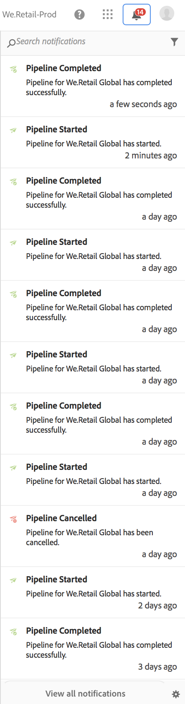
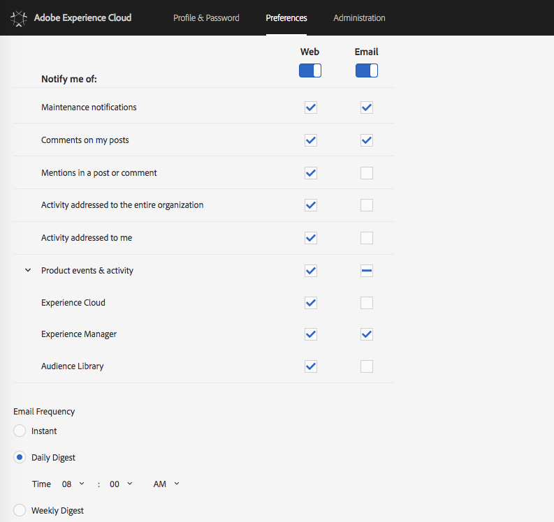

# Notifications{#notifications}

Cloud Manager allows the users to receive notifications when a Pipeline starts and completes (successfully or unsuccessfully) as well as when the** Go-Live Approval **and** Scheduled **steps are reached. These notifications are sent through the Adobe Experience Cloud Notification system.

>[!NOTE]
>
>The approval and scheduled notifications are only sent to users in the Business Owner, Program Manager, and Deployment Manager roles.

The notifications appear in a sidebar in Cloud Manager UI (User Interface) and throughout the Adobe Experience Cloud.

Click on the bell icon from the header to open the sidebar and view the notifications, as shown in the figure below:

The sidebar lists the most recent notifications.

Additionally, click on one of these notifications and then click on **View Details** to access the Pipeline execution details page.

### Email Notifications {#email-notifications}

By default, notifications are available in the web user interface across Adobe Experience Cloud solutions. Individual users can also opt for these notifications to be sent through email, either on an immediate or digest basis.

Click on the gear icon at the bottom of the notifications sidebar, as shown in the figure below:

This will take the user to the Notifications Preferences screen in Adobe Experience Cloud.

The users can turn on email notifications and (optionally) select the types of notifications they want to receive over email.

>[!NOTE]
>
>You can also enable digesting from the Adobe Experience Cloud, as shown below:

