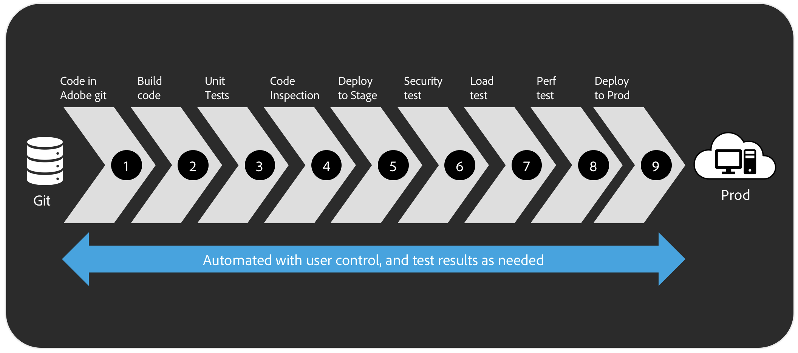
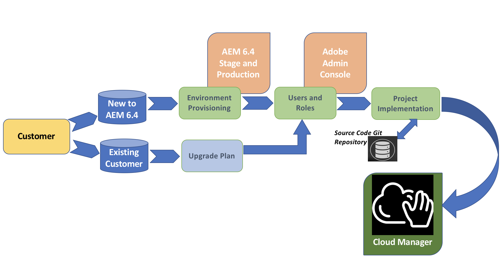

# Overview{#overview}

[!UICONTROL Cloud Manager] is a framework of tools and technologies available to all Managed Cloud customers.

[!UICONTROL Cloud Manager] allows code inspection, testing, and security validation based on best practices before pushing to production to minimize disruptions and further allows automatic, scheduled or manual deployment outside of business hours for maximum flexibility and control.

This section provides an overview to [!UICONTROL Cloud Manager] and covers the following topics:

* **Introduction to [!UICONTROL Cloud Manager]**
* **Key Concepts**
* **Customer Journey**

## Introduction to [!UICONTROL Cloud Manager] {#introduction-to-cloud-manager}

[!UICONTROL Cloud Manager] is a self-service customer portal designed to deliver ***Continuous Integration/Continuous Delivery (CI/CD)*** of code to speed time to market for deployment.

*CI/CD* helps to speed innovation delivery without compromising on quality and with the help of [!UICONTROL Cloud Manager], code is delivered with best quality and further allows more flexibility on when you want to deliver the code.

The [!UICONTROL Cloud Manager] performs the following tasks:

* **Continuous Integration / Continuous Delivery** of code to speed time to market for deployment from months/weeks to days/hours.
* **Code Inspection, performance testing and security validation** based on best practices before pushing to production to minimize disruptions.
* **Automatic, scheduled or manual deployment** even outside of business hours for maximum flexibility and control.

[!UICONTROL Cloud Manager] will enable you to successfully deploy custom code outside business hours and allow high-frequency of new/modified code deployments.

The following image illustrates the *CI/CD Process Flow* in [!UICONTROL Cloud Manager].

## Key Concepts {#key-concepts}

Before diving into the details of [!UICONTROL Cloud Manager], please refer to the key concepts.

The following section lists some of the important terms explaining the underlying key functionalities of [!UICONTROL Cloud Manager]:

**Application** The set of customizations and configurations created by a customer (or their agents) in order to adapt the underlying solution for their specific use cases and needs. An application is a logical unit which may be composed of multiple artifacts.

For example, *We.Retail*.

**Artifact** A deployable unit. The result of some build process which transforms source code into a single unit (even just to zip up the source code).

**Artifact Repository** A location where customer-specific artifacts are stored.

**Environment** A single stack within a program. For AEM, this is composed of an author instance (optionally with additional author instances in a MongoDB/RDBMK cluster or cold standby), zero or more publish instances, and one or more dispatcher instances.

**Git Repository** A location where customer-specific source code is stored, accessible using the git protocol.

For example, *git@git.amsadobe.com:weretail-go.git*.

**Instance** A specific running "copy" of the solution. Instances may be discreet single processes or composed of microservices, but regardless represent a single logical unit from a deployment perspective.

**Pipeline** A set of steps which are executed in sequence.

**Product** A specific set of functionality within a solution licensed by an organization. Different programs within an organization may be entitiled to different sets of products.

**Program** A set of environments that support a logical grouping of customer initiatives, usually corresponding to a purchased Service Level Agreements (SLA). Each program has exactly one production environment and may have many non-production environments. For example, We.Retail Go.

**Solution** A cloud-level brand which may be composed of multiple products.

**Step** A configured instruction set that accomplishes some unit of work, building block of a pipeline

## Customer Journey {#customer-journey}

A customer may be new to Adobe Experience Manager (AEM) 6.4 or needs an upgrade to AEM 6.4 Release.

The following scenarios explain your journey of a customer to get started with [!UICONTROL Cloud Manager]:

* **New AEM Project**:

A new AEM 6.4 project will leverage your existing project and work with [!UICONTROL Cloud Manager].

For additional information, see [Getting Started with AEM 6.4](https://helpx.adobe.com/experience-manager/6-4/sites/deploying/using/deploy.html). Additionally, refer to [AEM Resources](https://www.adobe.com/marketing-cloud/experience-manager/resources.html?promoid=759X6WV8&mv=other) for further information.

* **Existing AEM Project**:

An existing AEM project has to confirm to the rules to project setup. You can upgrade your existing AEM installation to obtain new capabilities and enhancements offered in AEM 6.4 and get started with [!UICONTROL Cloud Manager]. Contact Customer Success Engineers (CSE) for support.

To get additional information on upgrading your AEM instance to 6.4, see [Upgrading to AEM 6.4](https://helpx.adobe.com/experience-manager/6-4/sites/deploying/using/upgrade.html).

Once you have access to [!UICONTROL Cloud Manager], you need to set up your environment, team and roles, source code, KPIs and test scripts to successfully deploy your code to the production environment.

The following diagram illustrates the customer journey to get started with [!UICONTROL Cloud Manager]:

### The Next Steps {#the-next-steps}

Once you get an overview of [!UICONTROL Cloud Manager], see *** [Understanding Concepts Before Using [!UICONTROL Cloud Manager]](understanding-concepts.md)***, to learn about concepts and terminologies that are good to know before using [!UICONTROL Cloud Manager].
