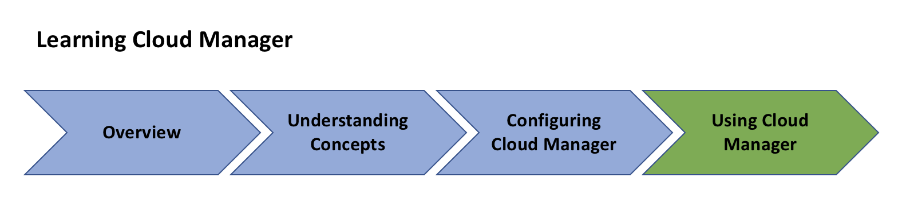

# Overview Index{#overview-index}

***Cloud Manager*** is a framework of tools and technologies available to all Adobe Managed Services customers.

This section provides the high level view of the list of resources that lets you get started with Cloud Manager.

Follow the resources below to begin your journey for using Cloud Manager, from understanding the key concepts and terminologies to setting up configurations (pre-requsites), that finally lets you get started with Cloud Manager.

The figure below illustrates the road map to your learning of Cloud Manager:

Follow the resources in the Overview section to get an introduction to Cloud Manager:

* ** [Introduction to Cloud Manager](https://chl-au/content/help/en/experience-manager/cloud-manager/using/introduction-to-cloud-manager0.html)**
* ** [Key Concepts](https://chl-author/content/help/en/experience-manager/cloud-manager/using/key-concepts.html)**
* ** [Customer Journey](https://c/content/help/en/experience-manager/cloud-manager/using/customer-journey.html)**

