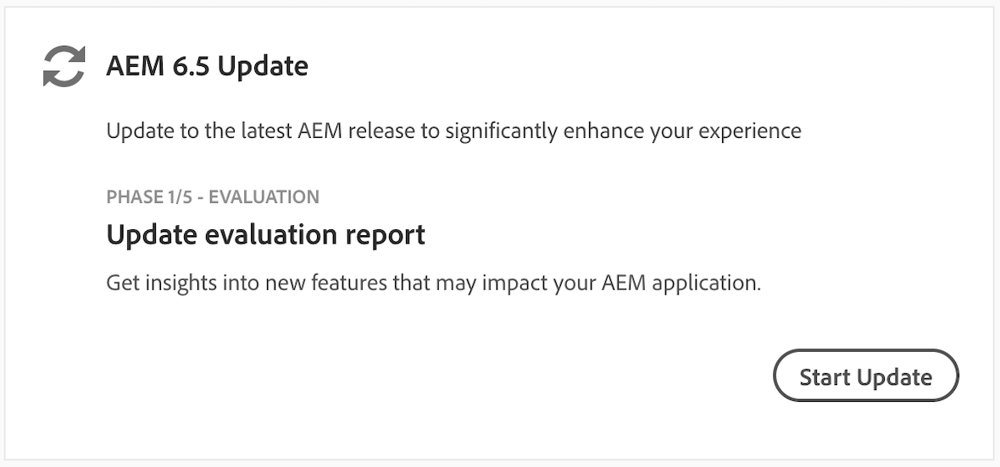

# Overview {#overview-product-update-wizard}

The Product Update wizard is a guided, step-by-step experience for Cloud Manager customers who are upgrading to the latest Adobe Experience Manager (AEM) 6.5. It streamlines the end-to-end process, ensures adherence to AEM best practices using Cloud Manager’s CI/CD framework and built-in automated testing.

The wizard includes five phases that guides the user during an AEM product update:

* **Evaluation**
* **Remediation**
* **Execution**
* **Validation**
* **Completion**

## Using Product Update Wizard {#using-product-update-wizard}

>[!NOTE]
>
>Customers on-boarded to Cloud Manager and eligible to upgrade to AEM 6.5 will be able to leverage the Product Update wizard. Contact your Customer Success Engineer (CSE) for more details.

1. You will receive a pulse notification via Cloud Manager informing you that AEM 6.5 is available to your program.

1. An **[!UICONTROL AEM 6.5 Update]** card displays on the overview screen of [!UICONTROL Cloud Manager]. This card will help track which phase of the update process you are currently in and will inform you as to what the next step to be taken is. Select **[!UICONTROL Start Update]** to launch the wizard.

   

   The wizard now displays the first phase of **[!UICONTROL AEM 6.5 Update]** process as seen in the [Evaluation Phase](evaluation.md).
