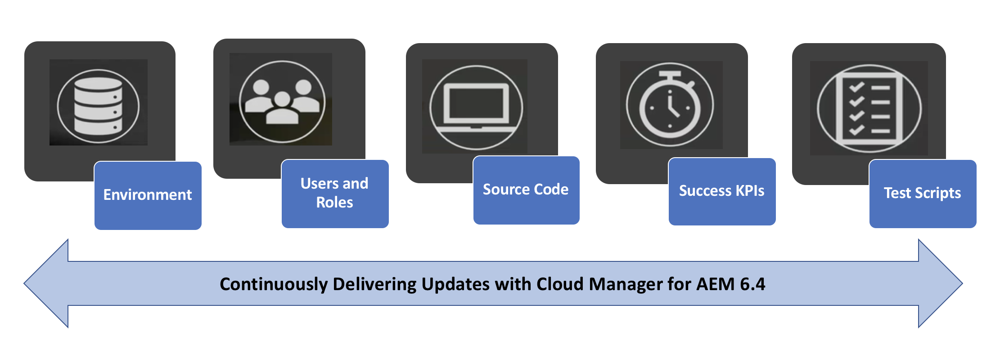
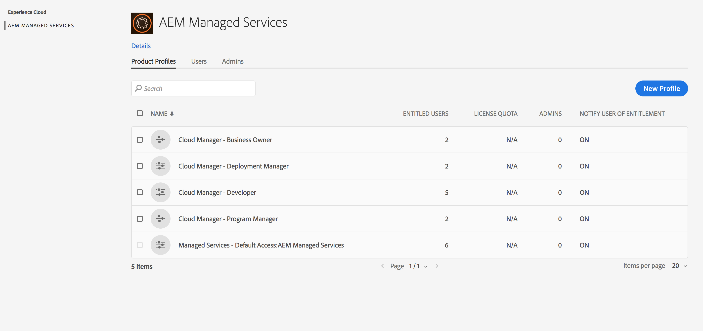
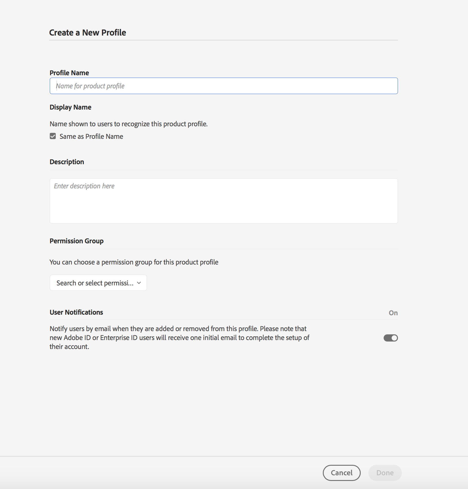

# Setting up General Configurations for Cloud Manager{#setting-up-general-configurations-for-cloud-manager}

The following section highlights the prerequisites for setting up Cloud Manager and managing content from its user interface.

This section page covers the following topics

* **Setting up Users and Roles**
* **AEM Application Project Setup**
* **Dispatcher Configurations**
* **Development Best Practices **

The following diagram illustrates the different functions that allow Cloud Manager to continuously deliver best quality code:

 

## Setting up Users and Roles {#setting-up-users-and-roles}

Roles are managed for Cloud Manager from the Adobe Admin Console. Specific role memberships are provided by adding the user to a Cloud Manager Product Profile in Admin Console.

>[!CAUTION]
>
>To use Cloud Manager, you must have an Adobe ID and the Adobe Managed Services Product Context.

You can assign specific role memberships by adding the user to a Cloud Manager Product Profile in the Admin Console.

Create the following roles using the Admin console for Cloud Manager:

>[!NOTE]
>
>The Adobe Admin Console provides a central location for managing your Adobe entitlements across your entire organization.
>
>To learn more about the Adobe Admin Console, see the documentation for [Admin Console](https://helpx.adobe.com/enterprise/using/admin-console.html).

| **Cloud Manager Roles** |**Description** |
|---|---|
| Business Owner |Responsible for defining KPIs, approving production deployments and overriding important 3-tier failures. |
| Program Manager |Uses Cloud Manager to perform team setup, review status and view KPIs. May approve important 3-tier failures. |
| Deployment Manager |Manages deployment operations. Uses Cloud Manager to execute stage/production deployments. May approve important 3-tier failures. Has git access. |
| Developer |Develops and tests custom application code. Primarily uses Cloud Manager to view status. Has commit access to git. |
| Customer Success Engineer |Generally supports customer success for AMS customers. Interacts with Cloud Manager for the purpose of executing deployments which require CSE oversight. |
| Content Author |Generally does not interact with Cloud Manager. May use Cloud Manager Program Switcher (having navigated from [!UICONTROL Experience Cloud]) to access AEM. |

### Using Admin Console to Set up Team {#using-admin-console-to-set-up-team}

In order to provide the appropriate role-based permissions to Cloud Manager users, an administrator in the customer's organization must create new Product Profiles under the AEM Managed Services Product Context.

>[!NOTE]
>
>To acces the admin console and set up your team (users and roles), open a browser and visit [https://adminconsole.adobe.com](https://adminconsole.adobe.com/enterprise).

Adding users (or groups) to these Product Profiles is done using normal Admin Console functionality, as shown in the figure below:

1. Log in to Admin console and click **New Profile** to add a new profile. 

   

1. Fill in the fields to set up a new role for Cloud Manager.

   Enter **Profile Name**, **Description** to create a new profile. Additionally, you can select a **Permission Group** for the profile.

   Click **Done** to complete the profile creation step.

   

## AEM Application Project Setup {#aem-application-project-setup}

Before you setup your application project in Cloud Manager, you will have to consider one of the two scenarios. You might be new to AEM 6.4 or already be an existing customer.

>[!NOTE]
>
>In order to to have access to Cloud Manager, contact Customer Success Engineers (CSE) to obtain URL and credentials to get started.

You can setup an application project for Cloud Manager, based on the following two scenarios:

* **New AEM Project**:

A new AEM project will leverage your existing project and work with Cloud Manager.

For additional information, see [Getting Started with AEM 6.4](https://chl-author./content/help/en/experience-manager/6-4/sites/deploying/using/deploy.html). Additionally, refer to [AEM Resources](https://www.adobe.com/marketing-cloud/experience-manager/resources.html?promoid=759X6WV8&mv=other) for further information.

* **Existing AEM Project**:

An existing AEM project has to confirm to the rules to project setup. You can upgrade your existing AEM installation to obtain new capabilities and enhancements offered in AEM 6.4 and get started with Cloud Manager. These criteria should work with minimal changes. Contact Customer Success Engineers (CSE) for support.

To get additional information on upgrading your AEM instance to 6.4, see [Upgrading to AEM 6.4](/content/help/en/experience-manager/6-4/sites/deploying/using/upgrade).

### Setting up Repository {#setting-up-repository}

A single, initially empty, git repository is provisioned for each program onboarded in Cloud Manager. Developers and deployment managers are provided with the git URL and credentials from their CSE.

With this information, a developer can add their code, following the guidelines in the **Project Set Up **in the succeeding section below, to complete the setup requirements before Using Cloud Manager.

## Dispatcher Configurations {#dispatcher-configurations}

Cloud Manager is able to deploy web server and dispatcher configuration files assuming they are stored in the git repository, in addition to normal AEM content packages.

To take advantage of this capability, the Maven build produces a zip file which contains two directories - ***conf*** and ***conf.d***.

Upon deployment to a dispatcher instance, the contents of these directories will overwrite the contents of these directories on the dispatcher instance. Since web server and dispatcher configuration files frequently require environment-specific information, in order for this capability to be used correctly, you will first need to work with their Customer Success Engineers (CSE) to extract these environment variables into /etc/sysconfig/httpd.

Follow the steps below to complete the initial process in configuring dispatcher:

1. Obtain current production configuration files from their CSE.
1. Remove hard-coded environment-specific data (e.g. publish renderer IP) and replaces with variables.
1. Define required variables in key-value pairs for each target dispatcher and requests CSE to add to ***/etc/sysconfig/httpd*** on each instance.
1. Test updated configs on stage, then request CSE to deploy to production to ensure they work properly.
1. Commit files to git.
1. Deploy through Cloud Manager.

The actual zip file can be produced using the maven-assembly-plugin. Projects generated using the Lazybones AEM Multimodule Template can have the right Maven project structure created as part of project creation.

>[!NOTE]
>
>Configuring dispatcher is done during on-boarding in Cloud Manager, but it can also be done at a later stage.

### Configuring Dispatcher for Performance Testing {#configuring-dispatcher-for-performance-testing}

In order for Cloud Manager to properly run performance tests, the stage dispatcher server must respond to the same host names as the production dispatcher in a manner consistent with the production server.

*For example*, if a customer has [www.myco.com](http://www.myco.com/) and [www.myotherco.com](http://www.myotherco.com,/) as their production host names and stage-myco.adobecqms.net as their stage host name, a request like this must respond appropriately:

```
curl -H"Host: www.myco.com" http://stage-myco.adobecqms.net/en/home.html
```

This will require not only that the host names are configured properly in the dispatcher configuration, but also that ***/etc/map***, any Apache rewrites, or really any other path ***mapping/filter*** rule be implemented in a consistent manner between stage and production.

## Development Best Practices {#development-best-practices}

Before using Cloud Manager, it is advisable to understand some best practices for setting up project and configuring webserver or dispather configuration.

### Project Set Up {#project-set-up}

Your projects must adhere to some criteria in order to work with Cloud Manager.

Follow the best practices for setting up project in Cloud Manager:

* The only build tool provided and supported is Apache Maven. Apache Maven 3.3.9 is installed.
* Builds run in a Linux environment in a Docker container as the root user.
* The Java version installed is Oracle JDK 8u161.
* There are some additional system packages installed such as, bzip2, unzip, libpng, imagemagick, and graphicsmagick. If you require other packages, you will need to request those via your CSE.
* Maven is always run with the command mvn -B clean package.
* You will be provided with exactly one git repository. There must be a pom.xml file in the root of this repository. This pom.xml file can refer to as many submodules (which in turn may have other submodules, etc.) as necessary, but there has to be only one entry point.
* Maven is configured at a system level with a settings.xml file which automatically includes the public Adobe artifact repository (repo.adobe.com).
* You can add additional repositories in your pom.xml files. However, access to password-protected or network-protected artifact repositories is not supported.
* Deployable content packages are discovered by scanning for zip files which are contained in a directory named target. Again, any number of submodules may produce content packages.
* If there is more than one content package, the ordering of package deployments is not guaranteed. Should a specific order be needed, content package dependencies can be used to define the order.

<!-- 

Comment Type: annotation
Last Modified By: jsyal
Last Modified Date: 2018-05-02T18:18:15.028-0400

change as per KT

 -->

### The Next Steps {#the-next-steps}

Once you have setup the general configurations, you ready to use Cloud Manager.

Refer to [***Using Cloud Manager***](https://chl-author./content/help/en/experience-manager/cloud-manager/using/using-cloud-manager.html) to get started with Cloud Manager.
