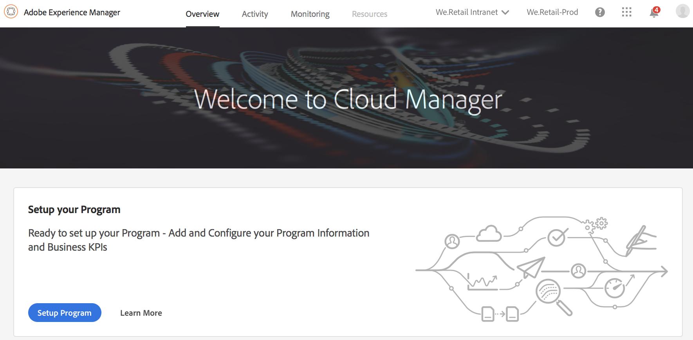
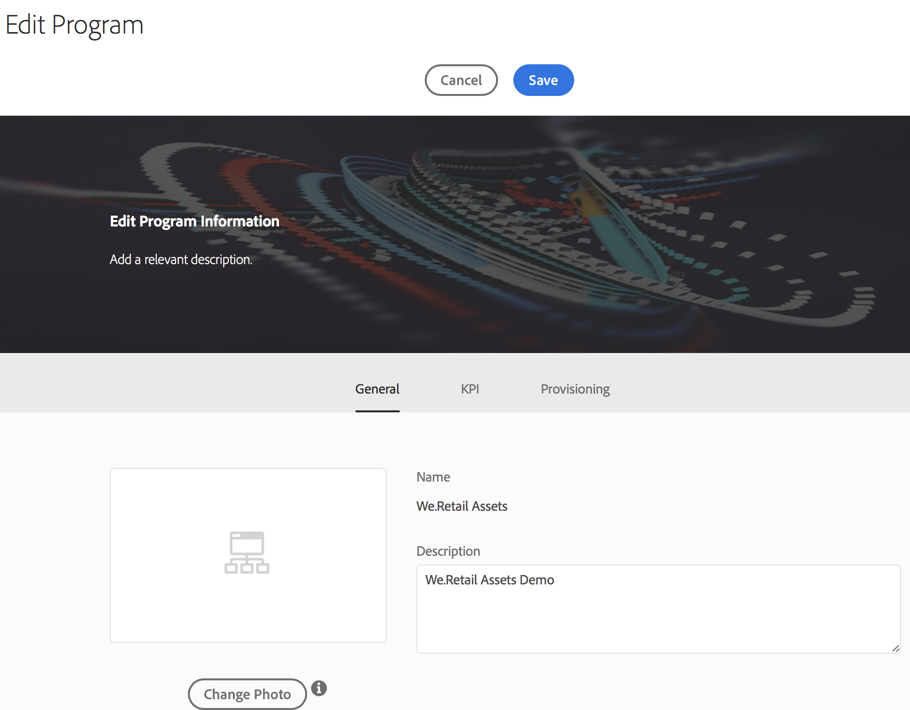
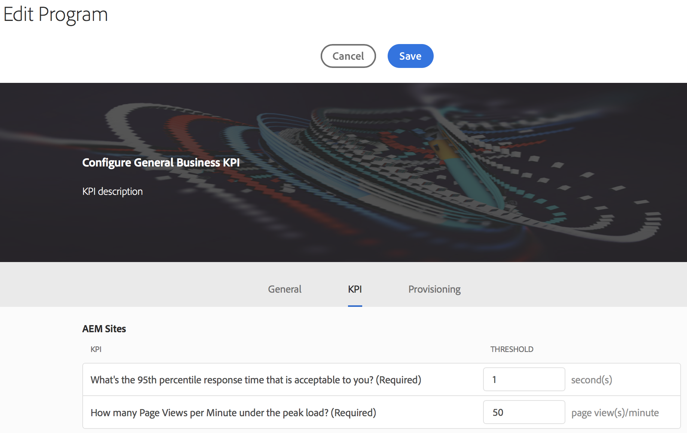
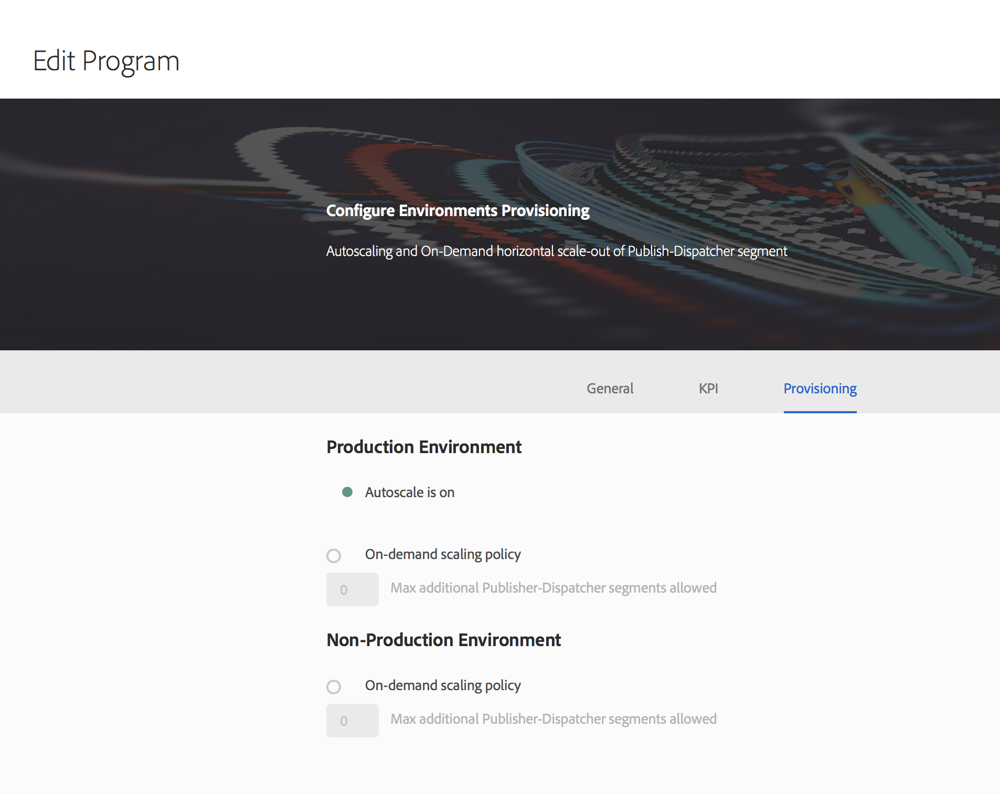

# Setup your Program {#setup-your-program}

After on-boarding, the business owner will need to complete some initial setup of the program. This involves setting the program description and defining the Key Performance Indicators (KPIs) which will be used for performance testing. Optionally, a thumbnail can be uploaded. Additionally, the business owner can configure environments provisioning while setting up the program.

The KPIs defined serves as a baseline for performance testing which is passed each time the pipeline executes.

>[!NOTE]
>
>The KPIs defined are measured on tests run on the **stage** environment. Typically, these KPIs are scaled down to fit the capabilities of the stage environment.
>
>For example, a user expecting an average of 1000 page views per minute in their production **Environment** and having four dispatcher/publish servers in production should scale this to 250 page views per minute (assuming their stage environment consists of only a single dispatcher/publish server pair).
>
>Additionally, many users will have a Content Delivery Network (CDN), such as Akamai or CloudFront in front of their production environment. Since [!UICONTROL Cloud Manager] tests against the stage environment directly, the KPI should reflect only the traffic expected to pass through the CDN, that is, the cache misses. Typically this will be a relatively small subset of the total production traffic.

## Using [!UICONTROL Cloud Manager] to Setup your Program {#using-cloud-manager-to-setup-your-program}

Follow the steps below to set up the program and define KPIs:

1. Click **Setup Program** to start the setup process in [!UICONTROL Cloud Manager].

   

1. The **Edit Program** screen displays.

   You will see three options as **General**, **KPI**, and **Provisioning** tab.

1. In **General** tab, upload a thumbnail to your program. You can also add a relevant description to your program.

   

1. Under **KPI**, you can define your two KPIs (expectations for each deployment):

    1. What is the 95th percentile response time that is acceptable to you?

        1. Recommended value - 3 seconds

    1. How many Page Views per Minute under the peak load?

        1. Recommended value - 200 page views per minute

   

1. Under **Provisioning**,you can you can view or edit the provisioning configuration for production and non-production environments in your program. You will see **Autoscale is on**, if autoscaling has been turned on for the program.

   >[!NOTE]
   >
   >* Autoscaling feature is applicable to production environment only and may not be available for all customer programs.
   >* On-demand scaling is not available for this release of [!UICONTROL Cloud Manager].

1. Click **Save** to complete the setup wizard.

## The Next Steps {#the-next-steps}

If you have already set up the **Pipeline**, the next execution will take your updated settings into account. If you have not yet set up the pipeline, follow the steps to set up your pipeline first.

Please see [Configure your CI/CD Pipeline](https://helpx.adobe.com/experience-manager/cloud-manager/using/configuring-pipeline.html) for setting up the pipeline.
