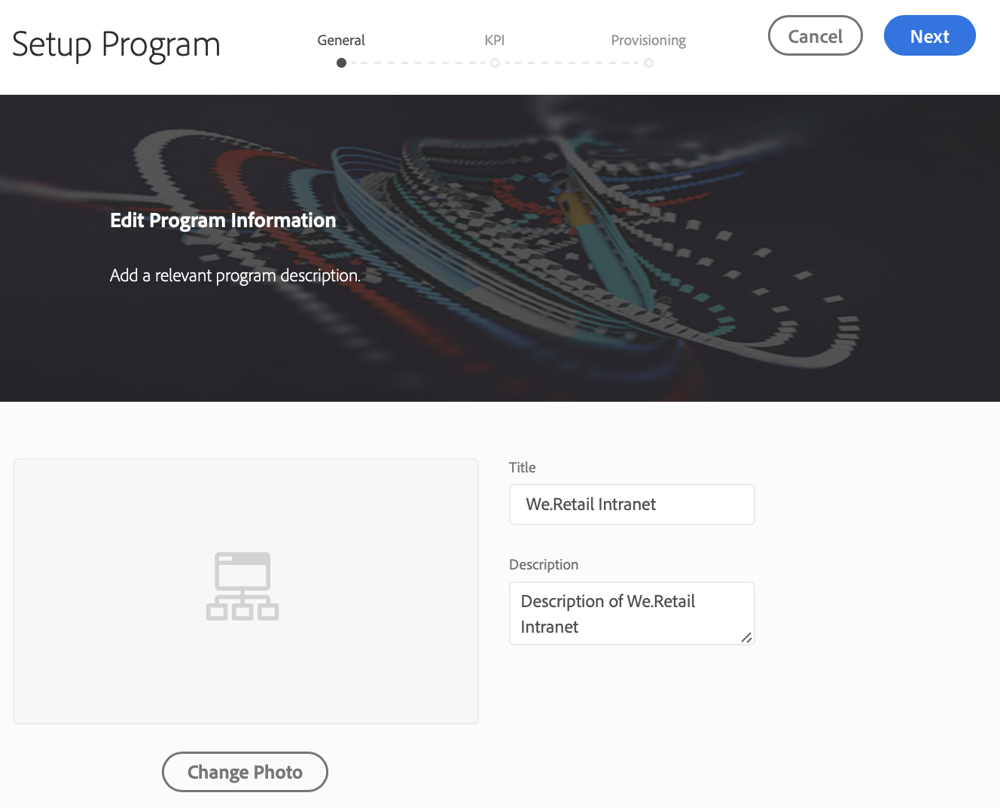
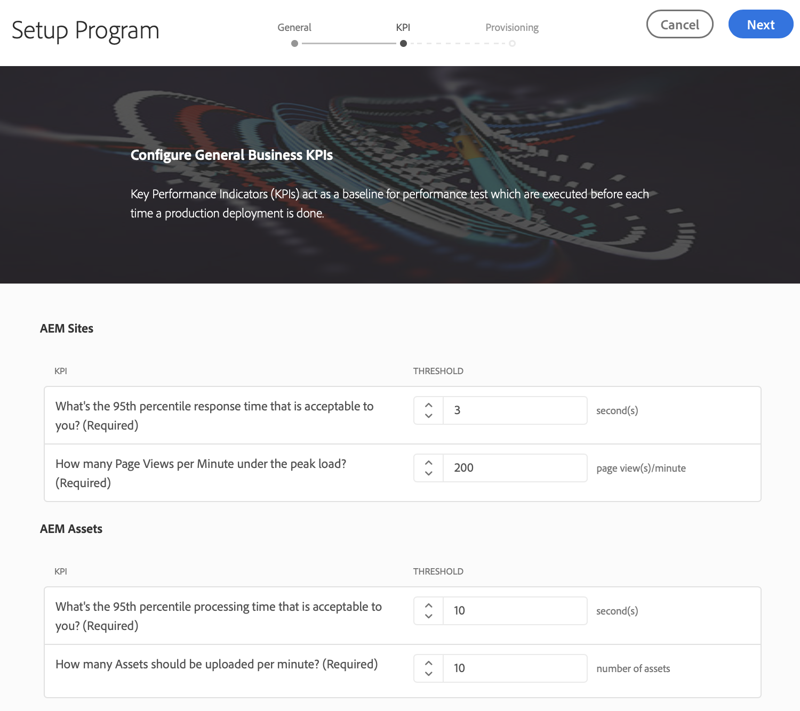
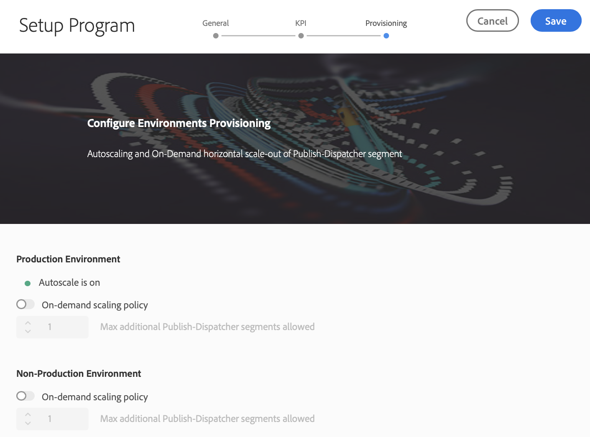
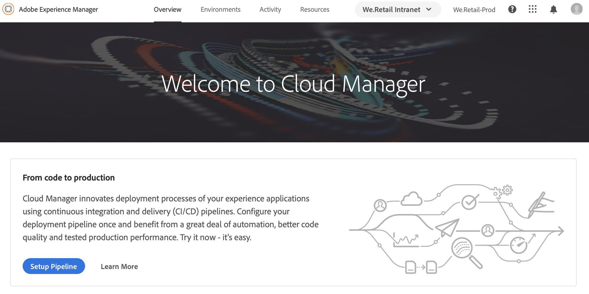
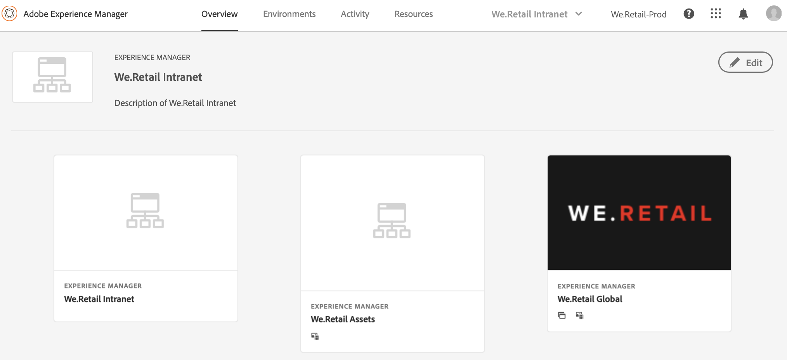

# Setup your Program {#setup-your-program}

After on-boarding, the business owner will need to complete some initial setup of the program. This involves setting the program description and defining the Key Performance Indicators (KPIs) which will be used for performance testing. Optionally, a thumbnail can be uploaded. Additionally, the business owner can configure environments provisioning while setting up the program.

The KPIs defined serves as a baseline for performance testing which is passed each time the pipeline executes.

>[!NOTE]
>
>The KPIs defined are measured on tests run on the **stage** environment. Typically, these KPIs are scaled down to fit the capabilities of the stage environment.
>
>For example, a user expecting an average of 1000 page views per minute in their production **Environment** and having four dispatcher/publish servers in production should scale this to 250 page views per minute (assuming their stage environment consists of only a single dispatcher/publish server pair).
>
>Additionally, many users will have a Content Delivery Network (CDN), such as Akamai or CloudFront in front of their production environment. Since [!UICONTROL Cloud Manager] tests against the stage environment directly, the KPI should reflect only the traffic expected to pass through the CDN, that is, the cache misses. Typically this will be a relatively small subset of the total production traffic.

## Using [!UICONTROL Cloud Manager] to Setup your Program {#using-cloud-manager-to-setup-your-program}

Follow the steps below to set up the program and define KPIs:

1. Click **Setup Program** to start the setup process in [!UICONTROL Cloud Manager].

   

1. The **Setup Program** screen displays the Edit Program Information.

1. You will see three options as **General**, **KPI**, and **Provisioning** tab.

1. In **General** tab, upload a thumbnail to your program. You can also add a relevant description to your program.

   

1. Under **KPI**, you can define your two KPIs (expectations for each deployment). Separate KPIs are defined for **AEM Sites** and **AEM Assets**. You will be able to specify the KPIs for the products you have licensed.

   **AEM Sites**

    1. What is the 95th percentile response time that is acceptable to you?

       * Recommended value - 3 seconds

    1. How many Page Views per Minute under the peak load?

        * Recommended value - 200 page views per minute

   **AEM Assets**

    Since its initial release, Cloud Manager has been able to execute performance testing for AEM Sites programs. With this release, the capability has been added to execute performance tests for AEM Assets programs as well. Assets performance testing is done by uploading assets repeatedly during a 30 minute test period and measuring the processing time for each asset as well as various system-level metrics.
    During Program Setup, Assets-specific KPIs are specified:

    * 95th Percentile Processing Time
    * Assets uploaded per minute

   

1. Under **Provisioning**,you can you can view or edit the provisioning configuration for production and non-production environments in your program. You will see **Autoscale is on**, if autoscaling has been turned on for the program.

   >[!NOTE]
   >
   >* Autoscaling feature is applicable to production environment only and may not be available for all customer programs.
   >* On-demand scaling is not available for this release of [!UICONTROL Cloud Manager].

   

1. Click **Save** to complete the setup wizard.

   >[!NOTE]
   >
   >You can always edit the program once the initial program has already been set up. Follow the steps below for more details.

## Editing a Program

1. Navigate to the solution on the **Cloud Manager** home screen.

   

1. Select the solution and click on **Edit** to update or modify your program, as shown in the figure below.

    

1. The **Edit Program** screen displays that allows you to update or modify your program.

   

## The Next Steps {#the-next-steps}

If you have already set up the **Pipeline**, the next execution will take your updated settings into account. If you have not yet set up the pipeline, follow the steps to set up your pipeline first.

Please see [Configure your CI/CD Pipeline](https://helpx.adobe.com/experience-manager/cloud-manager/using/configuring-pipeline.html) for setting up the pipeline.
