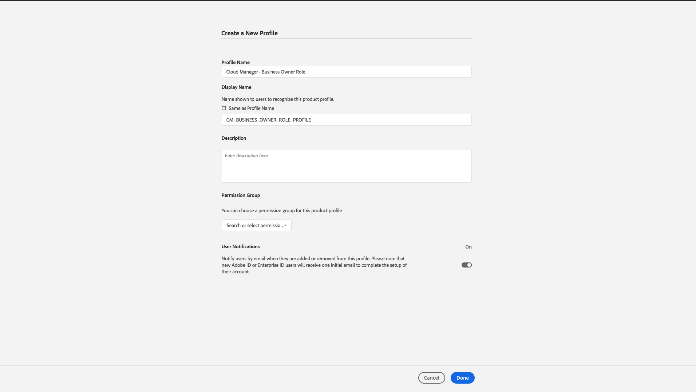
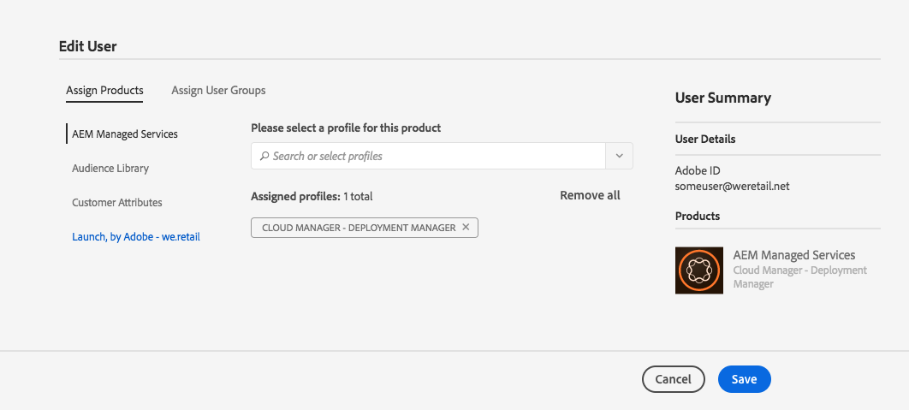

# Add Users and Roles{#add-users-and-roles}

Many features in Cloud Manager require specific permissions to operate. For example, only certain users are allowed to set the Key Performance Indicators (KPIs) for a program. These permissions are logically grouped into roles.

Cloud Manager currently defines four roles for users which govern the availability of specific features:

* Business Owner
* Program Manager
* Deployment Manager
* Developer

>[!CAUTION]
>
>To use Cloud Manager, you must have an Adobe ID and the Adobe Managed Services Product Context.

## Role Definitions {#role-definitions}

The following table summarizes the roles:

<table border="1" cellpadding="1" cellspacing="0" width="100%"> 
 <tbody>
  <tr>
   <td><strong>Cloud Manager Roles</strong></td> 
   <td><strong>Description</strong></td> 
  </tr>
  <tr>
   <td>Business Owner</td> 
   <td>Responsible for defining KPIs, approving production deployments and overriding important 3-tier failures.</td> 
  </tr>
  <tr>
   <td>Program Manager</td> 
   <td>Uses Cloud Manager to perform team setup, review status and view KPIs. Can approve important 3-tier failures.</td> 
  </tr>
  <tr>
   <td>Deployment Manager</td> 
   <td>Manages deployment operations. Uses Cloud Manager to execute stage/production deployments. Can edit CI/CD Pipelines. Can approve important 3-tier failures. Can get access to the Git repository. Please contact your CSE/AMS representative to request it.  </td> 
  </tr>
  <tr>
   <td>Developer</td> 
   <td>Develops and tests custom application code. Primarily uses Cloud Manager to view status. Should get access to the Git repository for code commit. Please contact your CSE/AMS representative when adding a user with this role to grant access to Git repository.  </td> 
  </tr>
  <tr>
   <td>Customer Success Engineer</td> 
   <td>Generally supports customer success for AMS customers. Interacts with Cloud Manager for the purpose of executing deployments which require CSE oversight.</td> 
  </tr>
  <tr>
   <td>Content Author</td> 
   <td>Generally does not interact with Cloud Manager. May use Cloud Manager Program Switcher (having navigated from Experience Cloud) to access AEM.</td> 
  </tr>
 </tbody>
</table>

>[!NOTE]
>
>Access to the Cloud Manager Git repository is managed by your CSE. Contact them to add and remove users.
>
>If a newly added user requires access to the Git repository you will need to contact your CSE/AMS representative to have the access granted. These roles are not providing automatic access to the Git repository. You can only have a maximum of 3 users with Git repository access.

## Using Admin Console to Create a Profile {#using-admin-console-to-create-a-profile}

Roles are managed for Cloud Manager from the Adobe Admin Console. Specific role memberships are provided by adding the user to a Cloud Manager Product Profile in Admin Console.

You can assign specific role memberships by adding the user to a Cloud Manager **Product Profile** in the Adobe Admin Console, a central location for managing your Adobe entitlements across your entire organization. To learn more about the Adobe Admin Console, see the documentation for [Admin Console](https://helpx.adobe.com/enterprise/using/admin-console.html).

>[!NOTE]
>
>To acces the admin console and set up your team (users and roles), open a browser and visit [https://adminconsole.adobe.com](https://adminconsole.adobe.com/enterprise).

In order to provide the appropriate role-based permissions to Cloud Manager users, an administrator in the customer's **Organization**, must create new Product Profiles under the AEM Managed Services Product Context.

To provide the appropriate role-based permissions to Cloud Manager users, as an administrator you must create four new Product Profiles under the AEM Managed Services Product Context corresponding to each of the four Cloud Manager roles:

* Business Owner
* Deployment Manager
* Developer
* Program Manager

You can create, or add, users/groups to these Product Profiles with the [Admin Console](https://adminconsole.adobe.com/) for Cloud Manager, as shown in the figure below:

1. Log in to Admin console and click **New Profile** to add a new profile.

   

1. Fill in the fields to set up a new role for Cloud Manager.

   Enter **Profile Name**, **Display Name** to create a new profile. Additionally, you can select a **Permission Group** for the profile.

   Click **Done** to complete the profile creation step.

   >[!NOTE]
   >
   >When creating these product profiles, the **Display Name** must be the technical value defined by Cloud Manager (see table below). The **Profile Name **can be anything, although to avoid confusion it is recommended to use the values in the "Recommended Profile Name" column below. To do this, when creating the Product Profile, uncheck the **Same as Profile Name** and specify the corresponding value as the **Display Name**.

   | **Role** |**Display Name (Required)** |**Recommended Profile Name** |
   |---|---|---|
   | Business Owner |CM_BUSINESS_OWNER_ROLE_PROFILE |Cloud Manager - Business Owner Role |
   | Deployment Manager |CM_DEPLOYMENT_MANAGER_ROLE_PROFILE |Cloud Manager - Deployment Manager Role |
   | Developer |CM_DEVELOPER_ROLE_PROFILE |Cloud Manager - Developer Role |
   | Program Manager |CM_PROGRAM_MANAGER_ROLE_PROFILE |Cloud Manager - Program Manager Role |

   

1. Once you create product profile, you can add users (or groups) to these Product Profiles.

    

