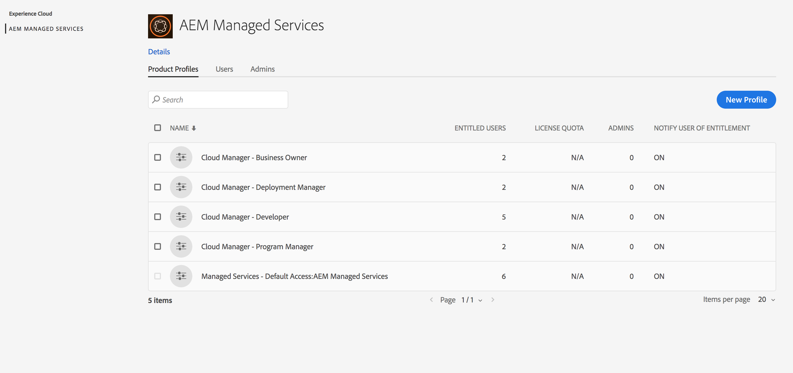

# Add Users and Roles{#add-users-and-roles}

Many features in [!UICONTROL Cloud Manager] require specific permissions to operate. For example, only certain users are allowed to set the Key Performance Indicators (KPIs) for a program. These permissions are logically grouped into roles.

[!UICONTROL Cloud Manager] currently defines four roles for users which govern the availability of specific features:

* Business Owner
* Program Manager
* Deployment Manager
* Developer

>[!CAUTION]
>
>To use [!UICONTROL Cloud Manager], you must have an Adobe ID and the Adobe Managed Services Product Context.

## Role Definitions {#role-definitions}

The following table summarizes the roles:

|[!UICONTROL Cloud Manager] Roles|Description|
|--- |--- |
|Business Owner|Responsible for defining KPIs, approving production deployments and overriding important 3-tier failures.|
|Program Manager|Uses [!UICONTROL Cloud Manager] to perform team setup, review status and view KPIs. Can approve important 3-tier failures.|
|Deployment Manager|Manages deployment operations. Uses [!UICONTROL Cloud Manager] to execute stage/production deployments. Can edit CI/CD Pipelines. Can approve important 3-tier failures. Can get access to the Git repository. Please contact your CSE/AMS representative to request it.|
|Developer|Develops and tests custom application code. Primarily uses [!UICONTROL Cloud Manager] to view status. Should get access to the Git repository for code commit. Please contact your CSE/AMS representative when adding a user with this role to grant access to Git repository.|
|Customer Success Engineer|Generally supports customer success for AMS customers. Interacts with [!UICONTROL Cloud Manager] for the purpose of executing deployments which require CSE oversight.|
|Content Author|Generally does not interact with [!UICONTROL Cloud Manager]. May use [!UICONTROL Cloud Manager] Program Switcher (having navigated from [!UICONTROL Experience Cloud]) to access AEM.|

>[!NOTE]
>
>Access to the [!UICONTROL Cloud Manager] Git repository is managed by your CSE. Contact them to add and remove users.
>
>If a newly added user requires access to the Git repository you will need to contact your CSE/AMS representative to have the access granted. These roles are not providing automatic access to the Git repository. You can only have a maximum of 3 users with Git repository access.

## Using Admin Console to Create a Profile {#using-admin-console-to-create-a-profile}

Roles are managed for [!UICONTROL Cloud Manager] from the Adobe Admin Console. Specific role memberships are provided by adding the user to a [!UICONTROL Cloud Manager] Product Profile in Admin Console.

You can assign specific role memberships by adding the user to a [!UICONTROL Cloud Manager] **Product Profile** in the Adobe Admin Console, a central location for managing your Adobe entitlements across your entire organization. To learn more about the Adobe Admin Console, see the documentation for [Admin Console](https://helpx.adobe.com/enterprise/using/admin-console.html).

>[!NOTE]
>
>To acces the admin console and set up your team (users and roles), open a browser and visit [https://adminconsole.adobe.com](https://adminconsole.adobe.com/enterprise).

In order to provide the appropriate role-based permissions to [!UICONTROL Cloud Manager] users, an administrator in the customer's **Organization**, must create new Product Profiles under the AEM Managed Services Product Context.

To provide the appropriate role-based permissions to [!UICONTROL Cloud Manager] users, as an administrator you must create four new Product Profiles under the AEM Managed Services Product Context corresponding to each of the four [!UICONTROL Cloud Manager] roles:

* Business Owner
* Deployment Manager
* Developer
* Program Manager

You can create, or add, users/groups to these Product Profiles with the [Admin Console](https://adminconsole.adobe.com/) for [!UICONTROL Cloud Manager], as shown in the figure below:

1. Log in to Admin console and click **New Profile** to add a new profile.

   

1. Fill in the fields to set up a new role for [!UICONTROL Cloud Manager].

   Enter **Profile Name**, **Display Name** to create a new profile. Additionally, you can select a **Permission Group** for the profile.

   Click **Done** to complete the profile creation step.

   >[!NOTE]
   >
   >When creating these product profiles, the **Display Name** must be the technical value defined by [!UICONTROL Cloud Manager] (see table below). The **Profile Name** can be anything, although to avoid confusion it is recommended to use the values in the *Recommended Profile Name* column below. To do this, when creating the Product Profile, uncheck the **Same as Profile Name** and specify the corresponding value as the **Display Name**.

   | **Role** |**Display Name (Required)** |**Recommended Profile Name** |
   |---|---|---|
   | Business Owner |CM_BUSINESS_OWNER_ROLE_PROFILE |[!UICONTROL Cloud Manager] - Business Owner Role |
   | Deployment Manager |CM_DEPLOYMENT_MANAGER_ROLE_PROFILE |[!UICONTROL Cloud Manager] - Deployment Manager Role |
   | Developer |CM_DEVELOPER_ROLE_PROFILE |[!UICONTROL Cloud Manager] - Developer Role |
   | Program Manager |CM_PROGRAM_MANAGER_ROLE_PROFILE |[!UICONTROL Cloud Manager] - Program Manager Role |

   

1. Once you create product profile, you can add users (or groups) to these Product Profiles.

   
   
   

