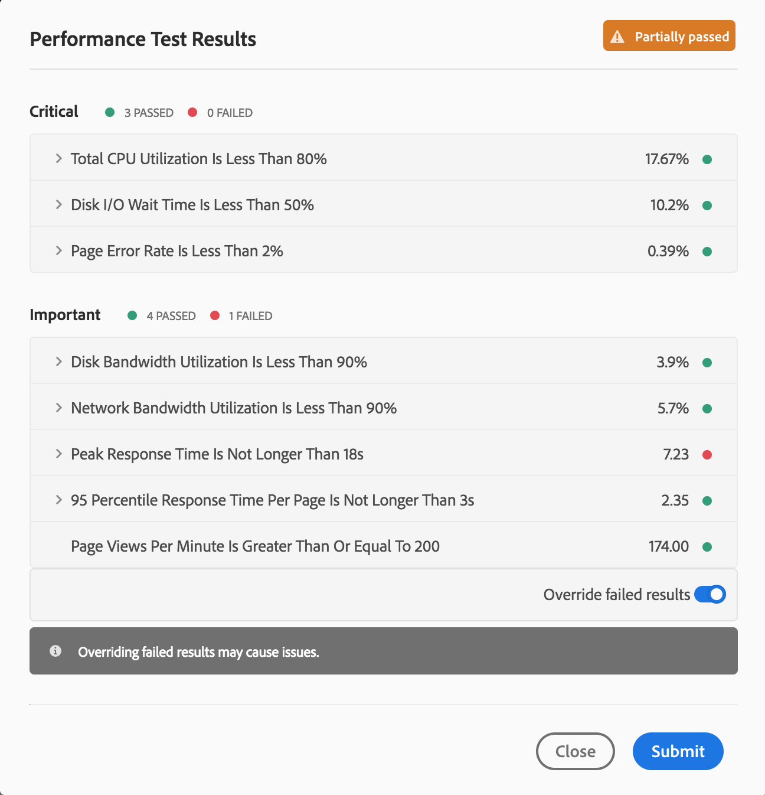

# Understand your Test Results{#understand-your-test-results}

During the **Pipeline** process, a number of metrics are captured and compared to either the Key Performance Indicators (KPIs) defined by the business owner, or standards set by Adobe Managed Services.

These are reported using the three-tier gating system as defined in this section.

## Three-Tier Gates while Running a Pipeline  {#three-tier-gates-while-running-a-pipeline}

There are three gates in the pipeline:

* Code Quality
* Performance Testing
* Security Testing

For each of these gates, there is a three-tier structure for issues identified by the gate.

* **Critical** - These are issues identified by the gate which cause an immediate failure of the pipeline.
* **Important** - These are issues identified by the gate which cause the pipeline to enter a paused state. A deployment manager, project manager, or business owner can either override the issues, in which case the pipeline proceeds, or they can accept the issues, in which case the pipeline stops with a failure.
* **Info** - These are issues identified by the gate which are provided purely for informational purposes and have no impact on the pipeline execution.

## Code Quality Testing {#code-quality-testing}

As part of the pipeline the source code is scanned to ensure that deployments meet certain quality criteria. Currently, this is implemented by SonarQube. There are over 100 rules combining generic Java rules and AEM-specific rules. The following table summarizes the rating for testing criteria:

<table border="1" cellpadding="1" cellspacing="0" width="100%"> 
 <tbody> 
  <tr> 
   <td><strong>Name</strong></td> 
   <td><strong>Definition</strong></td> 
   <td><strong>Category</strong></td> 
   <td><strong>Failure Threshold</strong></td> 
  </tr> 
  <tr> 
   <td>Security Rating</td> 
   <td>A = 0 Vulnerability<br /> B = at least 1 Minor Vulnerability<br /> C = at least 1 Major Vulnerability<br /> D = at least 1 Critical Vulnerability<br /> E = at least 1 Blocker Vulnerability</td> 
   <td>Critical</td> 
   <td>&lt; B</td> 
  </tr> 
  <tr> 
   <td>Reliability Rating</td> 
   <td>A = 0 Bug<br /> B = at least 1 Minor Bug<br /> C = at least 1 Major Bug<br /> D = at least 1 Critical Bug<br /> E = at least 1 Blocker Bug</td> 
   <td>Important</td> 
   <td>&lt; C</td> 
  </tr> 
  <tr> 
   <td>Maintainability Rating</td> 
   <td><p>Outstanding remediation cost for code smells is:</p> 
    <ul> 
     <li>&lt;=5% of the time that has already gone into the application, the rating is A</li> 
     <li>between 6 to 10% the rating is a B</li> 
     <li>between 11 to 20% the rating is a C</li> 
     <li>between 21 to 50% the rating is a D</li> 
     <li>anything over 50% is an E</li> 
    </ul> </td> 
   <td>Important</td> 
   <td>&lt; A</td> 
  </tr> 
  <tr> 
   <td>Coverage</td> 
   <td><p>A mix of line coverage and condition coverage using this formula:</p> <p>Coverage = (CT + CF + LC)/(2*B + EL)<br /> <br /> where:</p> <p>CT = conditions that have been evaluated to 'true' at least once<br /> CF = conditions that have been evaluated to 'false' at least once<br /> LC = covered lines = lines_to_cover - uncovered_lines<br /> <br /> B = total number of conditions<br /> EL = total number of executable lines (lines_to_cover)</p> </td> 
   <td>Important</td> 
   <td>&lt; 50%</td> 
  </tr> 
  <tr> 
   <td>Skipped Unit Tests</td> 
   <td>Number of skipped unit tests.</td> 
   <td>Info</td> 
   <td>&gt; 1</td> 
  </tr> 
  <tr> 
   <td>Open Issues</td> 
   <td>Overall issue types - Vulnerabilities, Bugs, and Code Smells</td> 
   <td>Info</td> 
   <td>&gt; 1</td> 
  </tr> 
  <tr> 
   <td>Duplicated Lines</td> 
   <td><p>Number of lines involved in duplicated blocks.</p> <p>For a block of code to be considered as duplicated:</p> 
    <ul> 
     <li>Non-Java projects: 
      <ul> 
       <li>There should be at least 100 successive and duplicated tokens.</li> 
       <li>Those tokens should be spread at least on: 
        <ul> 
         <li>30 lines of code for COBOL</li> 
         <li>20 lines of code for ABAP</li> 
         <li>10 lines of code for other languages<br /> <br /> </li> 
        </ul> </li> 
      </ul> </li> 
     <li>Java projects: 
      <ul> 
       <li>There should be at least 10 successive and duplicated statements whatever the number of tokens and lines.</li> 
      </ul> </li> 
    </ul> <p>Differences in indentation as well as in string literals are ignored while detecting duplications.</p> </td> 
   <td>Info</td> 
   <td>&gt; 1%</td> 
  </tr> 
 </tbody> 
</table>

>[!NOTE]
>
>Refer to [Metric Definitions](https://docs.sonarqube.org/display/SONAR/Metric+Definitions) for more detailed definitions.

You can download the list of rules here:

[](assets/sonarqube_rules.xlsx)

>[!NOTE]
>
>To learn more about the custom SonarQube rules executed by Cloud Manager, please refer to [Custom Code Quality Rules](../using/custom-code-quality-rules.md).

### Dealing with False Positives {#dealing-with-false-positives}

The quality scanning process is not perfect and will sometimes incorrectly identify issues which are not actually problematic. This is referred to as a "false positive".

In these cases, the source code can be annotated with the standard Java `@SuppressWarnings` annotation specifying the rule ID as the annotation attribute. For example, one common problem is that the SonarQube rule to detect hardcoded passwords can be aggressive about how a hardcoded password is identified.

To look at a specific example, this code would be fairly common in an AEM project which has code to connect to some external service:

```java
@Property(label = "Service Password")
private static final String PROP_SERVICE_PASSWORD = "password";
```

SonarQube will then raise a Blocker Vulnerability. After reviewing the code, you identify that this is not a vulnerability and can annotate this with the appropriate rule id.

```java
@SuppressWarnings("squid:S2068")
@Property(label = "Service Password")
private static final String PROP_SERVICE_PASSWORD = "password";
```

However, on the other hand, if the code was actually this:

```java
@Property(label = "Service Password", value = "mysecretpassword")
private static final String PROP_SERVICE_PASSWORD = "password";
```

Then the correct solution is to remove the hardcoded password.

>[!NOTE]
>
>While it is a best practice to make the `@SuppressWarnings`annotation as specific as possible, i.e. annotate only the specific statement or block causing the issue, it is possible to annotate at a class level.

## Security Testing {#security-testing}

Cloud Manager runs the existing ***AEM Security Heath Checks*** on stage following the deployment and reports the status through the UI. The results are aggregated from all AEM instances in the environment.

If any of the **Instances** report a failure for a given health check, the entire **Environment** fails that health check. As with Code Quality and Performance Testing, these health checks are organized into categories and reported using the three-tier gating system. The only distinction is that there is no threshold in the case of security testing. All the health checks are simply pass or fail.

The following table lists the current checks:

| **Health Check** |**Category** |
|---|---|
| Deserialization Firewall Attach API Readiness |Critical |
| Deserialization Firewall Functional |Critical |
| Deserialization Firewall Loaded |Critical |
| Authorizable Node Name Generation |Critical |
| Default Login Accounts |Critical |
| Sling Get Servlet |Critical |
| CQ Dispatcher Configuration |Critical |
| CQ HTML Library Manager Config |Critical |
| Sling Java Script Handler |Critical |
| Sling JSP Script Handler |Critical |
| Sling Referrer Filter |Critical |
| SSL Configuration |Critical |
| User Profile Default Access |Critical |
| CRXDE Support |Important |
| DavEx Health Check |Important |
| Example Content Packages |Important |
| WCM Filters Configuration |Important |
| WebDAV Health Check |Important |
| Web Server Configuration |Important |
| Replication and Transport Users |Info |

## Performance Testing {#performance-testing}

*Performance testing* in Cloud Manager is implemented using a 30 minute test.

During pipeline setup, the deployment manager can decide how much traffic to direct to each bucket.

You can learn more about bucket controls, from [Configure your CI/CD Pipeline](https://chl-aut/content/help/en/experience-manager/cloud-manager/using/configuring-pipeline.html).

>[!NOTE]
>
>To setup your program and define your KPIs, see [Setup your Program](https://chl-author.co/content/help/en/experience-manager/cloud-manager/using/setting-up-program.html).

The following table summarizes the performance test matrix using the three-tier gating system:

| **Metric** |**Category** |**Failure Threshold** |
|---|---|---|
| Page Request Error Rate % |Critical |>= 2% |
| CPU Utilization Rate |Critical |>= 80% |
| Disk IO Wait Time |Critical |>= 50% |
| 95 Percentile Response Time |Important |>= Program-level KPI |
| Peak Response Time |Important |>= 18 seconds |
| Page Views Per Minute |Important |< Program-level KPI |
| Disk Bandwidth Utilization |Important |>= 90% |
| Network Bandwidth Utilization |Important |>= 90% |
| Requests Per Minute |Info |< 6000 |

### Performance Testing Results Graphs {#performance-testing-results-graphs}

New graphs and download options have been added to the Performance Test Results dialog.

When you open the Performance Test dialog, the metric panels can be expanded to display a graph, provide a link to a download, or both.

For Cloud Manager Release 2018.7.0, this functionality is available for the following metrics:

* **CPU Utilization**

    * A graph of CPU Utilization during the test period.

* **Disk I/O Wait Time**

    * A graph of Disk I/O Wait Time during the test period.

* **Page Error Rate**

    * A graph of page errors per minute during the test period.
    * A CSV file listing pages which have produced an error during the test.

* **Disk Bandwidth Utilization**

    * A graph of Disk Bandwidth Utilization during the test period.

* **Network Bandwidth Utilization**

    * A graph of Network Bandwidth Utilization during the test period.

* **Peak Response Time**

    * A graph of peak response time per minute during the test period.

* **95th Percentile Response Time**

    * A graph of 95th percentile response time per minute during the test period.
    * A CSV file listing pages whose 95th percentile response time has exceeded the defined KPI.

The following images display the performance test graphs:

  

