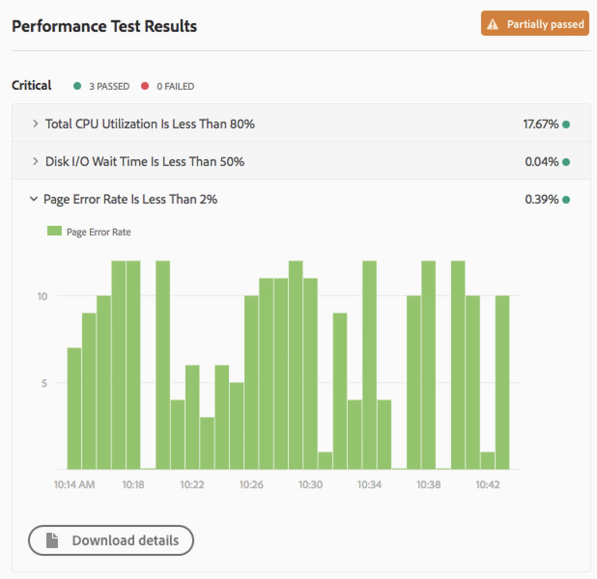

# Understand Your Test Results {#understand-your-test-results}

 Learn how code quality testing of pipelines works and how it can improve the quality of your deployments.

## Introduction {#introduction}

During pipeline execution, a number of metrics are captured and compared to either the key performance indicators (KPIs) defined by the business owner or to standards set by Adobe Managed Services.

These are reported using three-tiered rating system as defined in the next section

>[!NOTE]
>
>To learn about tests supported by Cloud Manager for AEM as a Cloud Service, see the [AEM as a Cloud Service documentation.](https://experienceleague.adobe.com/docs/experience-manager-cloud-service/content/implementing/using-cloud-manager/test-results/overview-test-results.html).


## Three-Tiered Ratings  {#three-tier-gates-while-running-a-pipeline}

There are three gates in the pipeline:

* Code Quality
* Performance Testing
* Security Testing

For each of these gates, there is a three-tiered structure for issues identified by the gate.

* **Critical** - These are issues which cause an immediate failure of the pipeline.
* **Important** - These are issues which cause the pipeline to enter a paused state. A deployment manager, project manager, or business owner can either override the issues, in which case the pipeline proceeds, or they can accept the issues, in which case the pipeline stops with a failure. Override of important failures are subject to a [timeout.](deploying-code.md#timeouts)
* **Info** - These are issues which are provided purely for informational purposes and have no impact on pipeline execution.

>[!NOTE]
>
>In a code quality only pipeline, important failures in the Code Quality gate cannot be overridden since the code quality testing step is the final step in the pipeline.

## Code Quality Testing {#code-quality-testing}

This step evaluates the quality of your application code, which is the main purpose of a code quality only pipeline, and is executed immediately following the build step in all non-production and production pipelines. Please refer to the document [Configuring Non-Production Pipelines](configuring-non-production-pipelines.md) to learn more.

### Understanding Code Quality Testing {#understanding-code-quality-testing}

Code quality testing scans the source code to ensure that it meets certain quality criteria. This is implemented by a combination of SonarQube analysis, content package-level examination using OakPAL, and dispatcher validation using the Dispatcher Optimization Tool.

There are over 100 rules combining generic Java rules and AEM-specific rules. Some of the AEM-specific rules are created based on best practices from AEM Engineering and are referred to as [Custom Code Quality Rules.](/help/using/custom-code-quality-rules.md)

>[!NOTE]
>
>You can download the complete list of rules [using this link.](/help/using/assets/CodeQuality-rules-latest-AMS.xlsx)

The results of code quality testing is delivered as **ratings**. The following table summarizes the ratings for various test criteria.

|Name|Definition|Category|Failure Threshold|
|--- |--- |--- |--- |
|Security Rating|A = No vulnerabilities<br/>B = At least 1 minor vulnerability<br/>C = At least 1 major vulnerability<br/>D = At least 1 critical vulnerability<br/>E = At least 1 blocker vulnerability|Critical|&lt; B|
|Reliability Rating|A = No bugs<br/>B = At least 1 minor bug <br/>C = At least 1 major bug<br/>D = At least 1 critical bug<br/>E = At least 1 blocker bug|Important|&lt; C|
|Maintainability Rating|Defined by the outstanding remediation cost for code smells as a percentage of the time that has already gone into the application<br/><ul><li>A = &lt;=5%</li><li>B = 6-10%</li><li>C = 11-20%</li><li>D = 21-50%</li><li>E = >50%</li></ul>|Important|&lt; A|
|Coverage|Defined by a mix of unit test line coverage and condition coverage using the formula: <br/>`Coverage = (CT + CF + LC) / (2 * B + EL)`  <ul><li>`CT` = Conditions that have been evaluated as `true` at least once while running unit tests</li><li>`CF` = Conditions that have been evaluated as `false` at least once while running unit tests</li><li>`LC` = Covered lines = lines_to_cover - uncovered_lines</li><li>`B` = total number of conditions</li><li>`EL` = total number of executable lines (lines_to_cover)</li></ul>|Important|&lt; 50%|
|Skipped Unit Tests|Number of skipped unit tests|Info|> 1|
|Open Issues|Overall issue types - Vulnerabilities, Bugs, and Code Smells|Info|&gt; 0|
|Duplicated Lines|Defined as the number of lines involved in duplicated blocks. A block of code is considered duplicated under the following conditions.<br>Non-Java Projects:<ul><li>There should be at least 100 successive and duplicated tokens.</li><li>Those tokens should be spread over at least: </li><li>30 lines of code for COBOL </li><li>20 lines of code for ABAP </li><li>10 lines of code for other languages</li></ul>Java Projects:<ul></li><li> There should be at least 10 successive and duplicated statements regardless of the number of tokens and lines.</li></ul>Differences in indentation as well as in string literals are ignored when detecting duplicates.|Info|&gt; 1%|
|Cloud Service Compatibility|Number of identified Cloud Service Compatibility issues|Info|> 0|

>[!NOTE]
>
>Refer to [SonarQube's metric definitions](https://docs.sonarqube.org/latest/user-guide/metric-definitions/) for more detailed information.

>[!NOTE]
>
>To learn more about the custom code quality rules executed by [!UICONTROL Cloud Manager], please refer to the document [Custom Code Quality Rules.](custom-code-quality-rules.md)

### Dealing with False Positives {#dealing-with-false-positives}

The quality scanning process is not perfect and will sometimes incorrectly identify issues which are not actually problematic. This is referred to as a **false positive**.

In these cases, the source code can be annotated with the standard Java `@SuppressWarnings` annotation specifying the rule ID as the annotation attribute. For example, one common false positive is that the SonarQube rule to detect hardcoded passwords can be aggressive about how a hardcoded password is identified.

The following code is fairly common in an AEM project, which has code to connect to some external service.

```java
@Property(label = "Service Password")
private static final String PROP_SERVICE_PASSWORD = "password";
```

SonarQube will then raise a blocker vulnerability. But after reviewing the code, you recognize that this is not a vulnerability and can annotate the code with the appropriate rule ID.

```java
@SuppressWarnings("squid:S2068")
@Property(label = "Service Password")
private static final String PROP_SERVICE_PASSWORD = "password";
```

However, if the code was actually this:

```java
@Property(label = "Service Password", value = "mysecretpassword")
private static final String PROP_SERVICE_PASSWORD = "password";
```

Then the correct solution is to remove the hardcoded password.

>[!NOTE]
>
>While it is a best practice to make the `@SuppressWarnings` annotation as specific as possible, i.e. annotate only the specific statement or block causing the issue, it is possible to annotate at a class level.

## Security Testing {#security-testing}

[!UICONTROL Cloud Manager] runs the existing **AEM Security Heath Checks** on the staging environment following deployment and reports the status through the UI. The results are aggregated from all AEM instances in the environment.

These same health checks can be executed at any time through the Web Console or the Operations Dashboard.

If any of the instances reports a failure for a given health check, the entire environment fails that health check. As with code quality and performance testing, these health checks are organized into categories and reported using the three-tiered gating system. The only distinction is that there is no threshold in the case of security testing. All the health checks are pass or fail.

The following table lists the health checks.

|Name|Health Check Implementation|Category|
|---|---|---|
| Deserialization firewall Attach API Readiness is in an acceptable state. | [Deserialization Firewall Attach API Readiness](https://experienceleague.adobe.com/docs/experience-manager-65/administering/security/mitigating-serialization-issues.html#security) |Critical |
| Deserialization firewall is functional. | [Deserialization Firewall Functional](https://experienceleague.adobe.com/docs/experience-manager-65/administering/security/mitigating-serialization-issues.html#security) |Critical |
| Deserialization firewall is loaded. | [Deserialization Firewall Loaded](https://experienceleague.adobe.com/docs/experience-manager-65/administering/security/mitigating-serialization-issues.html#security) |Critical |
| `AuthorizableNodeName` implementation does not expose authorizable ID in the node name/path. | [Authorizable Node Name Generation](https://experienceleague.adobe.com/docs/experience-manager-65/administering/security/security-checklist.html#security) |Critical |
| Default passwords have been changed. | [Default Login Accounts](https://experienceleague.adobe.com/docs/experience-manager-65/administering/security/security.html#users-and-groups-in-aem) |Critical |
| Sling default GET servlet is protected from DOS attacks. | Sling Get Servlet |Critical |
| The Sling Java Script handler is configured appropriately. | Sling Java Script Handler |Critical |
| The Sling JSP Script handler is configured appropriately. | Sling JSP Script Handler |Critical |
| SSL is configured correctly. | SSL Configuration |Critical |
| No obviously insecure user profile policies are found. | User Profile Default Access |Critical |
| The Sling Referrer filter is configured in order to prevent CSRF attacks. | [Sling Referrer Filter](https://experienceleague.adobe.com/docs/experience-manager-65/administering/security/security-checklist.html#security) |Important |
| The Adobe Granite HTML Library Manager is configured appropriately. | CQ HTML Library Manager Config |Important |
| CRXDE Support bundle is disabled. | CRXDE Support |Important |
| Sling DavEx bundle and servlet are disabled. | DavEx Health Check |Important |
| Sample content is not installed. | Example Content Packages |Important |
| Both the WCM Request Filter and the WCM Debug Filter are disabled. | [WCM Filters Configuration](https://experienceleague.adobe.com/docs/experience-manager-65/deploying/configuring/osgi-configuration-settings.html#configuring) |Important |
| Sling WebDAV bundle and servlet are configured appropriately. | WebDAV Health Check |Important |
| The web server is configured to prevent clickjacking. | Web Server Configuration |Important |
| Replication is not using the `admin` user. | Replication and Transport Users |Info |

## Performance Testing {#performance-testing}

### AEM Sites {#aem-sites}

Cloud Manager executes performance testing for AEM Sites programs. The performance test is run for approximately 30 mins by spinning up virtual users (containers) that simulate actual users to access pages in staging environments to simulate traffic. These pages are found using a crawler.

#### Virtual Users {#virtual-users}

The number of virtual users or containers that are spun up by Cloud Manager is driven by the KPIs (response time and pageviews/min) defined by the user with the **Business Owner** role while [creating or editing the program.](setting-up-program.md) Based on the KPIs defined, up to 10 containers that simulate actual users will be spun up. The pages that are selected for testing are split and assigned to each virtual user.

#### Crawler {#crawler}

Prior to the start of the 30 minute test period, Cloud Manager will crawl the staging environment using a set of one or more seed URLs configured by the Customer Success Engineer. Starting from these URLs, the HTML of each page is inspected and links are traversed in a breadth-first fashion. This crawling process is limited to a maximum of 5000 pages. Requests from the crawler have a fixed timeout of 10 seconds.

#### Page Sets for Testing {#page-sets}

Pages are selected by three page sets. Cloud Manager uses the access logs from the AEM instances across production and staging environments to determine the following buckets.

* **Popular Live Pages** - This option is selected to make sure that the most popular pages accessed by live customers are tested. Cloud Manager will read the access log and determine the top 25 most-accessed pages by live customers to generate a list of top `Popular Live Pages`. The intersection of these that are also present on the staging environment are then crawled on the staging environment. 

* **Other Live Pages** - This option is selected to make sure that the pages that fall outside the top 25 popular live pages that may not be popular, but important to test are tested. Similar to popular live pages, these are extracted from the access log and must also be present on the staging environment.

* **New Pages** - This option is selected to test new pages that may have only been deployed to the staging and not yet to production, but are must be tested. 

##### Distribution of Traffic Across Page Sets Selected {#distribution-of-traffic}

You can choose anywhere from one to all three sets on the **Testing** tab of your [pipeline configuration.](configuring-production-pipelines.md) The distribution of traffic is based on the number of sets selected. That is, if all three are selected, 33% of the total page views are put toward each set. If two are selected, 50% goes to each set. If one is selected, 100% of the traffic goes to that set.

Let us consider this example.

* There is a 50/50 split between the popular live pages and new pages sets.
* Other live pages is not used.
* The new pages set contains 3000 pages.
* The page views per minute KPI is set to 200. 

Over the 30 minute test period:

* Each of the 25 pages in the popular live pages set will be hit 120 times: `((200 * 0.5) / 25) * 30 = 120`
* Each of the 3000 pages in the new pages set will be hit once: `((200 * 0.5) / 3000) * 30 = 1`
 
#### Testing and Reporting {#testing-reporting}

Cloud Manager executes performance testing for AEM Sites programs by requesting pages as an unauthenticated user by default on the staging publish server for a 30 minute test period. It measures the virtual user-generated metrics (response time, error rate, views per minute, etc.) for each page as well as various system-level metrics (CPU, memory, networking data) for all instances.

The following table summarizes the performance test matrix using the three-tiered gating system.

| Metric |Category |Failure Threshold |
|---|---|---|
| Page Request Error Rate |Critical |>= 2% |
| CPU Utilization Rate |Critical |>= 80% |
| Disk IO Wait Time |Critical |>= 50% |
| 95th Percentile Response Time |Important |>= Program-level KPI |
| Peak Response Time |Important |>= 18 seconds |
| Page Views Per Minute |Important |< Program-level KPI |
| Disk Bandwidth Utilization |Important |>= 90% |
| Network Bandwidth Utilization |Important |>= 90% |
| Requests Per Minute |Info |>= 6000 |

Refer to the section [Authenticated Performance Testing](#authenticated-performance-testing) for more details on using basic authentication for performance testing for Sites and Assets.

>[!NOTE]
>
>Both author and publish instances are monitored during the period of the test. If any metric for one instance is not obtained, that metric is reported as unknown and the corresponding step will fail.

#### Optional - Authenticated Performance Testing {#authenticated-performance-testing}

If necessary, AMS customers with authenticated sites can specify a username and password which Cloud Manager will use to access the website during sites performance testing.

The username and password are specified as pipeline variables with the names `CM_PERF_TEST_BASIC_USERNAME` and `CM_PERF_TEST_BASIC_PASSWORD`.

The username should be stored in a `string` variable and the password should be stored in a `secretString` variable. If both of these are specified, every request from the performance test crawler and the test virtual users will contain these credentials as HTTP Basic authentication.

To set these variables using the Cloud Manager CLI, run:

```shell
$ aio cloudmanager:set-pipeline-variables <pipeline id> --variable CM_PERF_TEST_BASIC_USERNAME <username> --secret CM_PERF_TEST_BASIC_PASSWORD <password>
```

Please refer to the document [Patch User Pipeline Variables](https://www.adobe.io/apis/experiencecloud/cloud-manager/api-reference.html#/Variables/patchPipelineVariables) to learn how to use the API. 

### AEM Assets {#aem-assets}

Cloud Manager executes performance testing for AEM Assets programs by uploading assets repeatedly for a 30 minute test period. 

#### Onboarding Requirement {#onboarding-requirement}

For Assets performance testing, your Customer Success Engineer will create a `cloudmanager` user and password during the onboarding of the author to staging environment. The performance test steps require a user called `cloudmanager` and the associated password set up by your CSE. This should neither be removed from the author instance nor its permissions changed. Doing so will likely fail the Assets performance testing.

#### Images and Assets for Testing {#assets-for-testing}

Customers can upload their own assets for testing. This can be done from the **Pipeline Setup** or **Edit** screen. Common image formats such as JPEG, PNG, GIF and BMP are supported along with Photoshop, Illustrator and Postscript files.

If no images are uploaded, Cloud Manager will use a default image and PDF documents for testing.

#### Distribution of Assets for Testing {#distribution-of-assets}

The distribution of how many assets of each type are uploaded per minute is set in the **Pipeline Setup** or **Edit** screen.

For example, if a 70/30 split is used, and there are 10 assets uploaded per minute, 7 images and 3 documents will be uploaded per minute.

#### Testing and Reporting {#testing-and-reporting}

Cloud Manager will create a folder on the author instance using the username and password as setup by the CSE in the [Onboarding Requirements](#onboaring-requirements) section. Assets are then uploaded to the folder using an open-source library. The tests run by the Assets testing step are written using an [open source library.](https://github.com/adobe/toughday2) Both processing time for each asset as well as various system-level metrics are measured across the 30-minute testing duration. This feature can upload both images and PDF documents.

>[!TIP]
>
>Please refer to the document [Configure Production Pipelines](configuring-production-pipelines.md) to learn more. Refer to the document [Setup your Program](setting-up-program.md) to learn how to setup your program and define your KPIs.

### Performance Testing Results Graphs {#performance-testing-results-graphs}

A number of metrics are available in the **Performance Test dialog**

  

The metric panels can be expanded to display a graph, provide a link to a download, or both.



This functionality is available for the following metrics.

* **CPU Utilization**
  * A graph of CPU utilization during the test period

* **Disk I/O Wait Time**
  * A graph of disk I/O wait time during the test period

* **Page Error Rate**
  * A graph of page errors per minute during the test period
  * A CSV file listing pages which have produced an error during the test

* **Disk Bandwidth Utilization**
  * A graph of disk bandwidth utilization during the test period

* **Network Bandwidth Utilization**
  * A graph of network bandwidth utilization during the test period

* **Peak Response Time**
  * A graph of peak response time per minute during the test period

* **95th Percentile Response Time**
  * A graph of 95th percentile response time per minute during the test period
  * A CSV file listing pages whose 95th percentile response time has exceeded the defined KPI

## Content Package Scanning Optimization {#content-package-scanning-optimization}

As part of the quality analysis process, Cloud Manager performs analysis of the content packages produced by the Maven build. Cloud Manager offers optimizations to accelerate this process, which are effective when certain packaging constraints are observed. Most significant is the optimization performed for projects that output a single content package, generally referred to as an "all" package, which contains a number of other content packages produced by the build, which are marked as skipped. When Cloud Manager detects this scenario, rather than unpack the "all" package, the individual content packages are scanned directly and sorted based on dependencies. For example, consider the following build output.

* `all/myco-all-1.0.0-SNAPSHOT.zip` (content-package)
* `ui.apps/myco-ui.apps-1.0.0-SNAPSHOT.zip` (skipped-content-package)
* `ui.content/myco-ui.content-1.0.0-SNAPSHOT.zip` (skipped-content-package)

If the only items inside `myco-all-1.0.0-SNAPSHOT.zip` are the two skipped content packages, then the two embedded packages will be scanned in lieu of the "all" content package.

For projects that produce dozens of embedded packages, this optimization has been shown to save upwards of 10 minutes per pipeline execution.

A special case can occur when the "all" content package contains a combination of skipped content packages and OSGi bundles. For example, if `myco-all-1.0.0-SNAPSHOT.zip` contained the two embedded packages previously mentioned as well as one or more OSGi bundles, then a new, minimal content package is constructed with only the OSGi bundles. This package is always named `cloudmanager-synthetic-jar-package` and the contained bundles are placed in `/apps/cloudmanager-synthetic-installer/install`.

>[!NOTE]
>
>* This optimization does not impact the packages which are deployed to AEM.
>* Because the matching between the embedded content packages and the skipped content packages is based on file names, this optimization cannot be performed if multiple skipped content packages have exactly the same file name or if the file name is changed while embedding.