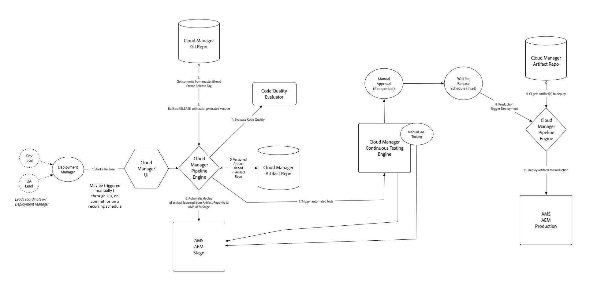

# Understanding Concepts Before Using Cloud Manager{#understanding-concepts-before-using-cloud-manager}

This section provides concepts and terminologies that are good to know before working in Cloud Manager and covers the following topics:

* **Deployment Environment**
* **Source Code Repository**
* **Security and Privacy**
* **Pipeline Overview**
* **Help Resources**

## Deployment Environment {#deployment-environment}

You may be new to Adobe Experience Manager (AEM) 6.4 or need an upgrade to AEM 6.4 Release.

If you are a new to AEM 6.4, then you already have access to Cloud Manager.

If you are an existing customer, then you need to upgrade to AEM 6.4 to have access to Cloud Manager. You can start using Cloud Manager, once you receive URL and credentials from Customer Success Engineers (CSE).

<!-- 

Comment Type: annotation
Last Modified By: ptager
Last Modified Date: 2018-05-02T17:19:24.147-0400

Section is redundant with the section in the Overview topic

 -->

## Source Code Repository {#source-code-repository}

**Multiple Git Servers**: In some cases, customers will have an existing git repository and want to keep using it.

For these cases, the you can use git's support for multiple remote repositories. Day to day development would continue to happen in the your git repository. When a deployment is desired, you can simply push the latest code to the Cloud Manager git repository.

<!-- 

Comment Type: annotation
Last Modified By: ptager
Last Modified Date: 2018-05-02T17:20:46.002-0400

Looks like we lost some content, compared to the previous version

 -->

## Security and Privacy {#security-and-privacy}

<!-- 

Comment Type: annotation
Last Modified By: jsyal
Last Modified Date: 2018-04-21T02:38:21.417-0400

Query for Brad B.

 -->

## Pipeline Overview {#pipeline-overview}

Cloud Manager will support a single pipeline per program (definition above) which handles deployments to stage and production. ****

The git branch used for stage and production deployments is master.

>[!NOTE]
>
>It is a best practice to to use master as a git branch for stage and production, but you can use any of the branch while setting up the pipeline.

The single pipeline process is illustrated below:

### Understanding the Flow {#understanding-the-flow}

You can configure your pipeline from the [!UICONTROL Pipeline Settings] tile from Cloud Manager UI.

Refer to [Using Cloud Manager,](hhttps://helpx.adobe.com/experience-manager/cloud-manager/using/using-cloud-manager.html) for more information.

The Deployment Manager is responsible for setting up the pipeline, that is:

* assigning application branch
* assigning deployment environments
* defining test options

When doing so, you first select a branch from their git repository. Next, define the trigger that will start the pipeline.

Next, you can define the parameters controlling the production deployment.

Finally, you will be able to configure the performance test parameters.

>[!NOTE]
>
>To learn about configuring the behavior and preferences for your pipeline, see **Configuring Pipeline** section in [Using Cloud Manager](using-cloud-manager.md).

### Help Resources {#help-resources}

Contact Adobe Managed Services Customer Success Engineer for support.

### The Next Steps {#the-next-steps}

Now you have better understanding of the Cloud Manager concepts.

To set up your project, environment, and the team (user and roles), refer to [Setting up General Configurations for Cloud Manager](setting-configurations-for-cloud-manager.md).
