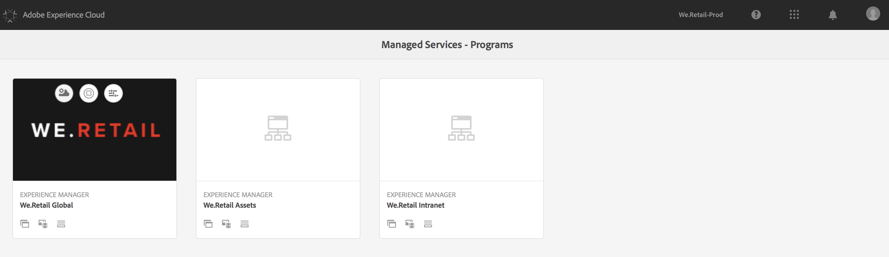
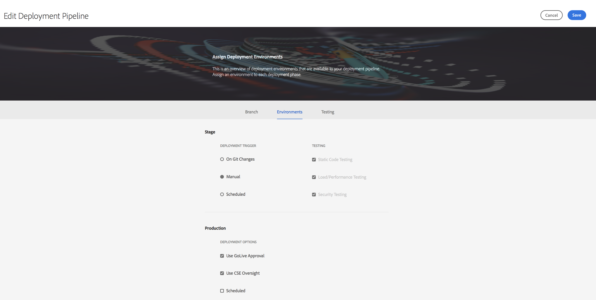
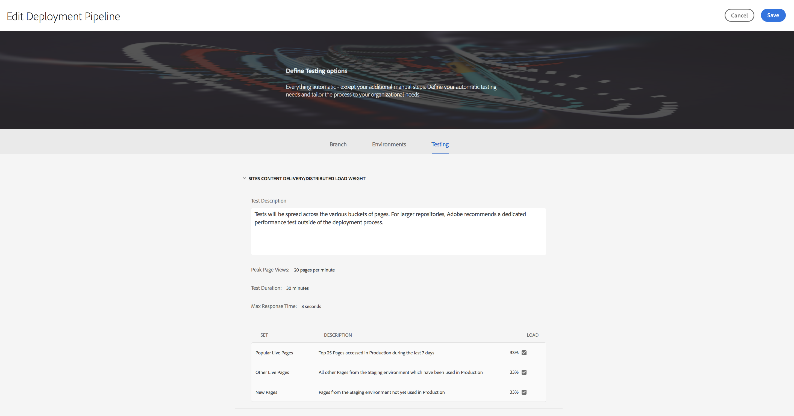
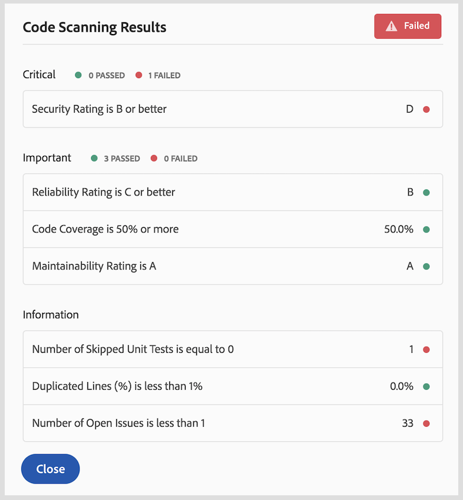

# Using Cloud Manager{#using-cloud-manager}

This section explains the User Interface (UI) for Cloud Manager and explains the workflow from setting up the program to code deployment followed by quality checks.

#### Prerequisites {#prerequisites}

Before you get into the details of using the Cloud Manager, it is recommended to go though the following sections:

* [Overview](../using/overview-cloud-manager.md)
* [Understanding the Concepts before Using Cloud Manager](../using/understanding-concepts.md)
* [Setting up General Configurations for Cloud Manager](../using/setting-configurations-for-cloud-manager.md)

The following topics are covered in this section:

* **Getting Started with Cloud Manager**
* **Setting up Program**
* **Available Environments**
* **Configuring Pipeline**
* **Deploying Code**
* **Results from Quality Checks**

## Getting Started with Cloud Manager {#getting-started-with-cloud-manager}

Once you have setup the general configurations for Cloud Manager, you are ready to use the Cloud Manager.

1. Log in to the Adobe Experience Cloud and you will see the list of solutions. 

   

1. Select the program and click on the top left icon to open Cloud Manager.

   

## Setting Up Program {#setting-up-program}

After onboarding, the business owner will need to do some initial setup of the program. This involves setting the program description and defining the KPIs which will be used for performance testing. Optionally, a thumbnail can be uploaded.

The KPIs defined serves as a baseline for performance testing that is passed each time the pipeline executes.

>[!NOTE]
>
>The KPIs defined are measured on tests run on the **stage** environment. Typically, these KPIs are scaled down to fit the capabilities of the stage environment.
>
>For example, a user expecting an average of 1000 page views per minute in their production environment and having four dispatcher/publish servers in production should scale this to 250 page views per minute (assuming their stage environment consists of only a single dispatcher/publish server pair).
>
>Also, many users will have a CDN (Akamai, CloudFront) in front of their production environment. Since Cloud Manager tests against the stage environment directly, the KPI should reflect only the traffic expected to pass through the CDN, that is, the cache misses. Typically this will be a relatively small subset of the total production traffic.

### Using Cloud Manager to define KPIs {#using-cloud-manager-to-define-kpis}

Follow the steps below to set up the program and define KPIs:

1. Click **Setup Program** to start the setup process in Cloud Manager.
1. The **Edit Program Information** screen displays.

   Upload a thumbnail to your program. You can also add a relevant description to your program and click **Next**.

1. The **Configure Users** screen displays.

   You can configure your team roles and users. Click **Next**.

1. The **Configure General Business KPIs** screen displays.

   You can define your two KPIs (expectations for each deployment):

    1. What's the 95th percentile response time that is acceptable to you?

        1. Recommended value - 3 seconds

    1. How many Page Views per Minute under the peak load?

        1. Recommended value - 200 pv/m

1. Click **Submit** to complete the setup wizard.

   You will see the home screen for Cloud Manager change to **Deploy**.

## Available Environments {#available-environments}

The **Available Environments** in the Cloud Manager lists all the managed AEM environments.

Each of the listed environments will have a status associated with it.

## Configuring Pipeline {#configuring-pipeline}

### Setting up Pipeline {#setting-up-pipeline}

>[!CAUTION]
>
>The pipeline cannot be setup until the git repository has at least one branch.

Before you start to deploy your code, you must configure your pipeline settings from the Cloud Manager.

To learn more about pipeline configuration, see **Pipeline Overview** section in ** [Understanding Concepts before Using Cloud Manager](../using/understanding-concepts.md)**.

>[!NOTE]
>
>You can change the pipeline settings after initial set up.

### Configuring Pipeline Settings from the Cloud Manager {#configuring-pipeline-settings-from-the-cloud-manager}

Follow the steps below from the Cloud Manager to configure the bahavior and preferences for your pipeline:

1. Access the **Branch** tab to set up the application branch.

   Select the git branch that you want to set up.

   >[!NOTE]
   >
   >Branches found in the Git repository are linked to your program.

   

1. Access the **Environments** tab to select **Stage** and **Production** options.

   You can define trigger that will start the pipeline:

    * **Manual** - someone has to click manually in the UI to start the pipeline.

   Now you define the parameters controlling the production deployment. The three available options are as follows:

    * **Use Go Live Approval **- A deployment must be manually approved by a business owner, project manager, or deployment manager via the Cloud Manager UI.
    * **Use CSE Oversight** - A CSE is engaged to actually start the deployment.

   

1. Access the **Testing** tab to define your testing criteria for your program.

   Now, you can configure the performance test parameters.

   

## Deploying Code {#deploying-code}

Once you have configured your pipeline (repository, environment, and testing environment), you are ready to deply your code.

### Deploying Code from Cloud Manager {#deploying-code-from-cloud-manager}

Follow the steps below to deploy your code to the production environment:

1. Click **Deploy** from the Cloud Manager to start the deployment process.
1. The **Stage Deployment** screen displays.

   Click **Build** to start the process.

1. The complete build process takes into account several parametrs to check and deploys your code.

   The following parameters that are checked are as follows:

   **Stage Deployment**

    * Repository
    * Unit Testing
    * Code Scanning
    * Deployed to Stage Environment

   **Pre-Production Testing**

    * Security Testing
    * Performance Testing

   >[!NOTE]
   >
   >Additionally, you can view logs or review results for above mentioned testing criteria.

## Results from Quality Checks {#results-from-quality-checks}

There are three gates in the pipeline: Code Quality, Performance Testing, and Security Testing.

For each of these gates, there is a three-tier structure for issues identified by the gate.

* **Critical** - These are issues identified by the gate which cause an immediate failure of the pipeline.
* **Important** - These are issues identified by the gate which cause the pipeline to enter a paused state. A deployment manager, project manager, or business owner can either override the issues, in which case the pipeline proceeds, or they can accept the issues, in which case the pipeline stops with a failure.
* **Info** - These are issues identified by the gate which are provided purely for informational purposes and have no impact on the pipeline execution.

### Code Scanning {#code-scanning}

 

### Performance Testing {#performance-testing}

*Performance testing* in Cloud Manager is implemented using a test for 30 minutes.

During pipeline setup, the deployment manager can decide how much traffic to direct to each bucket. They can choose anywhere from one to all three buckets. The distribution of traffic is based on the number of buckets selected, i.e. if all three are selected, 33% of the total page views are put toward each bucket; if two are selected, 50% goes to each set; if one is selected, 100% of the traffic goes to that set.

For example, let's say that there is a 50%/50% split between the Popular Live Pages and New Pages set (in this example, Other Live Pages is not used) and the New Pages set contains 3000 pages. The page views per minute KPI is set to 200. Over the 30 minute test period:

* Each of the 25 pages in the Popular Live Pages set will be hit 240 times - ((200 &#42; 0.5) / 25) &#42; 30 = 120
* Each of the 3000 pages in the New Pages set will be hit once - ((200 &#42; 0.5) / 3000) &#42; 30 = 1

 

#### Performance Test Metrics {#performance-test-metrics}

During the test period, a number of metrics are captured and compard to either the KPIs defined by the business owner or standards set by AMS.

These are reported using the three-tier gating system as follows:

#### Three-Tier Gates while Running a Pipeline {#three-tier-gates-while-running-a-pipeline}

There are three gates in the pipeline as Code Quality, Performance Testing, and Security Testing.

For each of these gates, there is a three-tier structure for the issues identified by the gate:

* **Critical**: These are issues identified by the gate which cause an immediate failure of the pipeline.
* **Important**: These are issues identified by the gate which cause the pipeline to enter a paused state. A deployment manager, project manager, or business owner can either override the issues, in which case the pipeline proceeds, or they can accept the issues, in which case the pipeline stops with a failure.
* **Info**: These are issues identified by the gate which are provided purely for informational purposes and have no impact on the pipeline execution.

The following table summarizes the performance test matrix using the three-tier gating system:

| **Metric** |**Category** |**Failure Threshold** |
|---|---|---|
| Page Request Error Rate % |Critical |>= 2% |
| CPU Utilization Rate |Critical |>= 80% |
| Disk IO Wait Time |Critical |>= 50% |
| 95 Percetile Response Time |Important |>= Program-level KPI |
| Peak Response Time |Important |>= 18 seconds |
| Page Views Per Minute |Important |< Program-level KPI |
| Disk Bandwidth Utilization |Important |>= 90% |
| Network Bandwidth Utilization |Important |>= 90% |
| Requests Per Minute |Info |< 6000 |

### Security Testing {#security-testing}

Cloud Manager runs the existing ***AEM Security Heath Checks*** on stage following the deployment and reports their status through the UI. The results are aggregated from all AEM instances in the environment.

If any of the instances report a failure for a given health check, the entire environment fails that health check. As with Code Quality and Performance Testing, these health checks are organized into categories and reported using the three-tier gating system. The only distinction is that there is no threshold in the case of security testing. All the health checks are simply pass or fail.

The current checks are:

| **Health Check** |**Category** |
|---|---|
| Deserialization Firewall Attach API Readiness |Critical |
| Deserialization Firewall Functional |Critical |
| Deserialization Firewall Loaded |Critical |
| Authorizable Node Name Generation |Critical |
| Default Login Accounts |Critical |
| Sling Get Servlet |Critical |
| CQ Dispatcher Configuration |Critical |
| CQ HTML Library Manager Config |Critical |
| Sling Java Script Handler |Critical |
| Sling Jsp Script Handler |Critical |
| Sling Referrer Filter |Critical |
| SSL Configuration |Critical |
| User Profile Default Access |Critical |
| CRXDE Support |Important |
| DavEx Health Check |Important |
| Example Content Packages |Important |
| WCM Filters Configuration |Important |
| WebDAV Health Check |Important |
| Web Server Configuration |Important |
| Replication and Transport Users |Info |

### Quality Check Implementation by SonarQube {#quality-check-implementation-by-sonarqube}

As part of the pipeline, as depicted above, the code is scanned. Currently, this is implemented by SonarQube. We have 93 rules which are a combination of generic Java rules and AEM-specific rules (including some from Cognifide's existing rule set). A list of these rules can be found here: [SonarQube Rules.xlsx](https://wiki.corp.adobe.com/download/attachments/1357776655/SonarQube%20Rules.xlsx?version=3&modificationDate=1520893776617&api=v2)

From these rules, a variety of metrics is calculated, some of which are used as a quality gate before allowing a deployment to the stage environment.

These are the current thresholds:

<table border="1" cellpadding="1" cellspacing="0" width="100%"> 
 <tbody> 
  <tr> 
   <td><strong>Name</strong></td> 
   <td><strong>Definition</strong></td> 
   <td><strong>Category</strong></td> 
   <td><strong>Failure Threshold</strong></td> 
  </tr> 
  <tr> 
   <td>Security Rating</td> 
   <td>A = 0 Vulnerability<br /> B = at least 1 Minor Vulnerability<br /> C = at least 1 Major Vulnerability<br /> D = at least 1 Critical Vulnerability<br /> E = at least 1 Blocker Vulnerability</td> 
   <td>Critical</td> 
   <td>&lt; B</td> 
  </tr> 
  <tr> 
   <td>Reliability Rating</td> 
   <td>A = 0 Bug<br /> B = at least 1 Minor Bug<br /> C = at least 1 Major Bug<br /> D = at least 1 Critical Bug<br /> E = at least 1 Blocker Bug</td> 
   <td>Important</td> 
   <td>&lt; C</td> 
  </tr> 
  <tr> 
   <td>Maintainability Rating</td> 
   <td><p>Outstanding remediation cost for code smells is:</p> 
    <ul> 
     <li>&lt;=5% of the time that has already gone into the application, the rating is A</li> 
     <li>between 6 to 10% the rating is a B</li> 
     <li>between 11 to 20% the rating is a C</li> 
     <li>between 21 to 50% the rating is a D</li> 
     <li>anything over 50% is an E</li> 
    </ul> </td> 
   <td>Important</td> 
   <td>&lt; A</td> 
  </tr> 
  <tr> 
   <td>Coverage</td> 
   <td><p>A mix of line coverage and condition coverage using this formula:</p> <p>Coverage = (CT + CF + LC)/(2*B + EL)<br /> <br /> where</p> <p>CT = conditions that have been evaluated to 'true' at least once<br /> CF = conditions that have been evaluated to 'false' at least once<br /> LC = covered lines = lines_to_cover - uncovered_lines<br /> <br /> B = total number of conditions<br /> EL = total number of executable lines (lines_to_cover)</p> </td> 
   <td>Important</td> 
   <td>&lt; 50%</td> 
  </tr> 
  <tr> 
   <td>Skipped Unit Tests</td> 
   <td>Number of skipped unit tests.</td> 
   <td>Info</td> 
   <td>&gt; 1</td> 
  </tr> 
  <tr> 
   <td>Open Issues</td> 
   <td>overs all issue types - Vulnerabilities, Bugs, and Code Smells</td> 
   <td>Info</td> 
   <td>&gt; 1</td> 
  </tr> 
  <tr> 
   <td>Duplicated Lines</td> 
   <td><p>Number of lines involved in duplicated blocks.</p> <p>For a block of code to be considered as duplicated:</p> 
    <ul> 
     <li>Non-Java projects: 
      <ul> 
       <li>There should be at least 100 successive and duplicated tokens.</li> 
       <li>Those tokens should be spread at least on: 
        <ul> 
         <li>30 lines of code for COBOL</li> 
         <li>20 lines of code for ABAP</li> 
         <li>10 lines of code for other languages<br /> <br /> </li> 
        </ul> </li> 
      </ul> </li> 
     <li>Java projects: 
      <ul> 
       <li>There should be at least 10 successive and duplicated statements whatever the number of tokens and lines.</li> 
      </ul> </li> 
    </ul> <p>Differences in indentation as well as in string literals are ignored while detecting duplications.</p> </td> 
   <td>Info</td> 
   <td>&gt; 1%</td> 
  </tr> 
 </tbody> 
</table>

#### False Positives {#false-positives}

The quality scanning process is not perfect and will sometimes incorrectly identify issues which are not actually problematic. This is called a "false positive" (although "false negative" would probably be more semantically correct). In these cases, the source code can be annotated with the standard Java @SuppressWarnings annotation specifying the rule ID as the annotation attribute. For example, one common problem is that the SonarQube rule to detect hardcoded passwords is very liberal about what it considers a hardcoded password.

To look at a specific example, this code would be fairly common in an AEM project which has code to connect to some external service:

```java
@Property(label = "Service Password")
private static final String SERVICE_PASSWORD = "password";
```

SonarQube will raise this as an Blocker Vulnerability. In this case, the customer can identify that this is not a vulnerability and annotate this with the appropriate rule id:

```java
@SuppressWarnings("squid:S2068")
@Property(label = "Service Password")
private static final String SERVICE_PASSWORD = "password";
```

However, on the other hand, if the code was actually this:

```java
@Property(label = "Service Password", value = "mysecretpassword")
private static final String SERVICE_PASSWORD = "password";
```

Then the customer should take SonarQube's warning to heart and remove the hardcoded password. They will still, however, need to add the @SuppressWarnings annotation since the SonarQube rule is actually being triggered by the term "password".

>[!NOTE]
>
>It is a best practice to make the @SuppressWarnings annotation as specific as possible, i.e. annotate only the specific statement or block causing the issue, it is possible to annotate at a class level.

