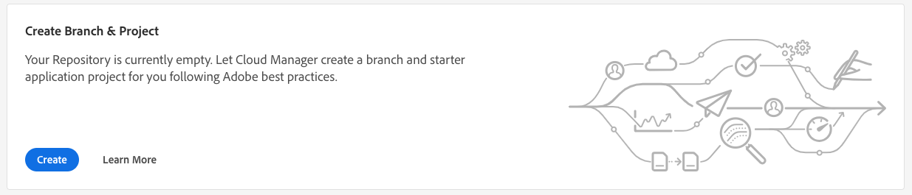
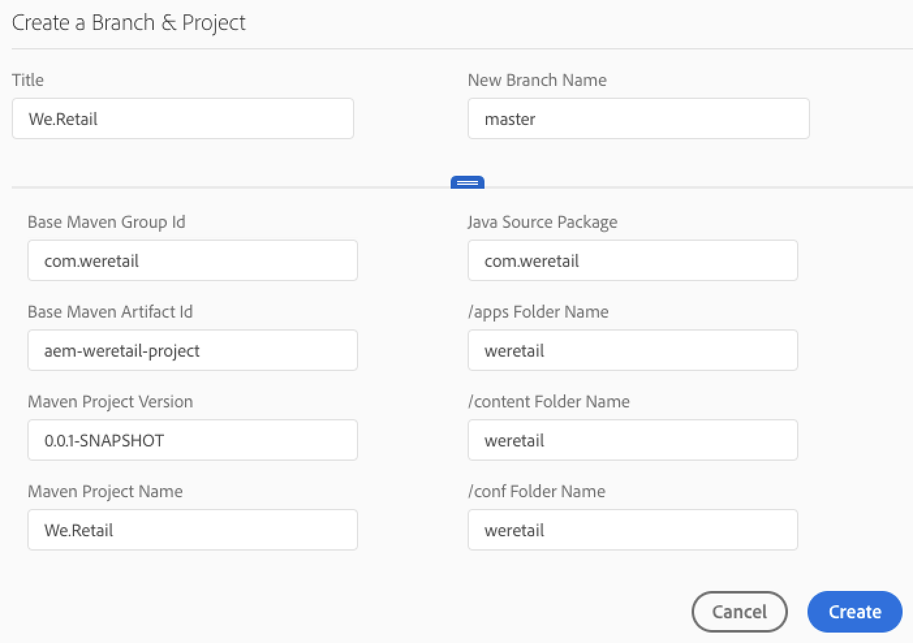

# Using the Wizard {#using-wizard-to-create-an-aem-application-project}

When customers are on-boarded to Cloud Manager, they are provided with an empty git repository. Current Adobe Managed Services (AMS) customers (or on-premise AEM customers who are migrating to AMS) will generally already have their project code in git (or another version control system) and will import their project into the Cloud Manager git repository. New customers, however, do not have existing projects.

To help get new customers started, Cloud Manger is now able to create a minimal AEM project as a starting point. This process is based on the [**AEM Project Archetype**](https://github.com/Adobe-Marketing-Cloud/aem-project-archetype).

Follow the steps below to create an AEM application project in Cloud Manager:

1. Once you log in to Cloud Manager and the basic program setup is complete, a special call to action card will be shown on the **Overview** screen, if the repository is empty.

   

1. Click **Create to** open a dialog box, which allows the user to provide the parameters required by the AEM Project Archetype. In its default form, the dialog box asks for two values:

    * **Title** - by default this is set to the *Program Name*
    
    * **New Branch Name** - by default this is *master*

   

   The dialog box has a drawer which can be opened by clicking on the handle toward the bottom of the dialog. In its expanded form, the dialog shows all of the configuration parameters for the Archetype. Many of these parameters have default values which are generated based on the **Title**.

   

   >[!NOTE]
   >
   >For example, if the **Title** is ***We.Finance***, the Base Maven Artifact Id parameter is generated as ***com.wefinance***. These values can be changed, if desired.
   >
   >
   >For example, you can change from the generated ***value com.wefinance*** to ***net.wefinance***.

1. Click **Create** in the preceding step to create the starter project by using the archetype and commit to the named git branch. Once this is done, you can set up the pipeline.